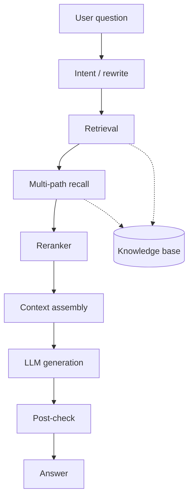
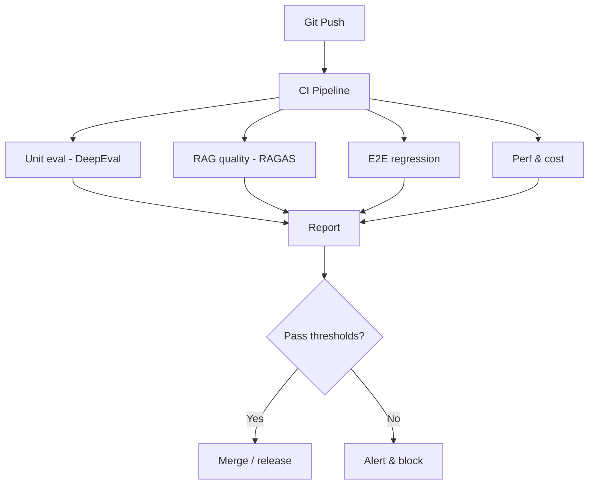

<!-- i18n:en -->

# 1. Why Agent Evaluation Matters

I once helped ship a RAG Agent that “felt great” internally—fluent answers, neat citations—then crashed into user feedback: wrong answers, missing facts, contradicted docs, and hallucinations. Our “tests” were a handful of friendly prompts. Without a real eval system, the Agent was flying blind.

Agents are harder than classic software:

- **Non-determinism**: paraphrase the question, get a different path.
- **Multi-step coupling**: intent, retrieval, reasoning, tools, generation—any hop can fail the final answer.
- **External dependence**: data quality, retrieval strategy, API health all show up in UX.

Unit/integration tests alone are not enough. This article covers metrics, methods, datasets, framework comparisons, CI/CD automation, and stage-by-stage choices—with **RAG Agents** as the deepest case.

You should leave with three answers: **Is my Agent reliable? Where does it fail? How do I make it more reliable?**

# 2. Core Evaluation Dimensions

- **Task quality**: final correctness, success rate, satisfaction
- **Reasoning**: chain correctness, multi-step consistency, logical completeness
- **Tool use**: tool choice, args, call order
- **Robustness & safety**: adversarial cases, boundaries, jailbreak/injection, hallucination rate
- **Efficiency & cost**: P50/P99 latency, tokens, tool calls, end-to-end spend

## 1. Task quality

Objective tasks allow exact/semantic match; subjective ones need humans or LLM-as-Judge. A common trap: correct final answers with broken middle steps—next paraphrase fails.

## 2. Reasoning

Expose CoT and score the chain (LLM judge + human spot checks).

## 3. Tool use

Did it call a tool when needed? Right tool? Right args? Sensible order? Tiny tool mistakes cascade.

## 4. Robustness & safety

Weird inputs, empty retrieval, jailbreaks, typos. Build adversarial/boundary sets.

## 5. Efficiency & cost

Fast and cheap matter. Track end-to-end latency, per-stage time, tokens, and tool API cost. Dimensions trade off—eval helps pick the balance.

# 3. Deep Dive: RAG Agent Evaluation



RAG has dual quality: **retrieval** feeds the model; **generation** cooks the meal. Either side failing breaks the dish.

## 3.1 Retrieval metrics

| Metric | Meaning | Typical use |
| --- | --- | --- |
| Hit Rate | Top-K contains a relevant doc | Can we find anything useful? |
| MRR | Mean reciprocal rank of first relevant | Ranking position |
| nDCG / Recall@K / Precision@K | Ranking & coverage quality | Offline retrieval tuning |
| Context Precision / Recall (RAGAS-style) | Context usefulness vs gold | End-to-end RAG |

## 3.2 Generation metrics

Faithfulness (grounded in context), answer relevancy, hallucination rate, citation accuracy. Prefer multi-metric dashboards over a single score.

## 3.3 Dataset construction

Mix golden Q–A, hard negatives, multi-hop questions, and noisy phrasings. Version datasets like code. Refresh as the knowledge base changes.

# 4. Evaluation Methods

- **Human eval**: gold standard, expensive—use for calibration and critical domains.
- **Automatic metrics**: fast regression signals; weak alone for open answers.
- **LLM-as-Judge**: scalable; pick a strong judge model and spot-check regularly.
- **Hybrid**: auto filter + human review on failures and high-risk cases.

# 5. Frameworks: RAGAS & DeepEval

## 5.1 RAGAS

```python
from datasets import Dataset
from ragas import evaluate
from ragas.metrics import faithfulness, answer_relevancy, context_precision, context_recall

eval_dataset = Dataset.from_dict({
    "question": ["What advantages does RAG have?"],
    "answer": ["RAG reduces hallucinations and improves traceability with fresher knowledge."],
    "contexts": [[
        "RAG advantages include fewer hallucinations, better traceability, and fresher knowledge."
    ]],
    "ground_truths": [
        ["RAG reduces hallucinations, improves traceability, and uses up-to-date knowledge."]
    ]
})

result = evaluate(
    eval_dataset,
    metrics=[faithfulness, answer_relevancy, context_precision, context_recall]
)
print(result)
# Example:
# {'faithfulness': 0.95, 'answer_relevancy': 0.88, 'context_precision': 0.92, 'context_recall': 0.85}
```

Swap the judge LLM for any OpenAI-compatible endpoint (including local Llama/Qwen) to control cost—and still run periodic human checks.

## 5.2 DeepEval (pytest-style)

```python
from deepeval import assert_test
from deepeval.metrics import FaithfulnessMetric, AnswerRelevancyMetric
from deepeval.test_case import LLMTestCase

# 定义测试用例
test_case = LLMTestCase(
    input="RAG 有哪些优势？",
    actual_output="RAG 可以减少幻觉、提高答案可追溯性，并且能够利用最新知识。",
    retrieval_context=[
        "RAG 的优势包括减少幻觉、提高可追溯性、利用最新知识。"
    ]
)

# 定义评估指标并设置阈值
faithfulness_metric = FaithfulnessMetric(threshold=0.8)
answer_relevancy_metric = AnswerRelevancyMetric(threshold=0.7)

# 运行测试
def test_rag_quality():
    assert_test(test_case, [faithfulness_metric, answer_relevancy_metric])
    # 如果忠实度分数低于 0.8 或答案相关性分数低于 0.7，测试会失败
```

# 6. Automation & CI/CD



```yaml
name: Agent Evaluation Pipeline

on:
  push:
    branches: [main]
  pull_request:
    branches: [main]

jobs:
  evaluate:
    runs-on: ubuntu-latest
    steps:
      - uses: actions/checkout@v3

      - name: Set up Python
        uses: actions/setup-python@v4
        with:
          python-version: '3.11'

      - name: Install dependencies
        run: |
          pip install ragas deepeval openai

      - name: Run RAGAS evaluation
        env:
          OPENAI_API_KEY: ${{ secrets.OPENAI_API_KEY }}
        run: |
          python ragas_eval.py

      - name: Run DeepEval tests
        env:
          OPENAI_API_KEY: ${{ secrets.OPENAI_API_KEY }}
        run: |
          python -m pytest deepeval_tests.py --tb=short

      - name: Check thresholds
        run: |
          # 如果评估分数低于阈值，退出码非 0，阻断 CI
          python check_thresholds.py
```

Automation finds regressions fast; it does not replace humans on high-stakes domains (health, finance, legal).

# 7. Online Monitoring & Feedback Loop

Offline sets never cover all live phrasing. Watch P99 latency, tokens, retrieval recall drift after KB updates, and thumbs-up/down. Close the loop: complaint → cluster → gold label → regression set → next release gate.

# 8. Closing & Selection Tips

- Ship a thin eval loop first (RAGAS/DeepEval), then deepen it.
- Tie metrics to business value (first-contact resolution vs faithfulness).
- Walk on two legs: automation + human review.
- Treat eval data/metrics/process as living artifacts.

Launch is the start; continuous evaluation is the moat. Stop flying blind—make the Agent reliably good.
