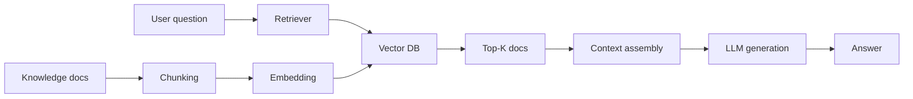

<!-- i18n:en -->

# RAG Basics: From First Principles to Production

> RAG (Retrieval-Augmented Generation) is both underrated and overhyped. Underrated because people treat it as “just look stuff up.” Overhyped because great RAG teams are rare—retrieval quality, context packing, hallucinations, and end-to-end latency all hide sharp edges. This article walks the full chain so you move from “knowing RAG” to “shipping RAG.”

---

## 1. Why RAG Exists

### 1.1 LLM limits

- **Knowledge cutoff**
- **Hallucinations** when uncertain
- **No private knowledge** without injection

### 1.2 Core idea

**Retrieve first, then generate.** Turn the model from a memory machine into a reading-comprehension machine.

1. **Indexing** — chunk & embed the corpus  
2. **Retrieval** — recall Top-K passages  
3. **Generation** — stuff context into the prompt and answer  

### 1.3 RAG vs fine-tuning

Prefer **RAG first**; fine-tune as a complement (style/format). RAG updates instantly and cites sources; fine-tuning is slower/costlier and more opaque.

| Dimension | RAG | Fine-tuning |
| --- | --- | --- |
| Knowledge updates | Immediate (swap docs) | Retrain |
| Explainability | Citations | Opaque |
| Hallucination risk | Lower with good context | Higher free-form risk |
| Cost to start | Lower | Higher |
| Best for | Knowledge QA / support / docs | Style, format, domain jargon |

## 2. Indexing Sets the Ceiling

Garbage in, garbage out. Focus on loaders that keep structure (titles, pages, tables), chunking policy (size/overlap/structure-aware), and embedding choice (domain language, dimension, latency).

Keep code samples from the Chinese section unchanged (`RecursiveCharacterTextSplitter`, embedding APIs, etc.).

## 3. Retrieval: Multi-Path + Rerank

Combine dense vectors with sparse/keyword (BM25) when queries are lexical. Always consider a **reranker** after Top-K—vector recall is coarse; cross-encoders refine.

## 4. Generation: Fight Hallucinations

Cite contexts, constrain prompts (“answer only from provided docs”), add refusal behavior when evidence is weak, and evaluate faithfulness/relevancy.

## 5. Evaluation & Ops

Track Hit Rate / MRR / context precision-recall, faithfulness, latency, and cost. Version corpora and eval sets together. Monitor online thumbs and retrieval drift after KB updates.

## 6. Closing

RAG is an engineering system, not a single API call. Index quality, hybrid retrieval, rerank, grounded generation, and continuous eval are the difference between a demo and a product.

> Diagrams above are English; all executable code blocks remain identical to the Chinese version for copy-paste fidelity.
