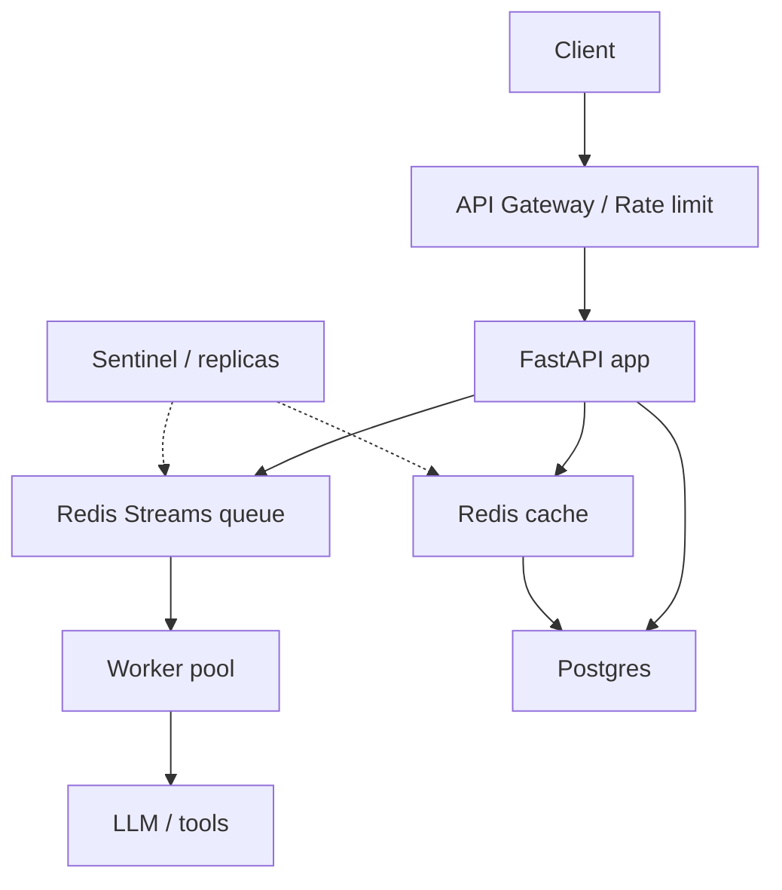

<!-- i18n:en -->

# AI Agent High-Concurrency Practice: Redis Rate Limiting, Queues, Caching, and HA

> Agents graduate from toys to productivity tools—then concurrency hits first. Burst uploads, parallel LLM calls, and progress polling can melt a naive DB. This article walks a real Agent evolution: **gateway limits, Redis Streams decoupling, cache defenses, distributed locks, and Sentinel HA**, with Python-oriented patterns you can ship.

## 1. The Real Pain

Imagine a document-analysis Agent: upload PDF → summarize → extract → report. Feature-simple, load-fragile. Synchronous LLM work on the request thread collapses under concurrent users.

## 2. Architecture Outline

Split **accept work** from **do work**. The API enqueues; workers consume.

## 3. Gateway Rate Limiting

Protect with token bucket / sliding window (Redis). Return 429 early. Separate limits for anonymous vs authenticated, and for expensive endpoints (upload/analyze) vs cheap status polls.

## 4. Redis Streams as the Async Backbone

Use Streams (or equivalent) for durable task queues: consumer groups, ACK, pending entries, retry/DLQ. Persist task state (`queued → running → succeeded/failed`) so clients poll safely.

Keep the Python snippets in the Chinese section as the canonical copy-paste code—only the surrounding explanation is localized here.

## 5. Cache: Penetration, Breakdown, Avalanche

- **Penetration**: missing keys hammer DB → bloom filter / cached nulls  
- **Breakdown**: hot key expiry → mutex / logical expire  
- **Avalanche**: many keys expire together → jitter TTLs  

Cache task results and idempotent LLM responses carefully (key by content hash + model/version).

## 6. Distributed Locks

Serialize critical sections (e.g. “finalize report once”) with Redis locks + fencing tokens; always set TTL; prefer libraries that renew safely.

## 7. High Availability

Sentinel or managed Redis for failover; connection pools with timeouts; graceful worker shutdown (stop claiming new messages, finish in-flight). Multi-AZ for Postgres; backpressure when queue depth spikes.

## 8. Closing

High concurrency for Agents is systems work: **admit, queue, cache, lock, fail over**. Redis is often the hub—not because it is trendy, but because it can be the rate limiter, queue, cache, and lock service in one operable plane.

> Mermaid labels above are English. All executable code blocks remain identical to the Chinese article for fidelity.
