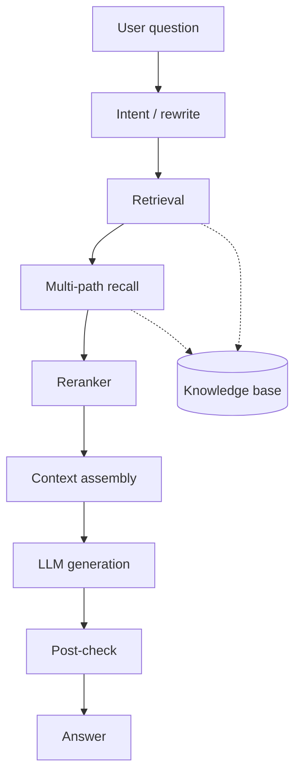
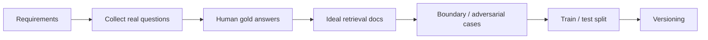
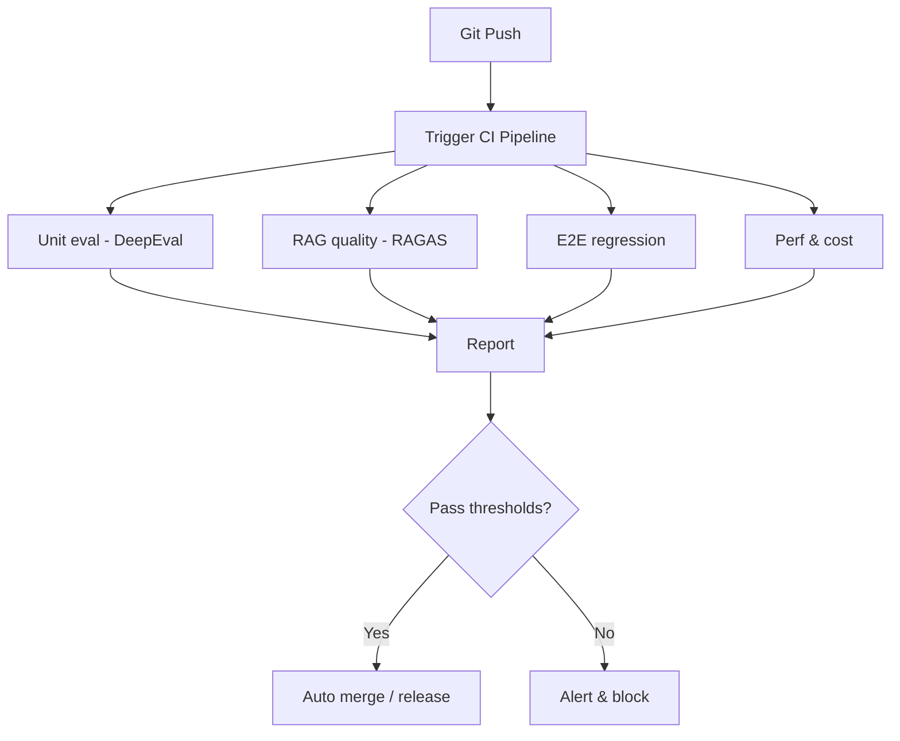

# 1. Why Agent Evaluation Matters

I once helped a team ship a RAG Agent that felt strong in internal testing—fluent answers, neat citations, even a bit of wit. After launch, user feedback was brutal: “off-topic,” “missing key facts,” “the doc says A but it says B,” “hallucinations everywhere.” A retrospective found the hard truth: our so-called “tests” were a few familiar prompts. Without a real evaluation system, the Agent was flying blind.

That story is common. Agents are far harder than classic software:

- **Non-determinism**: paraphrase the same question and the path can change completely.
- **Multi-step coupling**: intent, retrieval, reasoning, tool use, generation—any hop can break the final answer.
- **External dependence**: data quality, retrieval strategy, and API health all show up in UX.

Unit tests and integration tests alone almost stop working here. This article walks through metric design, evaluation methods, datasets, framework comparisons, CI/CD automation, and stage-by-stage choices. **RAG Agents**, today’s most common production shape, get the deepest treatment.

By the end you should answer three questions: **Is my Agent reliable? Where does it fail? How do I make it more reliable?**

# 2. Core Evaluation Dimensions

Before inventing metrics, build a map. I group Agent evaluation into five dimensions:

- **Task completion quality**
  - Final answer correctness
  - Task success rate
  - User satisfaction
- **Reasoning**
  - Reasoning-chain correctness
  - Multi-step consistency
  - Logical completeness
- **Tool use**
  - Tool-selection accuracy
  - Argument correctness
  - Call-order quality
- **Robustness & safety**
  - Adversarial robustness
  - Boundary handling
  - Jailbreak / injection defense
  - Hallucination rate
- **Efficiency & cost**
  - Latency P50 / P99
  - Token usage
  - Tool-call count
  - End-to-end cost

## 1. Task completion quality

The most intuitive dimension: did the Agent finish the job correctly? “Correct” is ambiguous—objective tasks (“Beijing weather today”) allow exact/semantic match; subjective ones (“write a warm apology email”) need humans or LLM-as-a-Judge.

Common trap: only scoring the final answer. The answer looks right while the middle reasoning is wrong—so the next paraphrase fails.

## 2. Reasoning

Is the thought process coherent? A math Agent can output the right number with a broken derivation. Expose chain-of-thought and score step by step—often with an LLM judge plus human spot checks.

## 3. Tool use

This is a core Agent skill beyond plain LLMs: search, calculator, DB, APIs. Did it call a tool when needed? The right tool? Correct args? Sensible order? Tiny mistakes (wrong filter, missing required field) cascade into total failure.

## 4. Robustness & safety

Real users ask weird things—edges and attacks. Can the Agent refuse jailbreaks in the prompt? Degrade gracefully on empty retrieval instead of inventing? Still understand typos and scrambled word order? Build dedicated adversarial and boundary sets.

## 5. Efficiency & cost

Speed and price decide UX and commercial viability. High accuracy with 30s waits and thousands of tokens still loses users. Track end-to-end latency, per-stage time, tokens, and tool API cost.

These dimensions trade off. More retrieval rounds can raise accuracy and also latency/cost. A good eval system helps you find the balance.

# 3. Deep Dive: RAG Agent Evaluation

RAG is the dominant production Agent pattern: question → intent/rewrite → retrieval → rerank → context assembly → generation → post-check.



RAG has dual quality: **retrieval** decides whether the LLM gets good ingredients; **generation** decides whether those ingredients become a good dish. Weak retrieval starves even a strong LLM; weak generation wastes perfect retrieval.

## 3.1 Retrieval metrics

| Metric | Meaning | Typical use | How |
| --- | --- | --- | --- |
| Hit Rate | Top-K contains a relevant gold doc | Can we find anything useful? | hits / total |
| MRR | Mean reciprocal rank of first relevant | Ranking position | mean(1/rank) |
| Precision | Share of retrieved docs that are relevant | Retrieval “purity” | relevant / retrieved |
| Recall | Share of all relevant docs that were retrieved | Coverage | retrieved relevant / all relevant |
| NDCG | Position-weighted relevance | Ranking quality | normalized DCG |
| Context Relevancy | How related retrieved text is to the question | LLM-assisted judgment | LLM score |

Pitfalls from practice:

- **High Hit Rate ≠ good retrieval.** Huge K (e.g. 100) inflates Hit Rate and floods the context window. Always report Hit Rate with K (often 3/5/10).
- **MRR fits unique-answer FAQ.** Multi-doc synthesis questions need more than MRR.
- **Read Precision with Recall.** High P/low R is “clean but incomplete”; high R/low P is “noisy.” F1 is a common compromise.
- **NDCG needs graded labels** (0/1/2/3). Binary labels mostly collapse it toward average precision.
- **Context Relevancy depends on the judge LLM**—good for sampling, expensive/noisy for full automation.

## 3.2 Generation metrics

| Metric | Meaning | How |
| --- | --- | --- |
| Faithfulness | Answer grounded in retrieved docs | LLM checks support |
| Answer Relevancy | On-topic vs off-topic | LLM semantic match |
| Context Precision | Retrieved chunks actually used / useful | Per-chunk usefulness |
| Context Recall | Needed answer facts exist in retrieval | Per-fact coverage |
| Hallucination Rate | Share of invented claims | Human / LLM unsupported ratio |
| Information Completeness | Missing key points vs gold | Gold keypoint coverage |

Notes:

- **Faithfulness is the floor.** If answers invent facts, RAG failed its purpose. Split answers into atomic claims and check support.
- **Relevancy can fight faithfulness.** Extra background may help the user and hurt faithfulness. In medical/legal domains, prefer faithfulness.
- **Context Precision + Recall** measure context efficiency and help tune chunk size / recall strategy.
- **Hallucination is hard to fully automate**—use LLM prefilter + human spot checks in high-stakes domains.

## 3.3 End-to-end metrics

Closer to user value:

- **Task success rate**: not “produced text,” but “usable outcome” (e.g. actually booking the flight).
- **Satisfaction**: thumbs, ratings, NPS.
- **First-contact resolution**: solved on the first ask.
- **Average turns**: more turns usually means worse understanding/guidance.

These need live traffic—offline sets cannot fully replace them (Section 7).

# 4. Building Evaluation Datasets

Metrics without datasets are theater. A standard flow:



Three sources:

1. **Human-labeled sets**: highest quality, highest cost—core scenarios with tiny error budget.
2. **Synthetic sets**: LLM-generated QA from docs—fast scale, needs human review. Example:

```python
import json
from openai import OpenAI

client = OpenAI()

def generate_qa_pairs(documents: list[str], num_pairs: int = 10) -> list[dict]:
    """
    Auto-generate QA pairs from document content with an LLM.
    """
    qa_pairs = []
    for doc in documents:
        prompt = f"""You are a professional test-data generator. Based on the document below,
generate {num_pairs} high-quality question-answer pairs.
Requirements:
- Questions must be grounded in the document — no invented facts
- Answers must be accurate and complete, citing concrete details from the text
- Diversify question types: fact lookup, comparison, summarization, etc.
- Return a JSON array; each element has "question" and "answer" fields

Document:
{doc[:3000]}  # truncate to stay within the token budget
"""
        response = client.chat.completions.create(
            model="gpt-4o",
            messages=[{"role": "user", "content": prompt}],
            response_format={"type": "json_object"},
            temperature=0.7
        )
        result = json.loads(response.choices[0].message.content)
        qa_pairs.extend(result.get("qa_pairs", []))
    return qa_pairs

# Usage example
documents = [
    "RAG combines retrieval and generation: it retrieves relevant docs from a knowledge base, then has the LLM answer grounded in those docs.",
    "RAG's core strength is reducing hallucinations so LLM answers stay evidence-based."
]
qa_pairs = generate_qa_pairs(documents, num_pairs=3)
for qa in qa_pairs:
    print(f"Q: {qa['question']}\nA: {qa['answer']}\n")
```

3. **Online feedback**: real questions/answers from logs—most realistic, noisiest; needs cleaning and labeling.

**Recommended mix**: online feedback as the base, synthetic data for scale, human gold as the calibration standard.

# 5. Framework Comparison

| Framework | Focus | Strengths | Custom metrics | RAG | Trade-offs |
| --- | --- | --- | --- | --- | --- |
| RAGAS | RAG-native | Faithfulness / relevancy / context P&R | Custom prompts | Native | Great out of box; weak multi-step Agent flows |
| DeepEval | General LLM eval | Built-ins + pytest style | Custom + thresholds | Yes | Fast to learn; smaller community |
| LangSmith | Observability + eval | Traces, datasets, online eval | Custom evaluators | Yes | Full LangChain stack; paid tiers |
| Phoenix (Arize) | Observability | Retrieval viz, drift | Custom | Strong | Powerful; steeper learning curve |
| TruLens | Feedback functions | Answer/context/grounding triad | Custom feedback | Native | Clear modular ideas; quieter community |
| MLflow Eval | Experiment mgmt | Multi-model compare | Custom | Generic | Strong experiments; weak Agent specifics |

## 5.1 RAGAS

RAGAS is built for RAG metrics and LLM-as-judge prompts:

```python
from datasets import Dataset
from ragas import evaluate
from ragas.metrics import faithfulness, answer_relevancy, context_precision, context_recall

# Evaluation data: question, answer, retrieved contexts, optional ground truth
eval_dataset = Dataset.from_dict({
    "question": ["What is RAG?", "What are RAG's advantages?"],
    "answer": [
        "RAG combines retrieval and generation: it retrieves relevant docs, then has the LLM answer from them.",
        "RAG's core strengths are fewer hallucinations, better traceability, and access to up-to-date knowledge."
    ],
    "contexts": [
        ["RAG combines retrieval and generation..."],
        ["RAG advantages include fewer hallucinations, better traceability, and up-to-date knowledge..."]
    ],
    "ground_truth": [
        "RAG stands for Retrieval-Augmented Generation — a pattern that combines retrieval and generation.",
        "RAG can reduce hallucinations, improve answer traceability, and use the latest knowledge."
    ]
})

# Run evaluation
result = evaluate(
    eval_dataset,
    metrics=[faithfulness, answer_relevancy, context_precision, context_recall]
)
print(result)
# Example output:
# {'faithfulness': 0.95, 'answer_relevancy': 0.88, 'context_precision': 0.92, 'context_recall': 0.85}
```

Use metrics alone or together. Default judge is OpenAI-compatible—swap to local Llama/Qwen to control cost, and still run periodic human checks because the judge’s strength biases scores.

## 5.2 DeepEval

If you know pytest, DeepEval feels natural—metrics as assertions with thresholds:

```python
from deepeval import assert_test
from deepeval.metrics import FaithfulnessMetric, AnswerRelevancyMetric
from deepeval.test_case import LLMTestCase

# Define a test case
test_case = LLMTestCase(
    input="What are RAG's advantages?",
    actual_output="RAG can reduce hallucinations, improve answer traceability, and use up-to-date knowledge.",
    retrieval_context=[
        "RAG advantages include fewer hallucinations, better traceability, and up-to-date knowledge."
    ]
)

# Metrics with thresholds
faithfulness_metric = FaithfulnessMetric(threshold=0.8)
answer_relevancy_metric = AnswerRelevancyMetric(threshold=0.7)

# Run the test
def test_rag_quality():
    assert_test(test_case, [faithfulness_metric, answer_relevancy_metric])
    # Fails if faithfulness < 0.8 or answer relevancy < 0.7
```

It also supports custom metrics, CI integration, and detailed reports.

# 6. Automation & CI/CD

Evaluation should gate merges, not be a one-off notebook:



```yaml
name: Agent Evaluation Pipeline

on:
  push:
    branches: [main]
  pull_request:
    branches: [main]

jobs:
  evaluate:
    runs-on: ubuntu-latest
    steps:
      - uses: actions/checkout@v3

      - name: Set up Python
        uses: actions/setup-python@v4
        with:
          python-version: '3.11'

      - name: Install dependencies
        run: |
          pip install ragas deepeval openai

      - name: Run RAGAS evaluation
        env:
          OPENAI_API_KEY: ${{ secrets.OPENAI_API_KEY }}
        run: |
          python ragas_eval.py

      - name: Run DeepEval tests
        env:
          OPENAI_API_KEY: ${{ secrets.OPENAI_API_KEY }}
        run: |
          python -m pytest deepeval_tests.py --tb=short

      - name: Check thresholds
        run: |
          # Non-zero exit if scores are below threshold — block the CI pipeline
          python check_thresholds.py
```

**Automation ≠ unattended ops.** Auto eval catches regressions fast; it does not replace humans in medical/finance/legal Agents. Use automation to filter, humans to verify.

# 7. Online Monitoring & Feedback Loop

Offline sets never cover all live phrasing, input quality, or context lengths. Online monitoring closes the system.

Offline vs online:

- **Freshness**: near-real-time signals, not hours later
- **Scale**: full traffic or heavy sampling
- **Labels**: behavioral signals (up/down/retry/abort) and LLM auto-labels instead of full human annotation

Watch at least:

- **P99 latency** — UX ceiling
- **Tokens per request** — cost
- **Retrieval recall drift** after KB updates
- **Feedback scores** — thumbs and ratings

Build the loop: complaint → cluster → gold label → regression set → release gate. Failures become permanent tests so they do not return.

# 8. Closing & Selection Tips

Agent evaluation is systems work—no silver bullet.

- **Ship a thin loop first**, then sharpen it (RAGAS/DeepEval is enough to start).
- **Tie metrics to business value** (first-contact resolution vs faithfulness).
- **Automation + humans**, always.
- **Treat datasets/metrics/process as living artifacts.**

Launch is the beginning. Continuous evaluation is the moat. Stop flying blind—make the Agent reliably good.
