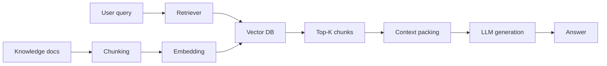
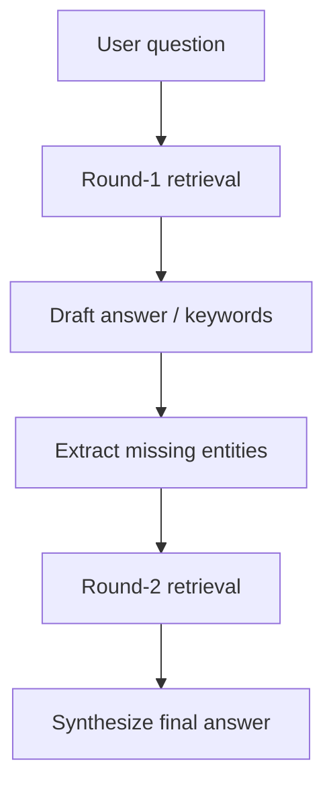
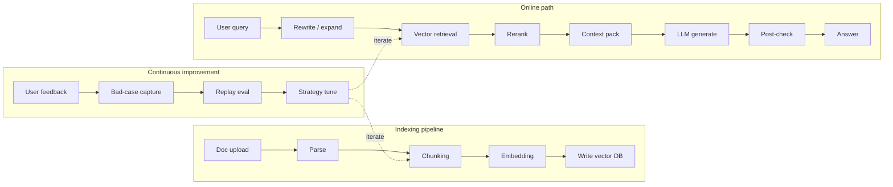

# RAG Basics: From First Principles to Production

> RAG (Retrieval-Augmented Generation) may be the most underrated *and* overhyped LLM technique of 2024–2026. Underrated because many treat it as “just look stuff up.” Overhyped because teams that truly ship great RAG are rare—retrieval quality, context packing, hallucinations, and end-to-end latency each hide sharp edges. This note starts from first principles and walks the full chain: components, key choices, evaluation, and production pitfalls—so you move from “knowing RAG” to “shipping RAG.”

---

## 1. Why RAG Exists

### 1.1 Inherent LLM limits

LLMs are powerful, but three limits remain fundamental:

- **Knowledge cutoff**: training data stops at a point in time; yesterday’s events are invisible.
- **Hallucination**: when the model does not know, it often invents instead of admitting uncertainty—unacceptable in medicine, law, and similar domains.
- **Private knowledge**: internal docs, databases, and business rules cannot be injected via pretraining alone.

### 1.2 Core idea

The idea is simple: **instead of answering from memory alone, retrieve relevant material first, then answer grounded in that material.** “Retrieve then generate” turns the LLM from a memory machine into a reading-comprehension machine.

The standard pipeline has three steps:

1. **Indexing**: preprocess external knowledge (docs, pages, DBs) into a searchable vector index.
2. **Retrieval**: given a user question, recall the most relevant chunks.
3. **Generation**: splice retrieved chunks with the question into a prompt and let the LLM answer.



### 1.3 RAG vs fine-tuning

Teams often hesitate between RAG and fine-tuning. My default: **prefer RAG first; fine-tune as a complement.**

| Dimension | RAG | Fine-tuning |
| --- | --- | --- |
| Knowledge updates | Instant—swap docs | Retrain; slow and costly |
| Explainability | Answers can cite sources | Black box |
| Hallucination risk | Lower under context constraints | Higher; freer generation |
| Implementation cost | Low; no training | High; data + compute |
| Best fit | Knowledge QA, support, doc search | Style transfer, fixed formats, domain jargon |

They are not mutually exclusive. Mature systems often use **RAG for knowledge and fine-tuning for how the model speaks.**

---

## 2. Indexing Sets the Ceiling

Garbage in, garbage out applies brutally to RAG. Index quality caps recall; recall caps generation. Three core stages: **load/parse, chunk, embed.**

### 2.1 Document loading & parsing

Different sources need different loaders:

- **Unstructured docs** (PDF, Word, PPT, Excel): `Unstructured`, `pypdf`, `python-docx`, etc. Pair OCR for scans and keep table structure when possible.
- **Web/HTML**: `BeautifulSoup` or `trafilatura`—keep body text, strip nav/ads.
- **Databases/SQL**: query structured data directly, use Text-to-SQL, or ETL to text.
- **Code repos**: `tree-sitter` for structure; chunk by function/class; keep call-graph metadata.

Key rule: **loaders must preserve structural metadata**—section titles, page numbers, table layout, code comments—all matter later for retrieval and generation.

### 2.2 Chunking: size vs strategy

Chunking is easy to ignore and hard to undo. Balance three constraints:

- **Context window**: inputs must fit the model.
- **Retrieval granularity**: too small → incomplete semantics; too large → noise and truncated signal.
- **Semantic coherence**: each chunk should center on one topic, or similar meanings get muddled.

Practical strategies:

**Fixed-size chunking**: split by token count with overlap (about 10%–20%) to reduce boundary breakage. Simple and general-purpose:

```python
from langchain.text_splitter import RecursiveCharacterTextSplitter

text_splitter = RecursiveCharacterTextSplitter(
    chunk_size=512,        # 每个 Chunk 最大 Token 数
    chunk_overlap=50,      # 重叠 Token 数，保持上下文连续
    separators=["\n\n", "\n", "。", ".", " "],  # 优先按语义边界切分
)
chunks = text_splitter.split_text(document)
```

**Semantic chunking**: embed adjacent sentences with `SentenceTransformer` and split when similarity drops below a threshold. Chunks are more coherent, at higher compute cost. Note: large models here usually act as binary discriminators, not free-form generators.

```python
from sentence_transformers import SentenceTransformer

model = SentenceTransformer("all-MiniLM-L6-v2")

def semantic_chunk(sentences, threshold=0.6):
    embeds = model.encode(sentences)
    chunks, current_chunk = [], [sentences[0]]
    for i in range(1, len(sentences)):
        sim = cosine_similarity(embeds[i-1:i], embeds[i:i+1])[0][0]
        if sim > threshold:
            current_chunk.append(sentences[i])
        else:
            chunks.append(" ".join(current_chunk))
            current_chunk = [sentences[i]]
    return chunks
```

**Structure-aware chunking**: for Markdown/HTML/PDF, split by heading hierarchy so each chunk carries section context—e.g. prefix `## 3.2 Model Architecture > 3.2.1 Transformer Layers`. LangChain’s `MarkdownHeaderTextSplitter` covers this pattern.

### 2.3 Embedding model selection

Embeddings turn text into dense vectors; quality drives retrieval precision. Watch these dimensions:

- **Size vs quality**: `text-embedding-3-small/large` (OpenAI), `BGE-M3` (BAAI), `Cohere Embed v3`, `GTE-Qwen2-7B`, etc. Larger usually means better—and slower/costlier.
- **Language**: for Chinese-heavy corpora, prefer strong C-MTEB models such as `BGE-M3` or `text2vec-large-chinese`.
- **Dimension & storage**: higher dims often help, but cost more. 768 is enough for many cases; 1536 for harder semantics.
- **Local vs API**: APIs are stable for PoCs but scale linearly in cost; local (BGE/GTE) costs more upfront, stays in-domain, and suits compliance-heavy settings.

The most direct quality check is **MTEB on your data** or careful human sampling.

---

## 3. Retrieval: From “Found” to “Found Right”

### 3.1 Vector retrieval basics

On query, embed the question and search the vector DB for Top-K similar chunks. Common metrics: **cosine similarity** and **dot product** (equivalent for normalized vectors).

Pick a vector store by scale and ops needs:

| Store | Traits | Fit |
| --- | --- | --- |
| Chroma | Light, embedded, easy | Local / PoC |
| FAISS | Meta OSS, library-only, very fast | Billion-scale / research |
| Milvus/Zilliz | Distributed, cloud-native, GPU | Large production |
| Qdrant | Rust, friendly APIs, filtering | Complex metadata filters |
| Pinecone | Fully managed | Teams that skip infra |

### 3.2 Multi-path recall

Single vector recall misses things. The common pattern is **multi-path recall + fusion ranking**:

- **Vector recall**: semantic similarity; good for paraphrases.
- **Keyword recall**: BM25 / Elasticsearch; exact proper nouns (SKU, names).
- **SQL recall**: structured data queried directly.

```python
def multi_stage_recall(query, top_k=10):
    # 1. 向量召回
    vec_results = vector_db.search(query, top_k=top_k)

    # 2. BM25 关键词召回
    bm25_results = bm25_index.search(query, top_k=top_k)

    # 3. 合并结果并去重
    all_results = merge_and_deduplicate(vec_results, bm25_results)

    # 4. 重排序 Reranker 重新打分
    reranked = reranker.rerank(query, all_results, top_k=5)
    return reranked
```

### 3.3 Reranking: the last mile of precision

Top-K from vector search can be noisy. A reranker re-scores with a finer model. Common choices: `Cohere Rerank`, `BGE-Reranker`, `cross-encoder/ms-marco-MiniLM-L-6-v2`.

```python
from sentence_transformers import CrossEncoder

reranker = CrossEncoder("cross-encoder/ms-marco-MiniLM-L-6-v2")

def rerank(query, documents, top_k=5):
    pairs = [[query, doc] for doc in documents]
    scores = reranker.predict(pairs)
    ranked = sorted(zip(documents, scores), key=lambda x: x[1], reverse=True)
    return [doc for doc, score in ranked[:top_k]]
```

Reranking costs compute, so the usual trade-off is: **vector recall Top-50 → rerank to Top-5**.

### 3.4 Hybrid retrieval + RRF fusion

When merging paths, **RRF (Reciprocal Rank Fusion)** is simple and effective—rank-based, score-agnostic across channels:

```python
def rrf(results_lists, k=60):
    """
    results_lists: 多个召回通道的结果列表，每个列表按相关性降序排列
    """
    scores = {}
    for rank_list in results_lists:
        for rank, doc_id in enumerate(rank_list):
            scores[doc_id] = scores.get(doc_id, 0) + 1.0 / (k + rank + 1)
    return sorted(scores.items(), key=lambda x: x[1], reverse=True)
```

---

## 4. Generation: From Grounded to Trustworthy

### 4.1 Prompt design: answer from evidence

Generation quality lives in the prompt. A solid RAG prompt usually includes:

```text
你是一个基于给定资料回答问题的助手。你必须严格依据以下参考资料回答。
如果资料中没有答案，请直接说“我不知道”，不要自行编造。

参考资料：
{retrieved_context}

用户问题：{query}

回答要求：
1. 优先从参考资料中提取信息
2. 如果参考资料中存在矛盾，请指出并说明
3. 引用来源时标注 [来源：文档名]
4. 如果信息不完整，明确说明缺失了什么
```

Key techniques:

- **Forced citation**: require source labels for traceability.
- **Refuse template**: explicitly say “if the docs lack the answer, say you don’t know”—still the strongest anti-hallucination lever.
- **Decompose hard questions**: split long queries into sub-questions and retrieve per sub-question.

### 4.2 Three layers of hallucination control

RAG reduces hallucination but still needs defense in depth:

**Layer 1 — retrieval quality gate.** If average relevance is below a threshold (e.g. 0.6), refuse and ask the user to rephrase. Persist per-chunk similarity scores at retrieval time.

**Layer 2 — post-generation check.** Use another LLM (or RAGAS `faithfulness`) to verify the answer is supported by retrieved context. Split the answer into atomic claims; if faithfulness < 0.7, regenerate or degrade.

**Layer 3 — feedback loop.** Collect thumbs up/down in production; turn bad cases into eval sets; periodically iterate prompts and retrieval.

```python
from ragas.metrics import faithfulness
from ragas import evaluate

# 生成答案后自动评估忠实度
faithfulness_score = evaluate(
    dataset,
    metrics=[faithfulness]
)
# 如果分数低于阈值，降级为"根据现有资料无法可靠回答"
if faithfulness_score < 0.7:
    return "根据当前资料，我无法给出可靠的答案，建议人工确认。"
```

### 4.3 The context-window sweet spot

Windows keep growing (e.g. GPT-4 at 128K)—**do not fill them**. In practice:

- Keep total context around **60%–70%** of the window so system instructions and output still fit.
- Prefer highest-relevance Top-K (often K=3–5); more chunks often add noise.
- When fragments multiply, summarize retrieved pieces first, then generate from the summary (“summarize-then-generate”).

---

## 5. Advanced RAG Patterns

### 5.1 Self-query retrieval

When questions include structured constraints (time, author, category), let the LLM parse them into a structured query:

```python
from typing import Optional
from pydantic import BaseModel

class SearchQuery(BaseModel):
    query_text: str           # 语义检索文本
    author: Optional[str]     # 过滤条件：作者
    date_range: Optional[str] # 过滤条件：时间范围
    category: Optional[str]   # 过滤条件：分类

# 用 LLM 将用户输入解析为结构化的 SearchQuery
# 例如用户输入："2024年关于Transformer的论文"
# 解析结果：query_text="Transformer 论文", date_range="2024"
```

### 5.2 Multimodal RAG

For images, tables, audio:

- **Joint embeddings**: `CLIP`, `BLIP-2`, etc., map image and text into one space.
- **Hybrid indexes**: separate text/image indexes; query both and fuse.
- **Caption-as-text**: describe media with a multimodal LLM (e.g. GPT-4V), then store captions as text vectors.

### 5.3 Rewrite–Retrieve–Generate

Raw user questions are often vague, colloquial, or full of pronouns. Rewrite into a clearer retrieval query before the standard pipeline:

```python
def rewrite_query(original_query: str, conversation_history: list = None) -> str:
    """
    使用 LLM 改写用户问题，补全指代、规范化表述
    """
    prompt = f"""
    请将以下用户问题改写为更清晰、关键词明确的检索查询。
    保留所有关键实体和条件，补全可能缺失的指代信息。

    原始问题：{original_query}
    对话历史：{conversation_history}

    只输出改写后的查询文本：
    """
    return llm.generate(prompt)
```

This matters especially in conversational RAG, where follow-ups depend on prior entities.

### 5.4 Recursive retrieval & multi-step reasoning

Hard questions often need more than one hop: retrieve → extract new entities → retrieve again → synthesize.



This shines in medical, legal, and other domains that need progressive deepening.

---

## 6. Evaluating RAG

### 6.1 Core metrics

Measure retrieval and generation separately:

| Metric | Meaning | How |
| --- | --- | --- |
| Hit Rate | Share of queries where Top-K contains the gold doc | Hits / queries |
| MRR | Mean reciprocal rank of the gold doc | Average of 1/rank |
| Faithfulness | Answer supported by retrieved context | LLM judge or human |
| Answer Relevancy | Answer on-topic | LLM judge or human |
| Context Recall | Needed info actually retrieved | Claim-level source checks |

### 6.2 Recommended frameworks

- **RAGAS**: Faithfulness, Answer Relevancy, Context Precision, Context Recall in a few Python lines.
- **DeepEval**: unit-test style metrics, thresholds, CI-friendly.
- **Human eval**: 50–100 labeled samples remain the gold standard for trusting automated scores—run regularly.

---

## 7. Production Pitfalls & Checklist

### 7.1 Common traps

| Trap | Symptom | Fix |
| --- | --- | --- |
| Chunks too small | Fragmented meaning | Raise to 512–1024 + overlap |
| Chunks too large | Noise drowns signal | Semantic/section splits + rerank Top-K |
| Weak embedding dims | Poor semantic separation | Larger/domain embeddings |
| No multi-turn handling | Pronouns unresolved | Carry last 3–5 turn summaries into retrieval |
| Unconstrained system prompt | Model freestyles beyond docs | Hard rule: answer only from references |

### 7.2 Go-live checklist

- [ ] Knowledge refresh cadence? (hourly/daily/weekly → index rebuild strategy)
- [ ] Retrieval latency budget? (P95 < 200ms / 500ms / 1s → GPU or not)
- [ ] Multi-tenant isolation?
- [ ] Document ACL filtering at retrieval time?
- [ ] Degradation path when LLM is down or times out?
- [ ] Feedback capture and improvement loop?

### 7.3 Reference production architecture



---

## Closing

RAG is not a static trick—it is an evolving engineering system. The core formula:

> **RAG = high-quality indexing + precise retrieval + controlled generation + continuous evaluation**

Every link has headroom, and every link depends on the previous one. Indexing caps recall; recall caps generation input; evaluation drives the next iteration.

Looking ahead: **multimodal RAG** (image/audio/video fused with text), **Agentic RAG** (planning, multi-round retrieve, self-check), and **lightweight real-time RAG** (edge deploy, quantization, streaming retrieval). Whatever the stack, the essence stays the same—keep the LLM **answerable to evidence**. Until hallucination is solved at the model root, RAG remains the practical path to production reliability.
