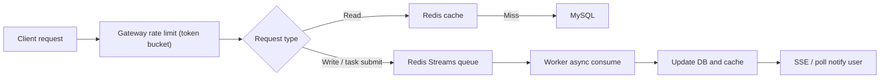
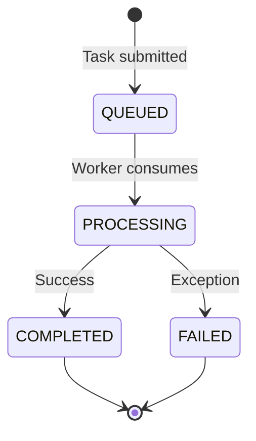
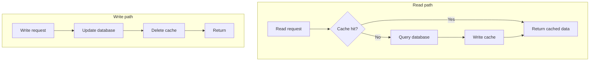
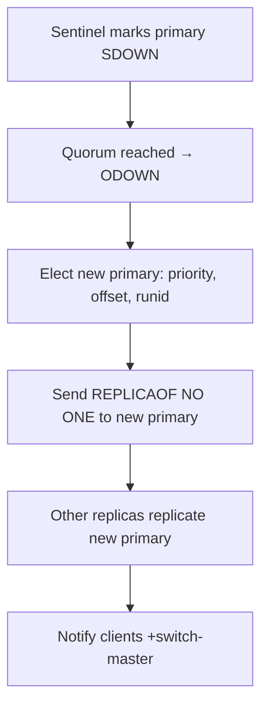

# AI Agent High-Concurrency in Practice: Redis Rate Limiting, Queues, Caching, and High Availability

> AI Agents are shifting from toys to productivity tools—but the moment you ship one to production, high concurrency becomes the first roadblock. Users submit analysis jobs in bulk, call large models concurrently, and poll task progress in real time… a sudden traffic spike is enough to crush the database. Using the evolution of a real Agent project as the thread, this article digs into a full stack of solutions—**gateway rate limiting, Redis Streams async decoupling, cache high availability, distributed locks, and cluster disaster recovery**—with plenty of production-ready Python code so you can finally nail Agent concurrency.

---

## 1. Background: The Real Pain of Agent High Concurrency

Suppose we run an “intelligent document analysis Agent” service: users upload PDFs and ask the Agent to generate summaries, extract key information, and output reports. The feature set is not complex, but problems show up as soon as it goes live:

- At 10 a.m., ops push a campaign link and 20,000 users submit documents at once.
- Request volume hits 30,000 QPS, of which 30% are task submissions (writes) and 70% are progress queries (reads).
- A single MySQL instance can only handle about 3,000 QPS and is immediately overwhelmed, cascading into a service avalanche.

**Root cause**: the database is the most fragile link in the system—you must stop large volumes of traffic from hitting the DB directly. This is identical to classic backend concurrency problems; the “object” just happens to be Agent tasks. What we need is an architecture of **layered interception, async peak shaving, and read/write separation**.

The overall approach looks like this:



Next we implement this layer by layer.

---

## 2. Layer One: Gateway Rate Limiting—Token Bucket from Principle to Code

### 1. Why a token bucket instead of a leaky bucket or sliding window?

- **Leaky bucket**: forces constant-rate processing and cannot absorb bursts. In Agent scenarios, users may flood in instantly—you need to allow some burst.
- **Sliding window**: simple to implement, but boundary bursts are hard to control, and precision is weaker than a token bucket.
- **Token bucket**: generates tokens at a constant rate; bucket capacity allows limited bursts while smoothing traffic. The best choice for gateway-level limiting.

### 2. Token bucket core idea and Redis + Lua implementation

A token bucket has two parts:

- **Token bucket**: fixed max capacity (e.g. 1,000 tokens).
- **Token generator**: pours tokens into the bucket at a fixed rate (e.g. 500 per second); discards when full.

When a request hits the gateway, it must take one token from the bucket. If it gets one, it proceeds; otherwise it is degraded.

**Production-grade implementation: Redis + Lua for atomicity**

```lua
-- ratelimit.lua
local key = KEYS[1]              -- 限流Key，如 "rate_limit:agent_api"
local capacity = tonumber(ARGV[1]) -- 桶容量
local rate = tonumber(ARGV[2])     -- 每秒生成令牌数
local now = tonumber(ARGV[3])      -- 当前时间戳(毫秒)
local requested = tonumber(ARGV[4])-- 请求令牌数，通常为1

-- 获取上次填充时间和当前令牌数
local bucket = redis.call("hmget", key, "tokens", "last_time")
local tokens = tonumber(bucket[1])
local last_time = tonumber(bucket[2])

-- 初始化
if tokens == nil then
    tokens = capacity
    last_time = now
end

-- 计算经过时间，补充令牌
local elapsed = math.max(now - last_time, 0)
local new_tokens = math.floor(elapsed * rate / 1000) -- 按毫秒计算
tokens = math.min(capacity, tokens + new_tokens)
last_time = now

-- 判断是否足够
if tokens >= requested then
    tokens = tokens - requested
    redis.call("hmset", key, "tokens", tokens, "last_time", last_time)
    return 1 -- 通过
else
    redis.call("hmset", key, "tokens", tokens, "last_time", last_time)
    return 0 -- 限流
end
```

**Python call example** (with redis-py):

```python
import redis
import time

r = redis.Redis()

def is_limited(key, capacity=1000, rate=500):
    """返回 True 表示被限流，False 表示放行"""
    now = int(time.time() * 1000)
    script = """
    -- 此处插入上面的 Lua 脚本内容 --
    """
    lua_func = r.register_script(script)
    result = lua_func(keys=[key], args=[capacity, rate, now, 1])
    return result == 0   # 0 表示限流
```

In a real gateway layer (e.g. Nginx + OpenResty or a Python middleware), you can integrate the logic above directly.

### 3. What to do after being limited? Three practical degradation strategies

Not getting a token does not mean you should drop the request blindly—choose by business need:

- **Reject with a message**: the gateway returns `429 Too Many Requests`; the frontend shows “System busy, please try again later.” Suitable for non-critical APIs.
- **Enqueue in a priority queue**: serialize request context into a Redis ZSet, with score as priority. Idle Workers pull and execute, returning a “queued” status.
- **Return stale cached data**: for query traffic, return the last cached result (with a longer logical TTL), trading freshness for availability.

In Agent projects we usually combine them: **queue task-submit APIs + serve queries from cache or ask the client to retry**.

---

## 3. Layer Two: Message-Queue Async Decoupling—Why We Insist on Redis Streams

### 1. The hard lessons of Redis List

At first we used `LPUSH` / `RPOP` as a task queue:

```python
# Producer
r.lpush("task_queue", task_json)
# Consumer
task_json = r.rpop("task_queue")   # 消息立即被删除
```

Then a serious incident: the Consumer `RPOP`’d a message and OOM-crashed before processing it—**the message vanished from the List, the task was lost, and user complaints poured in.**

**Redis Streams** appeared and solved this cleanly.

### 2. Three killer features of Redis Streams

#### (1) Consumer groups with automatic load balancing

```python
# 添加消息
r.xadd("mystream", {"task": "report_123", "user_id": "456"})
# 消费者组读取
r.xreadgroup("mygroup", "consumer1", {"mystream": ">"}, count=1)
```

- Multiple Workers join the same consumer group `mygroup`; Streams evenly distributes messages so **each message is consumed by only one Worker**.
- Scale out by adding Workers—no code changes.

#### (2) ACK + timeout reclaim with XCLAIM

After a Worker reads a message from the Stream, the message is not deleted; it enters that consumer’s Pending list. After processing you must ACK explicitly:

```python
r.xack("mystream", "mygroup", msg_id)
```

If a Worker crashes, the message stays Pending. Healthy Workers can periodically scan Pending and claim timed-out messages:

```python
# 查看 pending 列表
pending = r.xpending("mystream", "mygroup")
# 认领超过 60 秒未处理的消息
r.xclaim("mystream", "mygroup", "consumer2", min_idle_time=60000, message_ids=[msg_id])
```

That gives you **zero message loss**—far safer than List.

#### (3) Persistence and replay

Streams data lives in primary/replica Redis and survives restarts. New consumers can read historical messages from `0-0`, which helps backfill after failures.

### 3. Full Python implementation of Agent task state flow



Assume the Agent processes a document-analysis task. The full flow:

**API service submits a task** (FastAPI example):

```python
import uuid
import redis

r = redis.Redis(decode_responses=True)

async def submit_task(file_url: str):
    task_id = uuid.uuid4().hex
    # 写入 Streams
    r.xadd("agent:tasks", {"taskId": task_id, "fileUrl": file_url})
    # 初始化状态 Hash
    r.hset(f"task:status:{task_id}", mapping={"status": "QUEUED"})
    return {"task_id": task_id}
```

**Worker consumes tasks**:

```python
import redis
from redis.exceptions import ResponseError

r = redis.Redis(decode_responses=True)

# 创建消费者组（只需运行一次）
try:
    r.xgroup_create("agent:tasks", "group_agent", id="0", mkstream=True)
except ResponseError as e:
    if "BUSYGROUP" in str(e):
        pass

def process_message(msg_id, msg_data):
    task_id = msg_data["taskId"]
    # 更新状态为 PROCESSING
    r.hset(f"task:status:{task_id}", "status", "PROCESSING")
    try:
        # ---------- 执行 Agent 逻辑 ----------
        # 例如：调用大模型、生成报告等
        # do_agent_work(msg_data["fileUrl"])
        # ---------- 完成 ----------
        # 写 DB、回写缓存等操作...
        r.hset(f"task:status:{task_id}", "status", "COMPLETED")
    except Exception:
        r.hset(f"task:status:{task_id}", "status", "FAILED")
    finally:
        # 确认消息
        r.xack("agent:tasks", "group_agent", msg_id)

# 持续消费
while True:
    try:
        records = r.xreadgroup(
            "group_agent", "worker1",
            streams={"agent:tasks": ">"},
            count=1, block=2000
        )
        for stream_name, messages in records:
            for msg_id, msg_data in messages:
                process_message(msg_id, msg_data)
    except Exception as e:
        # 记录异常，继续循环
        print(f"Worker error: {e}")
```

**Frontend status**: poll the Hash `task:status:{task_id}`, or push via SSE long-lived connections (mentioned later).

### 4. Reads and writes must be separated

The system has both upload/submit (writes) and status/history queries (reads). You must not shove every request into the message queue—query latency would be unacceptable. Therefore:

- **Reads**: query Redis cache directly (task-status Hash, hot String data); rarely penetrate to the DB.
- **Writes**: rate limit → Streams queue → Worker async processing.

---

## 4. Layer Three: Redis Cache—Absorbing 90% of Reads

### 1. Read/write flow under Cache-Aside



“Delete cache after write” aims for eventual consistency and avoids dirty cache under concurrent writes. Updating the cache can overwrite with stale values, so **delete is the safer choice**.

### 2. Deep solutions for the three classic cache problems

#### (1) Cache penetration

Attackers query non-existent data such as `taskId=-1`. Neither cache nor DB has it, so many requests punch through to the DB.

**Python mitigations**:

- **Bloom filter**: use `pybloom-live` or Redis `BF.RESERVE` (requires RedisBloom).

  ```python
  from pybloom_live import BloomFilter
  bf = BloomFilter(capacity=1000000, error_rate=0.001)
  # 初始化：将所有已有 task_id 加入布隆
  for task_id in existing_ids:
      bf.add(task_id)
  
  def query_task(task_id):
      if task_id not in bf:
          return None   # 直接拒绝
      # 继续后续缓存/DB 查询...
  ```

- **Cache nulls with short TTL**: for missing IDs, cache a `null` value with a 30-second expiry.

  ```python
  data = r.get(f"task:{task_id}")
  if data == "NULL":
      return None
  if data is None:
      db_data = db.query(task_id)
      if db_data is None:
          r.setex(f"task:{task_id}", 30, "NULL")
          return None
      r.setex(f"task:{task_id}", 3600, json.dumps(db_data))
      return db_data
  return json.loads(data)
  ```

#### (2) Cache breakdown (hot key expiry)

A hot key expires and a flood of requests hits the DB at once.

**Python — mutex load** (simple distributed lock with redis-py):

```python
import redis
import time
import uuid

r = redis.Redis(decode_responses=True)

def get_task_result(task_id: str):
    # 1. 查缓存
    cache = r.get(f"task:{task_id}")
    if cache:
        return json.loads(cache)
    
    lock_key = f"lock:task:{task_id}"
    lock_value = uuid.uuid4().hex
    # 2. 尝试加锁（SET NX EX）
    acquired = r.set(lock_key, lock_value, nx=True, ex=10)
    if acquired:
        try:
            # 双重检查
            cache = r.get(f"task:{task_id}")
            if cache:
                return json.loads(cache)
            # 查 DB
            db_data = db.query(task_id)
            if db_data:
                r.setex(f"task:{task_id}", 3600, json.dumps(db_data))
            return db_data
        finally:
            # Lua 解锁
            unlock_script = """
            if redis.call("get", KEYS[1]) == ARGV[1] then
                return redis.call("del", KEYS[1])
            else
                return 0
            end
            """
            unlock = r.register_script(unlock_script)
            unlock(keys=[lock_key], args=[lock_value])
    else:
        # 未获取锁，等待一小段时间后重试或返回旧值
        time.sleep(0.05)
        return get_task_result(task_id)  # 简单重试
```

- **Logical expiry**: attach a logical TTL to the cached value. On read, if expired, return the stale data first, then asynchronously load from DB and refill the cache. Implement with `threading.Thread` or `asyncio`.

#### (3) Cache avalanche

Many keys expire together, or the Redis cluster goes down.

- **Add jitter to TTL**:

  ```python
  import random
  expire = 3600 + random.randint(0, 300)  # 3600~3900 秒
  r.setex(key, expire, value)
  ```

- **Multi-level cache**: local `cachetools`/LRU + remote Redis so not every request hits Redis.
- **Redis HA cluster** (next chapter): primary/replica + Sentinel so Redis itself stays up.

### 3. Discovering hot data and never-expire handling

For extremely hot Agent base config (model params, prompt templates), you can:

- **Skip TTL** and let a background job (e.g. APScheduler) refresh the cache every 5 minutes.
- Use `redis-cli --hotkeys` to find hot keys, combine with logical expiry so updates do not instantly break through.

---

## 5. Distributed Locks and Watchdog: Idempotency and Mutual Exclusion

### 1. Why do Agents need distributed locks?

In the queue, Streams consumer groups ensure one message goes to one consumer—but **manual retries, duplicate frontend submits, and scheduled compensation** can still run the same business action twice. For example, creating the same task record twice. You need a distributed lock for idempotency.

### 2. Correct Redis distributed lock pattern (Python)

```python
import uuid
import redis

r = redis.Redis(decode_responses=True)

def acquire_lock(lock_name, expire_sec=30):
    lock_key = f"lock:{lock_name}"
    lock_val = uuid.uuid4().hex
    acquired = r.set(lock_key, lock_val, nx=True, ex=expire_sec)
    if acquired:
        return lock_val
    return None

def release_lock(lock_name, lock_val):
    lock_key = f"lock:{lock_name}"
    unlock_script = """
    if redis.call("get", KEYS[1]) == ARGV[1] then
        return redis.call("del", KEYS[1])
    else
        return 0
    end
    """
    unlock = r.register_script(unlock_script)
    unlock(keys=[lock_key], args=[lock_val])
```

You must check the value in Lua before deleting, so you do not unlock someone else’s lock.

### 3. Watchdog mechanism (Python)

If business work exceeds the lock TTL (e.g. 30 seconds), the lock auto-releases and another thread may acquire it. A watchdog renews the lease on a timer:

```python
import threading

class RedisLockWithWatchdog:
    def __init__(self, r, lock_name, expire=30):
        self.r = r
        self.lock_key = f"lock:{lock_name}"
        self.lock_val = uuid.uuid4().hex
        self.expire = expire
        self._running = False
        self._watchdog_thread = None

    def acquire(self, blocking=True, timeout=None):
        # 简化版：只非阻塞尝试一次
        acquired = self.r.set(self.lock_key, self.lock_val, nx=True, ex=self.expire)
        if acquired:
            self._start_watchdog()
            return True
        return False

    def _start_watchdog(self):
        self._running = True
        self._watchdog_thread = threading.Thread(target=self._renew, daemon=True)
        self._watchdog_thread.start()

    def _renew(self):
        while self._running:
            # 每隔 expire/3 秒续期一次
            time.sleep(self.expire / 3)
            # 检查锁是否仍被自己持有
            current_val = self.r.get(self.lock_key)
            if current_val == self.lock_val:
                self.r.expire(self.lock_key, self.expire)
            else:
                break  # 锁已经被释放或过期

    def release(self):
        self._running = False
        # Lua 解锁
        script = """
        if redis.call("get", KEYS[1]) == ARGV[1] then
            return redis.call("del", KEYS[1])
        else
            return 0
        end
        """
        unlock = self.r.register_script(script)
        unlock(keys=[self.lock_key], args=[self.lock_val])
```

For long Agent jobs (LLM inference longer than 30 seconds), this matters a lot. In production you can also use `python-redis-lock`, which already implements similar renewal.

---

## 6. Redis HA Cluster: Primary/Replica + Sentinel Explained

### 1. Recommended topology: one primary, two replicas + three Sentinels

Enough for small/medium Agent projects—data volume is modest; the focus is availability.

- **Primary**: all writes.
- **Replicas**: async replication; share reads. Load-balance with round-robin, weights (favor replicas), or nearest access.
- **Sentinel cluster**: at least three instances for monitoring, notification, and automatic failover.

### 2. Connecting from a Python client via Sentinel

```python
from redis.sentinel import Sentinel

sentinel = Sentinel([('sentinel1', 26379), ('sentinel2', 26379), ('sentinel3', 26379)],
                    socket_timeout=0.1)
# 获取主节点连接（写）
master = sentinel.master_for('mymaster', socket_timeout=0.1, decode_responses=True)
# 获取从节点连接（读）
slave = sentinel.slave_for('mymaster', socket_timeout=0.1, decode_responses=True)

# 写操作使用 master
master.set("key", "value")
# 读操作使用 slave
value = slave.get("key")
```

When the primary dies and Sentinels finish failover, `master_for` reconnects to the new primary—no app restart required.

### 3. How Sentinels decide the primary is down

- **Subjective down (SDOWN)**: each Sentinel PINGs the primary every second. If there is no valid reply within `down-after-milliseconds` (default 30s), it marks subjective down.
- **Objective down (ODOWN)**: that Sentinel asks peers whether they also believe the primary is down. When votes ≥ `quorum` (usually `sentinel_count/2+1`, e.g. 2), the primary is objectively down and failover starts.

### 4. Full failover process

1. **Elect a new primary**



**Election priority**: among replicas, Sentinels pick a new primary by:

   - smallest `replica-priority` (lower = higher priority)
   - largest replication offset (freshest data)
   - lexicographically smallest `runid`

2. **Switch**: Sentinel sends `REPLICAOF NO ONE` to the chosen replica, promoting it to primary.
3. **Resync**: other replicas replicate the new primary.
4. **Notify clients**: publish new primary info on Pub/Sub channel `+switch-master`; Python’s `Sentinel` client handles this automatically.

The whole process usually finishes within about 10 seconds, greatly improving Redis availability.

### 5. Three ways to handle primary/replica lag

Async replication means brief inconsistency—reads from a replica may see stale data.

- **Force read primary**: after a write, strongly consistent reads go to the primary.
- **Delayed double-delete**: after a write, delete the cache again ~500 ms later so replicas have time to sync.

  ```python
  import threading
  def update_and_delete_cache(task_id, new_data):
      r.delete(f"task:{task_id}")          # 第一次删除
      db.update(task_id, new_data)
      # 延迟 0.5 秒第二次删除（异步）
      threading.Timer(0.5, lambda: r.delete(f"task:{task_id}")).start()
  ```

- **Logical expiry compatibility**: allow temporary stale reads; async refresh ensures eventual consistency.

---

## 7. Final Approach to Cache–MySQL Consistency

### 1. Why delete the cache instead of updating it?

Updating the cache has concurrency hazards: two writes update the DB in order A→B, but if cache updates reverse to B→A, dirty data can stick forever. **Deleting the cache** is a stateless operation—the next read refills with the latest data.

### 2. Hardening classic Cache-Aside

#### (1) Delayed double-delete (primary/replica lag)

Python example already given above—no need to repeat.

#### (2) Subscribe to MySQL binlog and update cache asynchronously

Use **Python-MySQL-Replication** or **Canal (Java) + Kafka** to listen for binlog changes, then delete/update Redis.

```python
# 示例：使用 pymysqlreplication 监听 binlog
from pymysqlreplication import BinLogStreamReader
from pymysqlreplication.row_event import WriteRowsEvent, UpdateRowsEvent, DeleteRowsEvent

stream = BinLogStreamReader(connection_settings={"host": "127.0.0.1", "port": 3306, ...},
                            server_id=100, only_events=[WriteRowsEvent, ...])
for binlogevent in stream:
    for row in binlogevent.rows:
        if isinstance(binlogevent, DeleteRowsEvent):
            # 删除对应缓存
            r.delete(f"task:{row['values']['id']}")
        # ... 处理其他事件
```

#### (3) Distributed transactions

When strong consistency is mandatory, you can bring in Saga- or TCC-based frameworks (e.g. Seata for Python or a custom stack)—but the overhead is high and usually not recommended for high-speed cache paths.

---

## 8. Shipping Agent High Concurrency: End-to-End Python Skeleton

Putting the pieces together, a FastAPI + Redis Agent concurrency skeleton looks like this.

**API service (`main.py`)**:

```python
import uuid
import json
import redis
from fastapi import FastAPI, HTTPException
from pydantic import BaseModel

app = FastAPI()
r = redis.Redis(decode_responses=True)

# 布隆过滤器（伪代码，实际需初始化）
# bf = BloomFilter(...)

class TaskReq(BaseModel):
    file_url: str

@app.post("/agent/task")
async def submit_task(req: TaskReq):
    # 1. 限流（可在此处调用前面实现的 is_limited 函数）
    # if is_limited("agent_submit", 1000, 500):
    #     raise HTTPException(status_code=429, detail="系统繁忙，请稍后重试")
    
    task_id = uuid.uuid4().hex
    # 写入 Streams
    r.xadd("agent:tasks", {"taskId": task_id, "fileUrl": req.file_url})
    r.hset(f"task:status:{task_id}", mapping={"status": "QUEUED"})
    return {"task_id": task_id}

@app.get("/agent/task/{task_id}")
async def query_task(task_id: str):
    # 布隆过滤拦截不存在 ID（可选）
    # if task_id not in bf:
    #     raise HTTPException(status_code=404, detail="任务不存在")
    
    # 查缓存
    status = r.hgetall(f"task:status:{task_id}")
    if status:
        return status
    
    # 缓存击穿保护：互斥锁回填
    lock_key = f"lock:task_query:{task_id}"
    lock_val = uuid.uuid4().hex
    acquired = r.set(lock_key, lock_val, nx=True, ex=5)
    if acquired:
        try:
            status = r.hgetall(f"task:status:{task_id}")
            if status:
                return status
            # 查 DB（示例使用 MySQL 或 PostgreSQL）
            # db_data = await db.fetch_one(...)
            # if db_data:
            #     r.hset(f"task:status:{task_id}", mapping=dict(db_data))
            #     return db_data
            # 缓存空值防穿透
            r.setex(f"task:null:{task_id}", 30, "NULL")
            raise HTTPException(status_code=404, detail="任务不存在")
        finally:
            # Lua 解锁
            unlock_script = """
            if redis.call("get", KEYS[1]) == ARGV[1] then
                return redis.call("del", KEYS[1])
            else
                return 0
            end
            """
            unlock = r.register_script(unlock_script)
            unlock(keys=[lock_key], args=[lock_val])
    else:
        # 未获取锁，稍后重试或返回旧数据
        raise HTTPException(status_code=202, detail="数据加载中，请稍后")
```

**Worker consumer (`worker.py`)**, deployable as multiple processes:

```python
import redis
from redis.exceptions import ResponseError
import time

r = redis.Redis(decode_responses=True)

try:
    r.xgroup_create("agent:tasks", "group_agent", id="0", mkstream=True)
except ResponseError as e:
    if "BUSYGROUP" not in str(e):
        raise

def handle_task(msg_id, data):
    task_id = data["taskId"]
    r.hset(f"task:status:{task_id}", "status", "PROCESSING")
    try:
        # Agent 核心逻辑：文件分析、大模型调用等
        # result = analyze_document(data["fileUrl"])
        time.sleep(2)  # 模拟耗时
        # 处理完成，更新 DB 和缓存
        r.hset(f"task:status:{task_id}", mapping={"status": "COMPLETED", "result": "..."})
    except Exception as e:
        r.hset(f"task:status:{task_id}", "status", "FAILED")
    finally:
        r.xack("agent:tasks", "group_agent", msg_id)

while True:
    try:
        streams = r.xreadgroup("group_agent", f"worker-{os.getpid()}",
                               {"agent:tasks": ">"}, count=1, block=2000)
        for stream, messages in streams:
            for msg_id, data in messages:
                handle_task(msg_id, data)
    except Exception as e:
        print(f"Error: {e}")
        time.sleep(1)
```

---

## 9. Summary and Interview Focus

The core idea of Agent high concurrency is **layered interception, async decoupling, read/write separation, and cache in front**. From gateway token buckets to message queues to cache and distributed locks, every component forms a sturdy funnel so only a tiny fraction of requests ever reach the database.

**Common interview points:**

- Token bucket principles; how to implement atomic rate limiting with Redis + Lua (Python calls).
- Advantages of Redis Streams over List; how consumer groups and `XCLAIM` prevent message loss.
- Solutions (and Python code) for cache penetration, breakdown, and avalanche.
- Correct distributed-lock patterns; why Lua unlock is required; watchdog renewal.
- Sentinel election flow; handling primary/replica lag (delayed double-delete, etc.).
- Under Cache-Aside, why delete the cache instead of updating it.

Master these and you will be comfortable whether you are shipping Python Agent projects or other high-concurrency systems. If this article helped, feel free to like, bookmark, and share so more developers see it. Questions welcome in the comments—let’s level up together.
