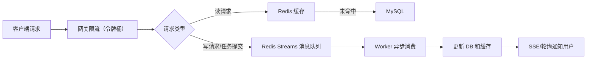
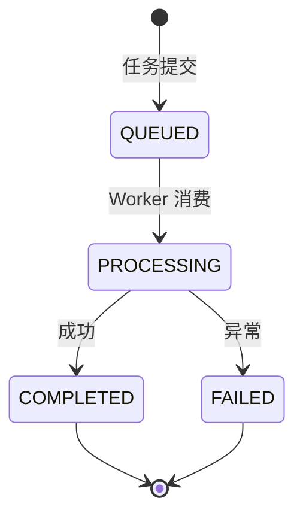
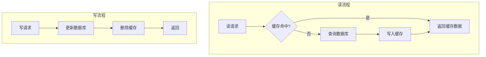
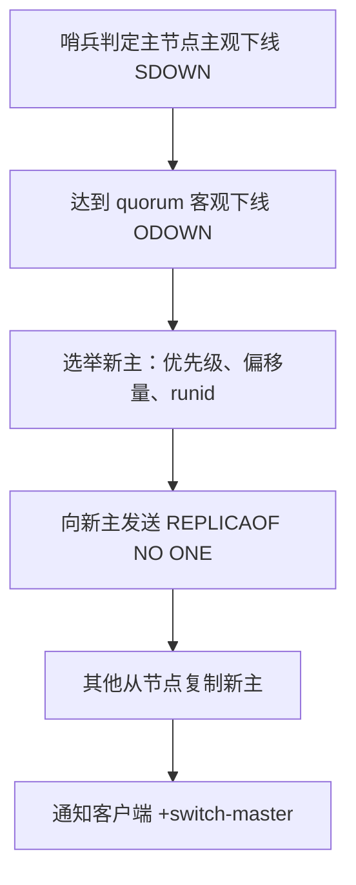
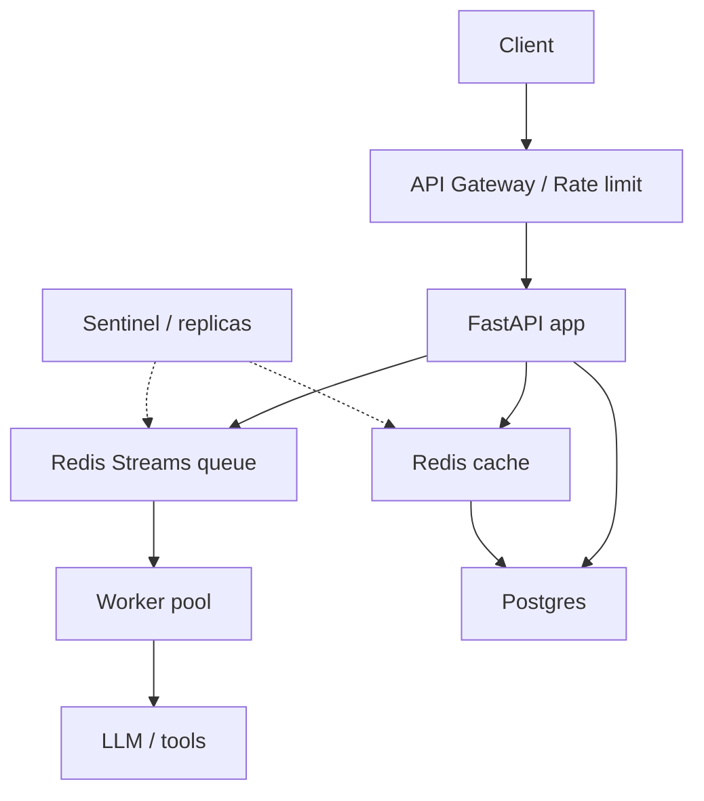

---

title: "AI Agent 高并发实战：Redis 限流、队列、缓存与高可用全栈方案"
titleEn: "AI Agent High-Concurrency in Practice: Redis Rate Limiting, Queues, Caching, and High Availability"
description: "高并发是 Agent 上线的第一道坎。本文从网关限流、Redis Streams 异步解耦、缓存穿透/击穿/雪崩防护，到分布式锁与哨兵高可用，全链路拆解一套可落地的 Python 高并发架构方案。"
descriptionEn: "High concurrency is the first hurdle when shipping an Agent. This article walks through gateway rate limiting, Redis Streams async decoupling, cache penetration/breakdown/avalanche defenses, distributed locks, and Sentinel HA—an end-to-end, production-ready Python architecture."
pubDate: 2026-08-12
---
# AI Agent 高并发实战：Redis 限流、队列、缓存与高可用全栈方案
> AI Agent 正逐渐从玩具变成生产力，但当你把 Agent 部署到生产环境时，高并发会成为第一个拦路虎。用户批量提交分析任务、并发调用大模型、实时查询任务进度……瞬间的高流量足以打垮数据库。本文将以一个真实 Agent 项目的演进为线索，深入剖析**网关限流、Redis Streams 异步解耦、缓存高可用、分布式锁与集群容灾**的全套解决方案，并给出大量可直接落地的 Python 代码，帮你彻底搞定 Agent 高并发。

---

## 一、背景：Agent 高并发的真正痛点

假设我们有一个「智能文档分析 Agent」服务，用户可以上传 PDF，要求 Agent 生成摘要、提取关键信息并输出报告。功能并不复杂，但一上线就遇到问题：

- 上午 10 点，运营推了一条活动链接，瞬间 2 万用户同时提交文档。
- 每秒请求量达到 3 万 QPS，其中 30% 是任务提交（写），70% 是查询任务进度（读）。
- 数据库 MySQL 单机只能扛 3000 QPS，直接被冲垮，导致服务雪崩。

**问题根源**：数据库是系统中最脆弱的一环，必须阻止大量请求直接打到 DB。这和传统后端高并发完全一致，只是“对象”变成了 Agent 任务。因此，我们需要的是一套**分层拦截、异步削峰、读写分离**的架构。

整体思路如下：



接下来，我们逐层深入实现。

---

## 二、第一层：网关限流——令牌桶算法从原理到代码

### 1. 为什么是令牌桶，而不是漏桶或滑动窗口？
- **漏桶**：强制匀速处理，无法应对突发流量。Agent 场景下，用户可能瞬间涌入，需要允许一定突发。
- **滑动窗口**：实现简单，但边界突发流量不好控制，限流精度不如令牌桶。
- **令牌桶**：恒定速率生成令牌，桶容量允许一定突发，同时平滑流量。网关层限流的最佳选择。

### 2. 令牌桶核心原理与 Redis + Lua 实现
令牌桶由两部分组成：
- **令牌桶**：固定最大容量（如 1000 个令牌）。
- **令牌生成器**：以固定速率（如每秒 500 个）向桶中投令牌，桶满则丢弃。

每个请求到达网关时，必须从桶中取一个令牌，取到则放行，否则降级处理。

**生产级实现：基于 Redis + Lua 保证原子性**
```lua
-- ratelimit.lua
local key = KEYS[1]              -- 限流Key，如 "rate_limit:agent_api"
local capacity = tonumber(ARGV[1]) -- 桶容量
local rate = tonumber(ARGV[2])     -- 每秒生成令牌数
local now = tonumber(ARGV[3])      -- 当前时间戳(毫秒)
local requested = tonumber(ARGV[4])-- 请求令牌数，通常为1

-- 获取上次填充时间和当前令牌数
local bucket = redis.call("hmget", key, "tokens", "last_time")
local tokens = tonumber(bucket[1])
local last_time = tonumber(bucket[2])

-- 初始化
if tokens == nil then
    tokens = capacity
    last_time = now
end

-- 计算经过时间，补充令牌
local elapsed = math.max(now - last_time, 0)
local new_tokens = math.floor(elapsed * rate / 1000) -- 按毫秒计算
tokens = math.min(capacity, tokens + new_tokens)
last_time = now

-- 判断是否足够
if tokens >= requested then
    tokens = tokens - requested
    redis.call("hmset", key, "tokens", tokens, "last_time", last_time)
    return 1 -- 通过
else
    redis.call("hmset", key, "tokens", tokens, "last_time", last_time)
    return 0 -- 限流
end
```

**Python 调用示例**（使用 redis-py）：
```python
import redis
import time

r = redis.Redis()

def is_limited(key, capacity=1000, rate=500):
    """返回 True 表示被限流，False 表示放行"""
    now = int(time.time() * 1000)
    script = """
    -- 此处插入上面的 Lua 脚本内容 --
    """
    lua_func = r.register_script(script)
    result = lua_func(keys=[key], args=[capacity, rate, now, 1])
    return result == 0   # 0 表示限流
```
在实际网关层（如 Nginx + OpenResty 或 Python 中间件），你可以直接集成上述逻辑。

### 3. 被限流后怎么做？三种实用降级策略
请求拿不到令牌不能粗暴丢弃，要根据业务选择策略：

- **拒绝并提示**：网关直接返回 429 Too Many Requests，前端展示“系统繁忙，请稍后重试”。适合非关键接口。
- **放入优先级队列排队**：将请求上下文序列化后放入一个 Redis ZSet 队列，score 为优先级。Worker 空闲时主动拉取执行，并返回“排队中”状态。
- **返回缓存旧数据**：对于查询类请求，可返回上次缓存的结果（设置较长的逻辑过期时间），牺牲实时性保证可用性。

在 Agent 项目中，我们通常组合使用：**任务提交接口排队 + 查询接口走缓存或提示重试**。

---

## 三、第二层：消息队列异步解耦——为什么坚决选择 Redis Streams

### 1. 从 Redis List 的血泪史说起
最初，我们用 `LPUSH` / `RPOP` 实现任务队列：
```python
# Producer
r.lpush("task_queue", task_json)
# Consumer
task_json = r.rpop("task_queue")   # 消息立即被删除
```
但发生过严重事故：Consumer 刚 RPOP 拿到消息，还没来得及处理就 OOM 崩溃，**这条消息直接从 List 中消失，任务丢失，用户投诉不断。**

**Redis Streams** 的出现，完美解决了这个问题。

### 2. Redis Streams 三大杀手锏
#### (1) 消费者组，自动负载均衡
```python
# 添加消息
r.xadd("mystream", {"task": "report_123", "user_id": "456"})
# 消费者组读取
r.xreadgroup("mygroup", "consumer1", {"mystream": ">"}, count=1)
```
- 多个 Worker 加入同一消费者组 `mygroup`，Streams 自动将消息均匀分发给组内消费者，**每个消息只被一个 Worker 消费**。
- 扩容时直接加 Worker，无需改代码。

#### (2) 消息确认 ACK + 超时重派 XCLAIM
Worker 从 Stream 拿到消息后，消息并不会被删除，而是进入该消费者的 Pending 列表。处理完成后必须显式确认：
```python
r.xack("mystream", "mygroup", msg_id)
```
如果 Worker 崩溃，消息会一直留在 Pending 中。此时其他健康 Worker 可以定期扫描 Pending 并认领超时消息：
```python
# 查看 pending 列表
pending = r.xpending("mystream", "mygroup")
# 认领超过 60 秒未处理的消息
r.xclaim("mystream", "mygroup", "consumer2", min_idle_time=60000, message_ids=[msg_id])
```
这样就做到了**消息零丢失**，比 List 安全得多。

#### (3) 消息持久化与回溯
Streams 数据存储在主从 Redis 中，即使 Redis 重启也不会丢失。新加入的消费者可以从头开始读取历史消息 `0-0`，便于故障后补数据。

### 3. Agent 任务状态流转的完整 Python 实现




    假设 Agent 处理一个文档分析任务，完整流程如下：

**API 服务提交任务**（FastAPI 示例）：
```python
import uuid
import redis

r = redis.Redis(decode_responses=True)

async def submit_task(file_url: str):
    task_id = uuid.uuid4().hex
    # 写入 Streams
    r.xadd("agent:tasks", {"taskId": task_id, "fileUrl": file_url})
    # 初始化状态 Hash
    r.hset(f"task:status:{task_id}", mapping={"status": "QUEUED"})
    return {"task_id": task_id}
```

**Worker 消费任务**：
```python
import redis
from redis.exceptions import ResponseError

r = redis.Redis(decode_responses=True)

# 创建消费者组（只需运行一次）
try:
    r.xgroup_create("agent:tasks", "group_agent", id="0", mkstream=True)
except ResponseError as e:
    if "BUSYGROUP" in str(e):
        pass

def process_message(msg_id, msg_data):
    task_id = msg_data["taskId"]
    # 更新状态为 PROCESSING
    r.hset(f"task:status:{task_id}", "status", "PROCESSING")
    try:
        # ---------- 执行 Agent 逻辑 ----------
        # 例如：调用大模型、生成报告等
        # do_agent_work(msg_data["fileUrl"])
        # ---------- 完成 ----------
        # 写 DB、回写缓存等操作...
        r.hset(f"task:status:{task_id}", "status", "COMPLETED")
    except Exception:
        r.hset(f"task:status:{task_id}", "status", "FAILED")
    finally:
        # 确认消息
        r.xack("agent:tasks", "group_agent", msg_id)

# 持续消费
while True:
    try:
        records = r.xreadgroup(
            "group_agent", "worker1",
            streams={"agent:tasks": ">"},
            count=1, block=2000
        )
        for stream_name, messages in records:
            for msg_id, msg_data in messages:
                process_message(msg_id, msg_data)
    except Exception as e:
        # 记录异常，继续循环
        print(f"Worker error: {e}")
```

**前端获取状态**：可轮询 `task:status:{task_id}` 这个 Hash，或通过 SSE 长连接推送（后面会提到）。

### 4. 读写必须分离
我们的系统既有上传任务（写），也有查询任务状态和历史记录（读）。绝不能把所有请求都塞进消息队列，否则查询延迟会不可接受。因此：
- **读请求**：直接查询 Redis 缓存（任务状态 Hash、热点数据 String），极少穿透到 DB。
- **写请求**：走限流 → Streams 队列 → Worker 异步处理。

---

## 四、第三层：Redis 缓存——抗住 90% 的读请求

### 1. Cache-Aside 模式下的读写流程


    “写后删缓存”是为了保证数据最终一致，避免并发写导致脏缓存。更新缓存反而可能覆盖旧数据，所以**删除是更安全的选择**。

### 2. 缓存三大难题的深度解决方案
#### (1) 缓存穿透
攻击者查询不存在的数据，如 `taskId=-1`，缓存和 DB 都没有，导致大量请求穿透到 DB。

**Python 解决方案**：
- **布隆过滤器**：使用 `pybloom-live` 或 Redis 的 `BF.RESERVE`（需 RedisBloom 模块）。
  ```python
  from pybloom_live import BloomFilter
  bf = BloomFilter(capacity=1000000, error_rate=0.001)
  # 初始化：将所有已有 task_id 加入布隆
  for task_id in existing_ids:
      bf.add(task_id)
  
  def query_task(task_id):
      if task_id not in bf:
          return None   # 直接拒绝
      # 继续后续缓存/DB 查询...
  ```
- **缓存空值并短过期**：对于不存在的 id，缓存一个 `null` 值，过期时间 30 秒。
  ```python
  data = r.get(f"task:{task_id}")
  if data == "NULL":
      return None
  if data is None:
      db_data = db.query(task_id)
      if db_data is None:
          r.setex(f"task:{task_id}", 30, "NULL")
          return None
      r.setex(f"task:{task_id}", 3600, json.dumps(db_data))
      return db_data
  return json.loads(data)
  ```

#### (2) 缓存击穿（热点数据过期）
某个热点 Key 恰好过期，瞬间大量请求打到 DB。

**Python 实现 - 互斥锁加载**（利用 redis-py 简单实现分布式锁）：
```python
import redis
import time
import uuid

r = redis.Redis(decode_responses=True)

def get_task_result(task_id: str):
    # 1. 查缓存
    cache = r.get(f"task:{task_id}")
    if cache:
        return json.loads(cache)
    
    lock_key = f"lock:task:{task_id}"
    lock_value = uuid.uuid4().hex
    # 2. 尝试加锁（SET NX EX）
    acquired = r.set(lock_key, lock_value, nx=True, ex=10)
    if acquired:
        try:
            # 双重检查
            cache = r.get(f"task:{task_id}")
            if cache:
                return json.loads(cache)
            # 查 DB
            db_data = db.query(task_id)
            if db_data:
                r.setex(f"task:{task_id}", 3600, json.dumps(db_data))
            return db_data
        finally:
            # Lua 解锁
            unlock_script = """
            if redis.call("get", KEYS[1]) == ARGV[1] then
                return redis.call("del", KEYS[1])
            else
                return 0
            end
            """
            unlock = r.register_script(unlock_script)
            unlock(keys=[lock_key], args=[lock_value])
    else:
        # 未获取锁，等待一小段时间后重试或返回旧值
        time.sleep(0.05)
        return get_task_result(task_id)  # 简单重试
```

- **逻辑过期**：缓存 value 附带一个逻辑过期时间。读取时发现过期，先返回旧数据，然后异步开启一个线程去查 DB 并回填缓存。可用 `threading.Thread` 或 `asyncio` 实现。

#### (3) 缓存雪崩
大量 Key 同时过期，或 Redis 集群宕机。
- **过期时间加随机值**：
  ```python
  import random
  expire = 3600 + random.randint(0, 300)  # 3600~3900 秒
  r.setex(key, expire, value)
  ```
- **多级缓存**：本地 cachetools/LRU + 远程 Redis，避免全部请求打到 Redis。
- **Redis 高可用集群**（见下章），主从 + 哨兵，保证 Redis 本身不挂。

### 3. 热点数据发现与永不过期处理
对于访问量极大的 Agent 基础配置（如模型参数、提示词模板），可以：
- **不设过期时间**，由后台定时任务（如 APScheduler）每 5 分钟主动更新缓存。
- 使用 `redis-cli --hotkeys` 找出热点 Key，配合逻辑过期方案，即使更新也不会瞬间击穿。

---

## 五、分布式锁与看门狗：解决任务幂等和互斥

### 1. 为什么 Agent 需要分布式锁？
在消息队列中，虽然 Streams 消费者组保证一条消息只被一个消费者拿到，但如果存在**人为重试、前端重复提交、定时补偿任务**，就可能出现同一个业务操作被重复执行。例如重复创建相同的任务记录，此时必须用分布式锁保证幂等。

### 2. 基于 Redis 的分布式锁正确姿势（Python）
```python
import uuid
import redis

r = redis.Redis(decode_responses=True)

def acquire_lock(lock_name, expire_sec=30):
    lock_key = f"lock:{lock_name}"
    lock_val = uuid.uuid4().hex
    acquired = r.set(lock_key, lock_val, nx=True, ex=expire_sec)
    if acquired:
        return lock_val
    return None

def release_lock(lock_name, lock_val):
    lock_key = f"lock:{lock_name}"
    unlock_script = """
    if redis.call("get", KEYS[1]) == ARGV[1] then
        return redis.call("del", KEYS[1])
    else
        return 0
    end
    """
    unlock = r.register_script(unlock_script)
    unlock(keys=[lock_key], args=[lock_val])
```
必须用 Lua 脚本校验 value 再删除，防止误删别人的锁。

### 3. 看门狗 Watchdog 机制（Python 实现）
如果业务执行超过锁的过期时间（如 30 秒），锁自动释放，其他线程可能加锁导致并发问题。看门狗定时续期：
```python
import threading

class RedisLockWithWatchdog:
    def __init__(self, r, lock_name, expire=30):
        self.r = r
        self.lock_key = f"lock:{lock_name}"
        self.lock_val = uuid.uuid4().hex
        self.expire = expire
        self._running = False
        self._watchdog_thread = None

    def acquire(self, blocking=True, timeout=None):
        # 简化版：只非阻塞尝试一次
        acquired = self.r.set(self.lock_key, self.lock_val, nx=True, ex=self.expire)
        if acquired:
            self._start_watchdog()
            return True
        return False

    def _start_watchdog(self):
        self._running = True
        self._watchdog_thread = threading.Thread(target=self._renew, daemon=True)
        self._watchdog_thread.start()

    def _renew(self):
        while self._running:
            # 每隔 expire/3 秒续期一次
            time.sleep(self.expire / 3)
            # 检查锁是否仍被自己持有
            current_val = self.r.get(self.lock_key)
            if current_val == self.lock_val:
                self.r.expire(self.lock_key, self.expire)
            else:
                break  # 锁已经被释放或过期

    def release(self):
        self._running = False
        # Lua 解锁
        script = """
        if redis.call("get", KEYS[1]) == ARGV[1] then
            return redis.call("del", KEYS[1])
        else
            return 0
        end
        """
        unlock = self.r.register_script(script)
        unlock(keys=[self.lock_key], args=[self.lock_val])
```

在长耗时的 Agent 任务（如大模型推理超过 30 秒）中，这个机制极为重要。生产环境也可以直接使用 `python-redis-lock` 库，它内部已经实现了类似的续期逻辑。

---

## 六、Redis 高可用集群：主从 + 哨兵全解析

### 1. 推荐架构：一主两从 + 三哨兵
中小规模 agent 项目使用此架构足以，数据量不大，重点是高可用。
- **主节点**：负责所有写操作。
- **从节点**：异步复制主数据，分担读请求。负载均衡策略可设为轮询、权重（从节点权重高）或就近访问。
- **哨兵集群**：至少 3 个实例，负责监控、通知和自动故障转移。

### 2. Python 客户端如何连接哨兵
```python
from redis.sentinel import Sentinel

sentinel = Sentinel([('sentinel1', 26379), ('sentinel2', 26379), ('sentinel3', 26379)],
                    socket_timeout=0.1)
# 获取主节点连接（写）
master = sentinel.master_for('mymaster', socket_timeout=0.1, decode_responses=True)
# 获取从节点连接（读）
slave = sentinel.slave_for('mymaster', socket_timeout=0.1, decode_responses=True)

# 写操作使用 master
master.set("key", "value")
# 读操作使用 slave
value = slave.get("key")
```
当主节点宕机，哨兵完成故障转移后，`master_for` 会自动连接到新主，应用无需重启。

### 3. 哨兵如何判定主节点宕机？
- **主观下线（SDOWN）**：每个哨兵每 1 秒向主节点发送 PING。若 ``down-after-milliseconds`` (默认 30 秒) 内无有效回复，标记为主观下线。
- **客观下线（ODOWN）**：该哨兵向其他哨兵询问是否也认为主已下线。当投票数 ≥ ``quorum``（一般设为 ``哨兵数/2+1``，如 2），主节点被判定为客观下线，触发故障转移。

### 4. 故障转移全过程
1. **选举新主**



    **：哨兵在所有从节点中按以下优先级选出新主：
   - `replica-priority` 最小（值越小优先级越高）
   - 复制偏移量最大（数据最新）
   - `runid` 字典序最小
2. **执行切换**：哨兵向选中的从节点发送 `REPLICAOF NO ONE`，提升为主。
3. **重新同步**：其他从节点改为复制新主。
4. **通知客户端**：通过 Pub/Sub 频道 `+switch-master` 发送新主信息，Python 的 `Sentinel` 客户端会自动处理。

整个过程通常可在 10 秒内完成，极大提高了 Redis 的可用性。

### 5. 主从延迟问题的三种应对
异步复制导致主从数据短暂不一致，读从库可能读到旧数据。
- **强制读主**：写操作后立即要求强一致的读走主库。
- **延迟双删**：写操作后延迟 500 ms 再删一次缓存，确保从库同步完成。
  ```python
  import threading
  def update_and_delete_cache(task_id, new_data):
      r.delete(f"task:{task_id}")          # 第一次删除
      db.update(task_id, new_data)
      # 延迟 0.5 秒第二次删除（异步）
      threading.Timer(0.5, lambda: r.delete(f"task:{task_id}")).start()
  ```
- **逻辑过期兼容**：允许暂时读到旧数据，异步刷新保证最终一致。

---

## 七、缓存与 MySQL 数据一致性的最终方案

### 1. 为什么是删除缓存而不是更新？
更新缓存存在并发问题：两个写请求先后更新 DB，如果更新缓存的操作顺序反了，就会造成脏数据永久存在。而**删除缓存**，下次读请求自然会回填最新数据，是一种无状态操作。

### 2. 经典 Cache-Aside 的增强措施
#### (1) 延迟双删（解决主从延迟）
前面已给出 Python 示例，不再重复。

#### (2) 订阅 MySQL Binlog 异步更新缓存
使用 **Python-MySQL-Replication** 或 **Canal（Java）+ kafka** 等方式监听 binlog 变更，解析后自动删除/更新 Redis。
```python
# 示例：使用 pymysqlreplication 监听 binlog
from pymysqlreplication import BinLogStreamReader
from pymysqlreplication.row_event import WriteRowsEvent, UpdateRowsEvent, DeleteRowsEvent

stream = BinLogStreamReader(connection_settings={"host": "127.0.0.1", "port": 3306, ...},
                            server_id=100, only_events=[WriteRowsEvent, ...])
for binlogevent in stream:
    for row in binlogevent.rows:
        if isinstance(binlogevent, DeleteRowsEvent):
            # 删除对应缓存
            r.delete(f"task:{row['values']['id']}")
        # ... 处理其他事件
```

#### (3) 分布式事务
当必须强一致时，可引入基于 Saga 或 TCC 的分布式事务框架（如 Seata Python 版或自研），但性能开销大，一般不推荐在高速缓存场景使用。

---

## 八、Agent 高并发落地方案：全链路 Python 代码骨架

综合以上技术，一个基于 FastAPI + Redis 的 Agent 高并发项目骨架如下。

**API 服务（main.py）**：
```python
import uuid
import json
import redis
from fastapi import FastAPI, HTTPException
from pydantic import BaseModel

app = FastAPI()
r = redis.Redis(decode_responses=True)

# 布隆过滤器（伪代码，实际需初始化）
# bf = BloomFilter(...)

class TaskReq(BaseModel):
    file_url: str

@app.post("/agent/task")
async def submit_task(req: TaskReq):
    # 1. 限流（可在此处调用前面实现的 is_limited 函数）
    # if is_limited("agent_submit", 1000, 500):
    #     raise HTTPException(status_code=429, detail="系统繁忙，请稍后重试")
    
    task_id = uuid.uuid4().hex
    # 写入 Streams
    r.xadd("agent:tasks", {"taskId": task_id, "fileUrl": req.file_url})
    r.hset(f"task:status:{task_id}", mapping={"status": "QUEUED"})
    return {"task_id": task_id}

@app.get("/agent/task/{task_id}")
async def query_task(task_id: str):
    # 布隆过滤拦截不存在 ID（可选）
    # if task_id not in bf:
    #     raise HTTPException(status_code=404, detail="任务不存在")
    
    # 查缓存
    status = r.hgetall(f"task:status:{task_id}")
    if status:
        return status
    
    # 缓存击穿保护：互斥锁回填
    lock_key = f"lock:task_query:{task_id}"
    lock_val = uuid.uuid4().hex
    acquired = r.set(lock_key, lock_val, nx=True, ex=5)
    if acquired:
        try:
            status = r.hgetall(f"task:status:{task_id}")
            if status:
                return status
            # 查 DB（示例使用 MySQL 或 PostgreSQL）
            # db_data = await db.fetch_one(...)
            # if db_data:
            #     r.hset(f"task:status:{task_id}", mapping=dict(db_data))
            #     return db_data
            # 缓存空值防穿透
            r.setex(f"task:null:{task_id}", 30, "NULL")
            raise HTTPException(status_code=404, detail="任务不存在")
        finally:
            # Lua 解锁
            unlock_script = """
            if redis.call("get", KEYS[1]) == ARGV[1] then
                return redis.call("del", KEYS[1])
            else
                return 0
            end
            """
            unlock = r.register_script(unlock_script)
            unlock(keys=[lock_key], args=[lock_val])
    else:
        # 未获取锁，稍后重试或返回旧数据
        raise HTTPException(status_code=202, detail="数据加载中，请稍后")
```

**Worker 消费脚本（worker.py）**，可独立部署多进程：
```python
import redis
from redis.exceptions import ResponseError
import time

r = redis.Redis(decode_responses=True)

try:
    r.xgroup_create("agent:tasks", "group_agent", id="0", mkstream=True)
except ResponseError as e:
    if "BUSYGROUP" not in str(e):
        raise

def handle_task(msg_id, data):
    task_id = data["taskId"]
    r.hset(f"task:status:{task_id}", "status", "PROCESSING")
    try:
        # Agent 核心逻辑：文件分析、大模型调用等
        # result = analyze_document(data["fileUrl"])
        time.sleep(2)  # 模拟耗时
        # 处理完成，更新 DB 和缓存
        r.hset(f"task:status:{task_id}", mapping={"status": "COMPLETED", "result": "..."})
    except Exception as e:
        r.hset(f"task:status:{task_id}", "status", "FAILED")
    finally:
        r.xack("agent:tasks", "group_agent", msg_id)

while True:
    try:
        streams = r.xreadgroup("group_agent", f"worker-{os.getpid()}",
                               {"agent:tasks": ">"}, count=1, block=2000)
        for stream, messages in streams:
            for msg_id, data in messages:
                handle_task(msg_id, data)
    except Exception as e:
        print(f"Error: {e}")
        time.sleep(1)
```

---

## 九、总结与面试重点

Agent 高并发的核心思路就是**分层拦截、异步解耦、读写分离、缓存前置**。从网关令牌桶到消息队列再到缓存和分布式锁，所有组件形成了一个坚固的漏斗，最终只有极少请求落在数据库上。

**面试常考要点：**
- 令牌桶算法原理，如何用 Redis+Lua 实现原子限流（Python 调用）。
- Redis Streams 相比 List 的优势，消费者组和 `XCLAIM` 如何保证消息不丢。
- 缓存穿透、击穿、雪崩的解决方案及 Python 代码实现。
- 分布式锁的正确姿势，为什么需要 Lua 解锁，看门狗的续期实现。
- 哨兵选举流程，主从延迟的处理方法（延迟双删等）。
- Cache-Aside 模式下为什么删除缓存而不是更新。

掌握了这些，无论是 Python 生态的 Agent 项目还是其他高并发系统，你都能游刃有余。如果本文对你有帮助，欢迎点赞、收藏、转发，让更多开发者看到。有任何疑问欢迎评论区交流，我们一起进步！


<!-- i18n:en -->


# AI Agent High-Concurrency Practice: Redis Rate Limiting, Queues, Caching, and HA

> Agents graduate from toys to productivity tools—then concurrency hits first. Burst uploads, parallel LLM calls, and progress polling can melt a naive DB. This article walks a real Agent evolution: **gateway limits, Redis Streams decoupling, cache defenses, distributed locks, and Sentinel HA**, with Python-oriented patterns you can ship.

## 1. The Real Pain

Imagine a document-analysis Agent: upload PDF → summarize → extract → report. Feature-simple, load-fragile. Synchronous LLM work on the request thread collapses under concurrent users.

## 2. Architecture Outline



Split **accept work** from **do work**. The API enqueues; workers consume.

## 3. Gateway Rate Limiting

Protect with token bucket / sliding window (Redis). Return 429 early. Separate limits for anonymous vs authenticated, and for expensive endpoints (upload/analyze) vs cheap status polls.

## 4. Redis Streams as the Async Backbone

Use Streams (or equivalent) for durable task queues: consumer groups, ACK, pending entries, retry/DLQ. Persist task state (`queued → running → succeeded/failed`) so clients poll safely.

Keep the Python snippets in the Chinese section as the canonical copy-paste code—only the surrounding explanation is localized here.

## 5. Cache: Penetration, Breakdown, Avalanche

- **Penetration**: missing keys hammer DB → bloom filter / cached nulls  
- **Breakdown**: hot key expiry → mutex / logical expire  
- **Avalanche**: many keys expire together → jitter TTLs  

Cache task results and idempotent LLM responses carefully (key by content hash + model/version).

## 6. Distributed Locks

Serialize critical sections (e.g. “finalize report once”) with Redis locks + fencing tokens; always set TTL; prefer libraries that renew safely.

## 7. High Availability

Sentinel or managed Redis for failover; connection pools with timeouts; graceful worker shutdown (stop claiming new messages, finish in-flight). Multi-AZ for Postgres; backpressure when queue depth spikes.

## 8. Closing

High concurrency for Agents is systems work: **admit, queue, cache, lock, fail over**. Redis is often the hub—not because it is trendy, but because it can be the rate limiter, queue, cache, and lock service in one operable plane.

> Mermaid labels above are English. All executable code blocks remain identical to the Chinese article for fidelity.

<!-- en-code-sync -->

## Appendix: Code & diagrams from the article

The English narrative above is localized for the language toggle. The following fenced blocks are copied unchanged from the Chinese version so you can still copy-paste every command and snippet while reading in English.


```lua
-- ratelimit.lua
local key = KEYS[1]              -- 限流Key，如 "rate_limit:agent_api"
local capacity = tonumber(ARGV[1]) -- 桶容量
local rate = tonumber(ARGV[2])     -- 每秒生成令牌数
local now = tonumber(ARGV[3])      -- 当前时间戳(毫秒)
local requested = tonumber(ARGV[4])-- 请求令牌数，通常为1

-- 获取上次填充时间和当前令牌数
local bucket = redis.call("hmget", key, "tokens", "last_time")
local tokens = tonumber(bucket[1])
local last_time = tonumber(bucket[2])

-- 初始化
if tokens == nil then
    tokens = capacity
    last_time = now
end

-- 计算经过时间，补充令牌
local elapsed = math.max(now - last_time, 0)
local new_tokens = math.floor(elapsed * rate / 1000) -- 按毫秒计算
tokens = math.min(capacity, tokens + new_tokens)
last_time = now

-- 判断是否足够
if tokens >= requested then
    tokens = tokens - requested
    redis.call("hmset", key, "tokens", tokens, "last_time", last_time)
    return 1 -- 通过
else
    redis.call("hmset", key, "tokens", tokens, "last_time", last_time)
    return 0 -- 限流
end
```
```python
import redis
import time

r = redis.Redis()

def is_limited(key, capacity=1000, rate=500):
    """返回 True 表示被限流，False 表示放行"""
    now = int(time.time() * 1000)
    script = """
    -- 此处插入上面的 Lua 脚本内容 --
    """
    lua_func = r.register_script(script)
    result = lua_func(keys=[key], args=[capacity, rate, now, 1])
    return result == 0   # 0 表示限流
```
```python
# Producer
r.lpush("task_queue", task_json)
# Consumer
task_json = r.rpop("task_queue")   # 消息立即被删除
```
```python
# 添加消息
r.xadd("mystream", {"task": "report_123", "user_id": "456"})
# 消费者组读取
r.xreadgroup("mygroup", "consumer1", {"mystream": ">"}, count=1)
```
```python
r.xack("mystream", "mygroup", msg_id)
```
```python
# 查看 pending 列表
pending = r.xpending("mystream", "mygroup")
# 认领超过 60 秒未处理的消息
r.xclaim("mystream", "mygroup", "consumer2", min_idle_time=60000, message_ids=[msg_id])
```

```python
import uuid
import redis

r = redis.Redis(decode_responses=True)

async def submit_task(file_url: str):
    task_id = uuid.uuid4().hex
    # 写入 Streams
    r.xadd("agent:tasks", {"taskId": task_id, "fileUrl": file_url})
    # 初始化状态 Hash
    r.hset(f"task:status:{task_id}", mapping={"status": "QUEUED"})
    return {"task_id": task_id}
```
```python
import redis
from redis.exceptions import ResponseError

r = redis.Redis(decode_responses=True)

# 创建消费者组（只需运行一次）
try:
    r.xgroup_create("agent:tasks", "group_agent", id="0", mkstream=True)
except ResponseError as e:
    if "BUSYGROUP" in str(e):
        pass

def process_message(msg_id, msg_data):
    task_id = msg_data["taskId"]
    # 更新状态为 PROCESSING
    r.hset(f"task:status:{task_id}", "status", "PROCESSING")
    try:
        # ---------- 执行 Agent 逻辑 ----------
        # 例如：调用大模型、生成报告等
        # do_agent_work(msg_data["fileUrl"])
        # ---------- 完成 ----------
        # 写 DB、回写缓存等操作...
        r.hset(f"task:status:{task_id}", "status", "COMPLETED")
    except Exception:
        r.hset(f"task:status:{task_id}", "status", "FAILED")
    finally:
        # 确认消息
        r.xack("agent:tasks", "group_agent", msg_id)

# 持续消费
while True:
    try:
        records = r.xreadgroup(
            "group_agent", "worker1",
            streams={"agent:tasks": ">"},
            count=1, block=2000
        )
        for stream_name, messages in records:
            for msg_id, msg_data in messages:
                process_message(msg_id, msg_data)
    except Exception as e:
        # 记录异常，继续循环
        print(f"Worker error: {e}")
```

```python
  from pybloom_live import BloomFilter
  bf = BloomFilter(capacity=1000000, error_rate=0.001)
  # 初始化：将所有已有 task_id 加入布隆
  for task_id in existing_ids:
      bf.add(task_id)
  
  def query_task(task_id):
      if task_id not in bf:
          return None   # 直接拒绝
      # 继续后续缓存/DB 查询...
  ```
```python
  data = r.get(f"task:{task_id}")
  if data == "NULL":
      return None
  if data is None:
      db_data = db.query(task_id)
      if db_data is None:
          r.setex(f"task:{task_id}", 30, "NULL")
          return None
      r.setex(f"task:{task_id}", 3600, json.dumps(db_data))
      return db_data
  return json.loads(data)
  ```
```python
import redis
import time
import uuid

r = redis.Redis(decode_responses=True)

def get_task_result(task_id: str):
    # 1. 查缓存
    cache = r.get(f"task:{task_id}")
    if cache:
        return json.loads(cache)
    
    lock_key = f"lock:task:{task_id}"
    lock_value = uuid.uuid4().hex
    # 2. 尝试加锁（SET NX EX）
    acquired = r.set(lock_key, lock_value, nx=True, ex=10)
    if acquired:
        try:
            # 双重检查
            cache = r.get(f"task:{task_id}")
            if cache:
                return json.loads(cache)
            # 查 DB
            db_data = db.query(task_id)
            if db_data:
                r.setex(f"task:{task_id}", 3600, json.dumps(db_data))
            return db_data
        finally:
            # Lua 解锁
            unlock_script = """
            if redis.call("get", KEYS[1]) == ARGV[1] then
                return redis.call("del", KEYS[1])
            else
                return 0
            end
            """
            unlock = r.register_script(unlock_script)
            unlock(keys=[lock_key], args=[lock_value])
    else:
        # 未获取锁，等待一小段时间后重试或返回旧值
        time.sleep(0.05)
        return get_task_result(task_id)  # 简单重试
```
```python
  import random
  expire = 3600 + random.randint(0, 300)  # 3600~3900 秒
  r.setex(key, expire, value)
  ```
```python
import uuid
import redis

r = redis.Redis(decode_responses=True)

def acquire_lock(lock_name, expire_sec=30):
    lock_key = f"lock:{lock_name}"
    lock_val = uuid.uuid4().hex
    acquired = r.set(lock_key, lock_val, nx=True, ex=expire_sec)
    if acquired:
        return lock_val
    return None

def release_lock(lock_name, lock_val):
    lock_key = f"lock:{lock_name}"
    unlock_script = """
    if redis.call("get", KEYS[1]) == ARGV[1] then
        return redis.call("del", KEYS[1])
    else
        return 0
    end
    """
    unlock = r.register_script(unlock_script)
    unlock(keys=[lock_key], args=[lock_val])
```
```python
import threading

class RedisLockWithWatchdog:
    def __init__(self, r, lock_name, expire=30):
        self.r = r
        self.lock_key = f"lock:{lock_name}"
        self.lock_val = uuid.uuid4().hex
        self.expire = expire
        self._running = False
        self._watchdog_thread = None

    def acquire(self, blocking=True, timeout=None):
        # 简化版：只非阻塞尝试一次
        acquired = self.r.set(self.lock_key, self.lock_val, nx=True, ex=self.expire)
        if acquired:
            self._start_watchdog()
            return True
        return False

    def _start_watchdog(self):
        self._running = True
        self._watchdog_thread = threading.Thread(target=self._renew, daemon=True)
        self._watchdog_thread.start()

    def _renew(self):
        while self._running:
            # 每隔 expire/3 秒续期一次
            time.sleep(self.expire / 3)
            # 检查锁是否仍被自己持有
            current_val = self.r.get(self.lock_key)
            if current_val == self.lock_val:
                self.r.expire(self.lock_key, self.expire)
            else:
                break  # 锁已经被释放或过期

    def release(self):
        self._running = False
        # Lua 解锁
        script = """
        if redis.call("get", KEYS[1]) == ARGV[1] then
            return redis.call("del", KEYS[1])
        else
            return 0
        end
        """
        unlock = self.r.register_script(script)
        unlock(keys=[self.lock_key], args=[self.lock_val])
```
```python
from redis.sentinel import Sentinel

sentinel = Sentinel([('sentinel1', 26379), ('sentinel2', 26379), ('sentinel3', 26379)],
                    socket_timeout=0.1)
# 获取主节点连接（写）
master = sentinel.master_for('mymaster', socket_timeout=0.1, decode_responses=True)
# 获取从节点连接（读）
slave = sentinel.slave_for('mymaster', socket_timeout=0.1, decode_responses=True)

# 写操作使用 master
master.set("key", "value")
# 读操作使用 slave
value = slave.get("key")
```

```python
  import threading
  def update_and_delete_cache(task_id, new_data):
      r.delete(f"task:{task_id}")          # 第一次删除
      db.update(task_id, new_data)
      # 延迟 0.5 秒第二次删除（异步）
      threading.Timer(0.5, lambda: r.delete(f"task:{task_id}")).start()
  ```
```python
# 示例：使用 pymysqlreplication 监听 binlog
from pymysqlreplication import BinLogStreamReader
from pymysqlreplication.row_event import WriteRowsEvent, UpdateRowsEvent, DeleteRowsEvent

stream = BinLogStreamReader(connection_settings={"host": "127.0.0.1", "port": 3306, ...},
                            server_id=100, only_events=[WriteRowsEvent, ...])
for binlogevent in stream:
    for row in binlogevent.rows:
        if isinstance(binlogevent, DeleteRowsEvent):
            # 删除对应缓存
            r.delete(f"task:{row['values']['id']}")
        # ... 处理其他事件
```
```python
import uuid
import json
import redis
from fastapi import FastAPI, HTTPException
from pydantic import BaseModel

app = FastAPI()
r = redis.Redis(decode_responses=True)

# 布隆过滤器（伪代码，实际需初始化）
# bf = BloomFilter(...)

class TaskReq(BaseModel):
    file_url: str

@app.post("/agent/task")
async def submit_task(req: TaskReq):
    # 1. 限流（可在此处调用前面实现的 is_limited 函数）
    # if is_limited("agent_submit", 1000, 500):
    #     raise HTTPException(status_code=429, detail="系统繁忙，请稍后重试")
    
    task_id = uuid.uuid4().hex
    # 写入 Streams
    r.xadd("agent:tasks", {"taskId": task_id, "fileUrl": req.file_url})
    r.hset(f"task:status:{task_id}", mapping={"status": "QUEUED"})
    return {"task_id": task_id}

@app.get("/agent/task/{task_id}")
async def query_task(task_id: str):
    # 布隆过滤拦截不存在 ID（可选）
    # if task_id not in bf:
    #     raise HTTPException(status_code=404, detail="任务不存在")
    
    # 查缓存
    status = r.hgetall(f"task:status:{task_id}")
    if status:
        return status
    
    # 缓存击穿保护：互斥锁回填
    lock_key = f"lock:task_query:{task_id}"
    lock_val = uuid.uuid4().hex
    acquired = r.set(lock_key, lock_val, nx=True, ex=5)
    if acquired:
        try:
            status = r.hgetall(f"task:status:{task_id}")
            if status:
                return status
            # 查 DB（示例使用 MySQL 或 PostgreSQL）
            # db_data = await db.fetch_one(...)
            # if db_data:
            #     r.hset(f"task:status:{task_id}", mapping=dict(db_data))
            #     return db_data
            # 缓存空值防穿透
            r.setex(f"task:null:{task_id}", 30, "NULL")
            raise HTTPException(status_code=404, detail="任务不存在")
        finally:
            # Lua 解锁
            unlock_script = """
            if redis.call("get", KEYS[1]) == ARGV[1] then
                return redis.call("del", KEYS[1])
            else
                return 0
            end
            """
            unlock = r.register_script(unlock_script)
            unlock(keys=[lock_key], args=[lock_val])
    else:
        # 未获取锁，稍后重试或返回旧数据
        raise HTTPException(status_code=202, detail="数据加载中，请稍后")
```
```python
import redis
from redis.exceptions import ResponseError
import time

r = redis.Redis(decode_responses=True)

try:
    r.xgroup_create("agent:tasks", "group_agent", id="0", mkstream=True)
except ResponseError as e:
    if "BUSYGROUP" not in str(e):
        raise

def handle_task(msg_id, data):
    task_id = data["taskId"]
    r.hset(f"task:status:{task_id}", "status", "PROCESSING")
    try:
        # Agent 核心逻辑：文件分析、大模型调用等
        # result = analyze_document(data["fileUrl"])
        time.sleep(2)  # 模拟耗时
        # 处理完成，更新 DB 和缓存
        r.hset(f"task:status:{task_id}", mapping={"status": "COMPLETED", "result": "..."})
    except Exception as e:
        r.hset(f"task:status:{task_id}", "status", "FAILED")
    finally:
        r.xack("agent:tasks", "group_agent", msg_id)

while True:
    try:
        streams = r.xreadgroup("group_agent", f"worker-{os.getpid()}",
                               {"agent:tasks": ">"}, count=1, block=2000)
        for stream, messages in streams:
            for msg_id, data in messages:
                handle_task(msg_id, data)
    except Exception as e:
        print(f"Error: {e}")
        time.sleep(1)
```
