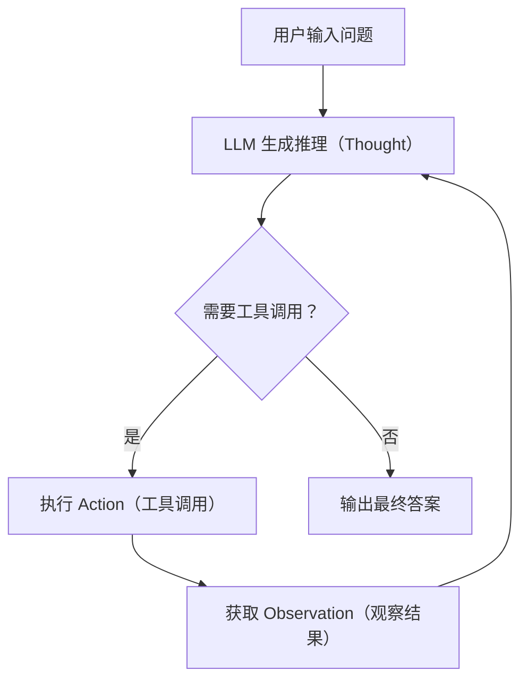
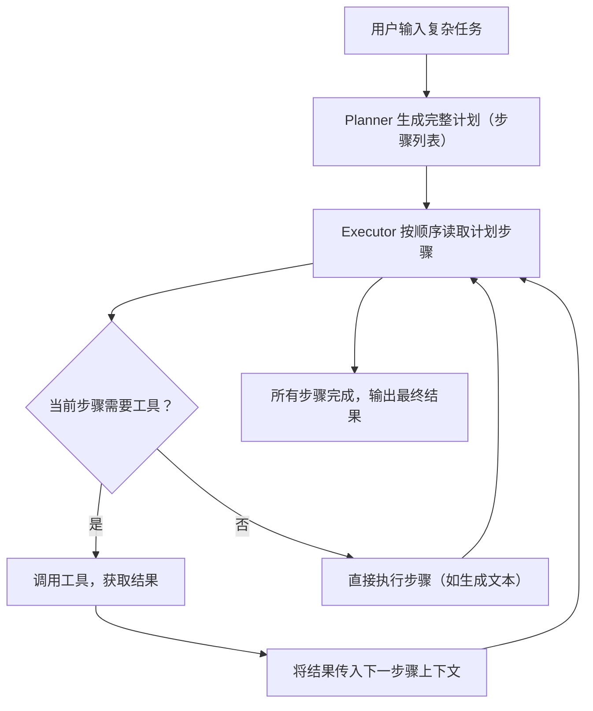
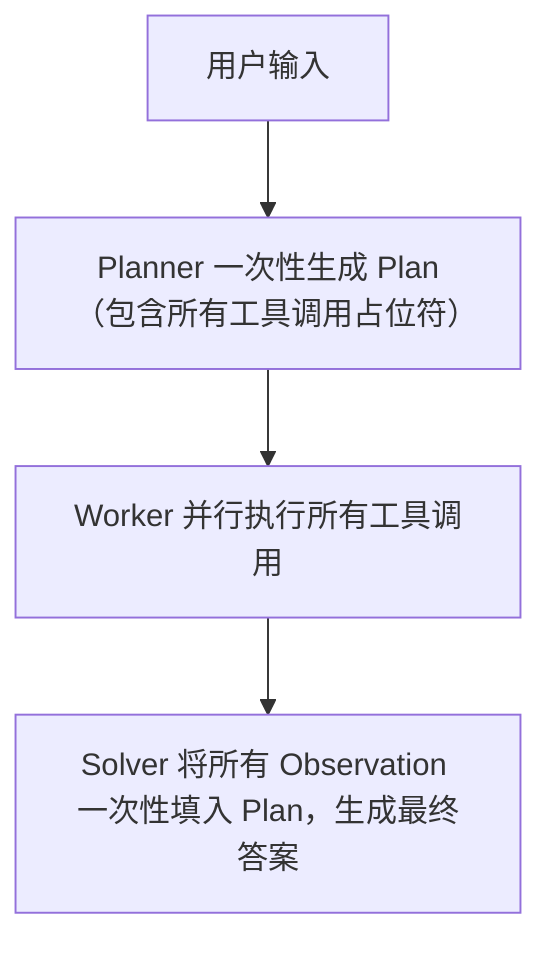
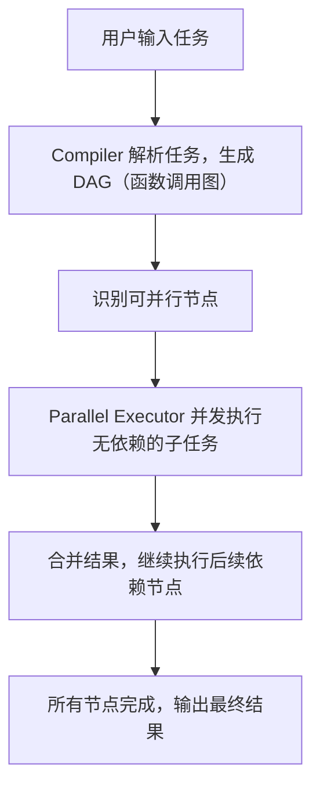
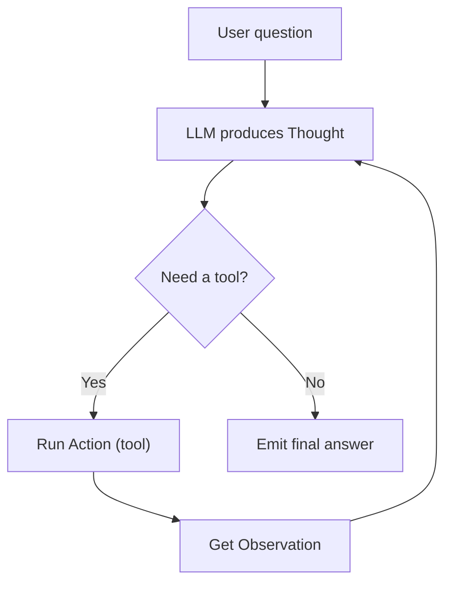
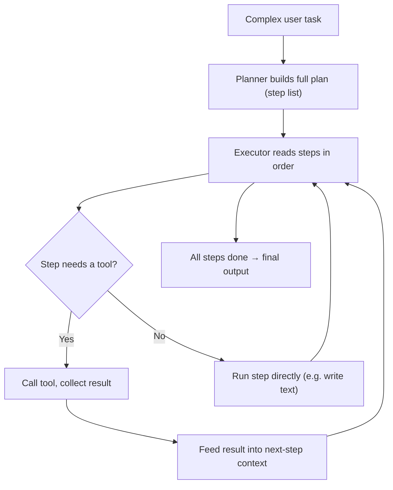
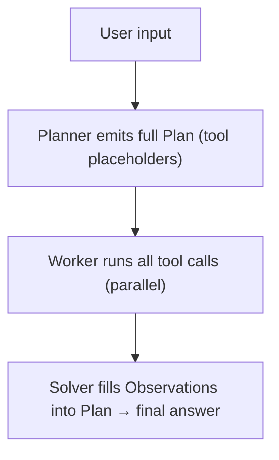
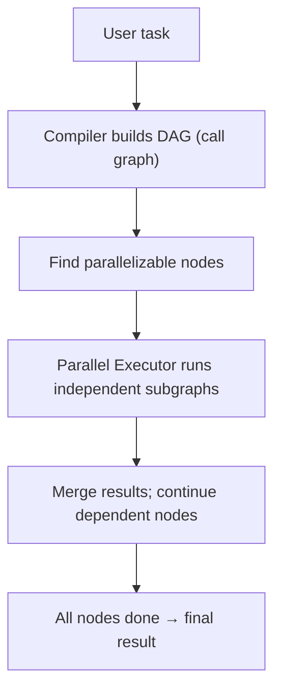

## 1. 引言：Agent 为什么需要范式

在 AI 智能体（Agent）的实际应用中，我们常常面临一个核心难题：**如何让大模型既能“思考”，又能“行动”，还能“高效可靠地拿到结果”**。  
简单地把任务丢给 LLM，让它自由发挥，容易出现思路混乱、重复调用工具、甚至迷失方向的问题。

为此，业界逐步沉淀出四种经典的 Agent 设计范式，它们分别在**推理与行动的平衡**、**计划与执行分离**、**减少交互次数**、**并行任务分解**上给出了优雅的解法。

本文将围绕这四种范式展开，结合流程图、代码示例和对比表格，帮助你真正理解它们的差异与适用场景。

| 范式                 | 核心思想       | 一句话描述                                |
| -------------------- | -------------- | ----------------------------------------- |
| **ReAct**            | 推理与行动交替 | 想一步、做一步，最经典的 Agent 模式       |
| **Plan‑and‑Execute** | 先计划后执行   | 先制定完整计划，再逐步执行，适合复杂任务  |
| **ReWOO**            | 无观察推理     | 一次性规划所有工具调用，减少 LLM 交互次数 |
| **LLM Compiler**     | 并行任务分解   | 将任务并行分解，类似编译器优化执行流程    |

## 2. ReAct：推理与行动交替进行

ReAct（Reasoning + Acting）是 Agent 领域的“开山鼻祖”。它的核心理念是：**每执行一步，都先思考一下当前状态，再决定下一步行动，然后观察结果，继续思考。**  
这种“思考‑行动‑观察”的循环就像人类解决新问题时的习惯——走一步看一步，安全且灵活。

### 2.1 工作流程



### 2.2 代码思想（伪代码）

```python
def react_agent(user_query):
    while True:
        # 1. 推理：让 LLM 根据历史与当前状态生成 Thought 和可能的 Action
        thought, action = llm.generate_thought_and_action(user_query, history)
        if action is None:
            # 没有更多行动，直接输出最终回答
            return thought
        # 2. 行动：执行工具调用
        observation = execute_tool(action)
        # 3. 将观察结果追加到历史中，继续下一轮
        history.append(f"Observation: {observation}")
```

### 2.3 优势与局限

| 优势                                     | 局限                                          |
| ---------------------------------------- | --------------------------------------------- |
| 逻辑清晰，易于调试和追踪                 | 每次工具调用都需要一次 LLM 交互，**延迟较高** |
| 适合探索性任务，能动态调整路径           | 面对步骤固定的任务，显得“过度思考”            |
| 天然支持错误恢复（看到错误后可重新规划） | 长任务容易超出上下文窗口                      |

## 3. Plan‑and‑Execute：先计划，再执行

当任务复杂度上升，例如“帮我写一份关于 X 的调研报告，包括数据收集、分析、可视化”，ReAct 的“走一步看一步”就会显得低效。  
Plan‑and‑Execute 范式借鉴了项目管理的思想：**先让 LLM 生成一个完整的执行计划，再交给一个轻量级的执行器逐步执行**。

### 3.1 工作流程



### 3.2 代码思想

```python
def plan_and_execute_agent(user_query):
    # 第一步：生成计划
    plan = llm.create_plan(user_query)  # 返回一个步骤列表
    context = {}
    for step in plan:
        if step.requires_tool:
            # 执行器调用工具
            result = execute_tool(step.action, context)
            context.update(result)
        else:
            # 执行器直接生成文本或操作
            result = llm.execute_step(step, context)
            context.update(result)
    return context["final_answer"]
```

### 3.3 优势与局限

Plan‑and‑Execute 经典实现中，Planner 与 Executor 可以是同一个模型或不同模型。这种分离让计划本身可被复用、审查，甚至人工干预。

## 4. ReWOO：一次性规划，杜绝冗余交互

ReWOO（Reason Without Observation）的提出者发现，**很多任务中，工具调用并不需要依赖前一步的观察结果**——我们完全可以提前规划好所有工具调用，然后批量执行，最后再统一推理。

这就像你去超市购物，写出购物清单再去买，而不是买一样东西回家看一眼冰箱再出门。

### 4.1 工作流程



### 4.2 代码思想

```python
def rewoo_agent(user_query):
    # 1. Planner 生成计划，里面用特殊符号标记工具调用，如 #E1 = search("xxx")
    plan = llm.generate_plan_with_tool_placeholders(user_query)
    # 2. Worker 解析计划，提取所有工具调用并批量执行
    observations = resolve_all_tools(plan)
    # 3. Solver 将观察结果替换回计划，生成最终回答
    final_answer = llm.generate_final_answer(plan, observations)
    return final_answer
```

### 4.3 为什么 ReWOO 能减少交互次数

ReAct 中，如果要调用 3 个工具，可能需要 3 次 LLM 交互（每步一次）。  
ReWOO 则只需要 **2 次 LLM 交互**：一次生成计划，一次用结果生成最终答案。工具调用本身可以并行进行，大幅降低延迟。

## 5. LLM Compiler：并行任务分解

LLM Compiler 是最为激进的范式，它借鉴了**编译器优化**的思想：将用户任务解析成一个**有向无环图（DAG）**，识别出哪些步骤可以并行执行，然后一次性调度执行。

### 5.1 工作流程



### 5.2 代码思想（简化）

```python
def llm_compiler_agent(user_query):
    # 1. Compiler 生成 DAG
    dag = llm.generate_dag(user_query)  # 节点为函数调用，边为依赖关系
    # 2. 并行执行
    results = parallel_execute(dag)  # 内置依赖分析，自动并发
    # 3. 最终合并
    final_answer = llm.merge_results(results)
    return final_answer
```

### 5.3 与 ReWOO 的区别

ReWOO 虽然可以并行执行工具，但它的计划仍然是**线性列表**，只是工具调用之间没有依赖。  
LLM Compiler 则明确支持**复杂的依赖关系**，例如：`A → B`，`A → C`，`B && C → D`。这种图结构让并行度更高，执行效率也更高。

## 6. 四种范式对比总结

| 范式                 | 核心模式             | LLM 交互次数                 | 并行能力   | 适合场景                 |
| -------------------- | -------------------- | ---------------------------- | ---------- | ------------------------ |
| **ReAct**            | 思考‑行动‑观察循环   | 高（每步一次）               | 无         | 探索性任务、单步决策     |
| **Plan‑and‑Execute** | 先计划后顺序执行     | 中（计划一次，每步可能一次） | 无         | 结构化任务、可审查流程   |
| **ReWOO**            | 一次性规划，批量执行 | 低（2 次）                   | 工具并行   | 工具调用互不依赖的任务   |
| **LLM Compiler**     | DAG 分解，并行调度   | 低（2~3 次）                 | 任务图并行 | 复杂依赖任务、高性能场景 |

### 6.1 选择建议

- 如果你的任务**步骤不确定**，需要根据中间结果动态调整 → **ReAct**
- 任务**步骤明确**，但希望计划可审计、可复用 → **Plan‑and‑Execute**
- 你十分在意**延迟和成本**，且工具调用之间没有依赖 → **ReWOO**
- 你面对的是**超大、复杂、有依赖的批处理任务** → **LLM Compiler**

## 7. 结语

四种范式并非相互排斥，现代 Agent 架构往往将它们组合使用。  
例如，LangChain 的 AgentExecutor 底层就是 ReAct，而 LangGraph 则允许你自由构建 Plan‑and‑Execute 或 LLM Compiler 风格的图。

理解这些范式，不仅能帮你选择合适的框架，更能让你在设计自己的智能体时，**像编译器优化代码一样优化你的 Agent 执行流程**。

<!-- i18n:en -->

## 1. Why Agents Need Paradigms

In real Agent systems the hard question is: **how can a model think, act, and still finish reliably and efficiently?**  
Dumping a free-form task onto an LLM often yields messy reasoning, repeated tool calls, and lost direction.

The industry settled on four classic paradigms that balance **reasoning vs action**, **plan vs execute**, **fewer LLM round-trips**, and **parallel decomposition**.

| Paradigm | Core idea | One-liner |
| --- | --- | --- |
| **ReAct** | Alternate reason and act | Think a step, act a step — the classic Agent loop |
| **Plan-and-Execute** | Plan first, then run | Build a full plan, then execute — great for complex work |
| **ReWOO** | Reason without observation | Plan all tool calls up front — fewer LLM hops |
| **LLM Compiler** | Parallel task graph | Compile a DAG and schedule like a compiler |

## 2. ReAct: Alternate Reasoning and Acting

ReAct (Reasoning + Acting) is the foundational pattern: **after each step, think about state, choose an action, observe, then think again.**  
Think–act–observe mirrors how humans tackle unfamiliar problems—flexible and recoverable.

### 2.1 Flow



### 2.2 Pseudocode

```python
def react_agent(user_query):
    while True:
        # 1. 推理：让 LLM 根据历史与当前状态生成 Thought 和可能的 Action
        thought, action = llm.generate_thought_and_action(user_query, history)
        if action is None:
            # 没有更多行动，直接输出最终回答
            return thought
        # 2. 行动：执行工具调用
        observation = execute_tool(action)
        # 3. 将观察结果追加到历史中，继续下一轮
        history.append(f"Observation: {observation}")
```

### 2.3 Pros & Cons

| Pros | Cons |
| --- | --- |
| Clear logic; easy to debug | One LLM call per tool step → **higher latency** |
| Great for exploration / dynamic paths | Overthinks fixed pipelines |
| Natural error recovery | Long jobs blow the context window |

## 3. Plan-and-Execute: Plan First, Then Run

For multi-stage work (“research report with collect → analyze → visualize”), ReAct’s step-by-step style gets expensive.  
Plan-and-Execute borrows project management: **ask the LLM for a full plan, then let a lighter executor walk it.**

### 3.1 Flow



### 3.2 Pseudocode

```python
def plan_and_execute_agent(user_query):
    # 第一步：生成计划
    plan = llm.create_plan(user_query)  # 返回一个步骤列表
    context = {}
    for step in plan:
        if step.requires_tool:
            # 执行器调用工具
            result = execute_tool(step.action, context)
            context.update(result)
        else:
            # 执行器直接生成文本或操作
            result = llm.execute_step(step, context)
            context.update(result)
    return context["final_answer"]
```

### 3.3 Pros & Cons

Planner and Executor may share a model or use different ones. Separation makes plans reusable, reviewable, and human-editable.

## 4. ReWOO: Plan Once, Cut Redundant Hops

ReWOO (Reason Without Observation) observes that **many tool calls do not depend on prior observations**—so you can plan them all, batch/parallel execute, then reason once.

Like writing a shopping list before entering the store, instead of buying one item, going home, then returning.

### 4.1 Flow



### 4.2 Pseudocode

```python
def rewoo_agent(user_query):
    # 1. Planner 生成计划，里面用特殊符号标记工具调用，如 #E1 = search("xxx")
    plan = llm.generate_plan_with_tool_placeholders(user_query)
    # 2. Worker 解析计划，提取所有工具调用并批量执行
    observations = resolve_all_tools(plan)
    # 3. Solver 将观察结果替换回计划，生成最终回答
    final_answer = llm.generate_final_answer(plan, observations)
    return final_answer
```

### 4.3 Why Fewer LLM Calls

ReAct may need 3 LLM turns for 3 tools.  
ReWOO needs **2**: one plan, one final answer. Tools themselves can run in parallel.

## 5. LLM Compiler: Parallel Task Graphs

LLM Compiler is the aggressive end: treat the task like **compiler IR**—parse into a **DAG**, find parallel nodes, schedule once.

### 5.1 Flow



### 5.2 Pseudocode (simplified)

```python
def llm_compiler_agent(user_query):
    # 1. Compiler 生成 DAG
    dag = llm.generate_dag(user_query)  # 节点为函数调用，边为依赖关系
    # 2. 并行执行
    results = parallel_execute(dag)  # 内置依赖分析，自动并发
    # 3. 最终合并
    final_answer = llm.merge_results(results)
    return final_answer
```

### 5.3 Vs ReWOO

ReWOO can parallelize tools but plans are still a **linear list** of independent calls.  
LLM Compiler models **real dependencies** (`A→B`, `A→C`, `B∧C→D`) for higher parallelism.

## 6. Comparison

| Paradigm | Pattern | LLM hops | Parallelism | Best for |
| --- | --- | --- | --- | --- |
| **ReAct** | Think–act–observe | High (per step) | None | Exploratory / single-step decisions |
| **Plan-and-Execute** | Plan then sequential run | Medium | None | Structured, auditable workflows |
| **ReWOO** | One-shot plan, batch tools | Low (2) | Tool-level | Independent tool calls; latency/cost sensitive |
| **LLM Compiler** | DAG schedule | Low (2–3) | Graph-level | Complex dependencies; high throughput |

### 6.1 Choosing

- Path depends on intermediate results → **ReAct**
- Clear steps, want auditable plans → **Plan-and-Execute**
- Latency/cost first, tools independent → **ReWOO**
- Huge interdependent batch work → **LLM Compiler**

## 7. Closing

These paradigms compose. LangChain’s AgentExecutor is ReAct-shaped; LangGraph lets you build Plan-and-Execute or Compiler-style graphs.

Understanding them helps you pick frameworks—and design Agents the way compilers optimize code: **optimize the execution plan, not just the prompt.**
