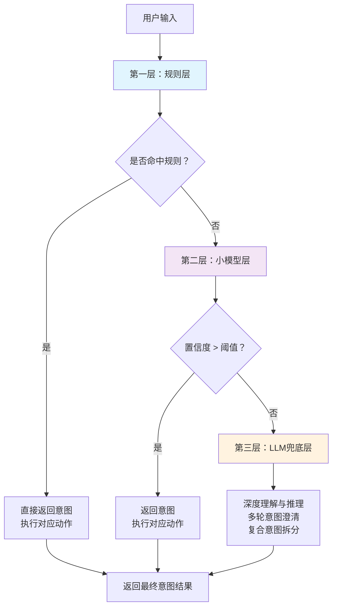
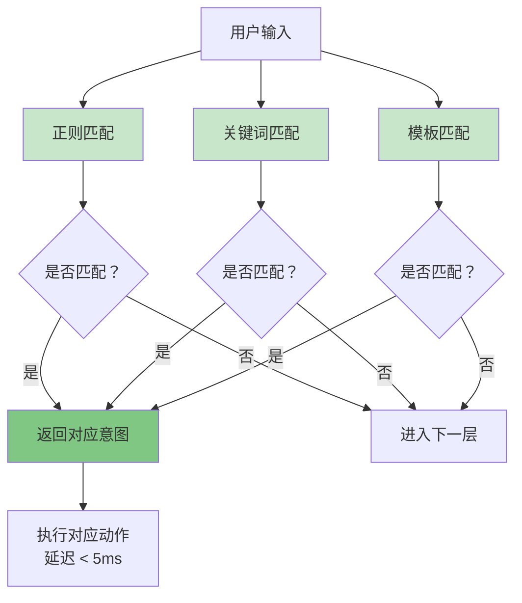
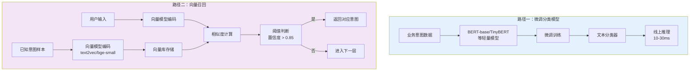
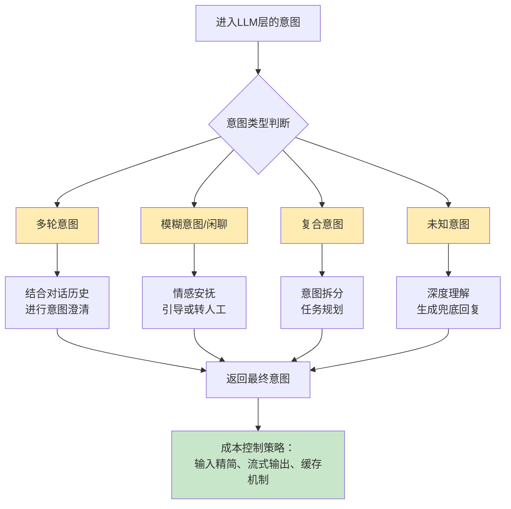

# Agent 意图识别设计：规则+小模型+LLM 三层漏斗，完美平衡速度、成本与智能

> 别再一上来就把所有意图识别都扔给大模型了，一次调用几百毫秒的延迟和高昂的成本，在生产环境根本扛不住。本文分享一种工业级 Agent 意图识别架构：**规则层 → 小模型层 → LLM 兜底层**，让热点意图毫秒级响应，复杂意图才走到大模型，既快又省钱。

---

### 为什么不能让 LLM 包办一切？

很多同学在做 Agent 的时候，习惯把用户输入直接丢给 LLM，写一个巨型 Prompt 让它来判断意图、提取槽位，甚至直接生成最终答案。这种方式在 Demo 里看起来“聪明又省事”，但一到生产环境，问题就暴露得一清二楚：

- **延迟太高**：一次 LLM 推理普遍需要 200~800ms，如果用户的每一句话都要过一次大模型，整个对话的响应时间直接飙到秒级，体验极差。
- **成本压不住**：哪怕使用 GPT-3.5 级别的模型，在 QPS 稍高的场景下，推理费用也会成为一笔不小的开销，更别说 GPT-4 或同等规模的自部署模型。
- **简单问题过度处理**：大量用户问的是“怎么退货”、“查一下订单”、“转人工”这类高频固定问题，答案明确、路径固定，根本用不着 LLM 去“思考”。

因此，一个真正能落地的 Agent 意图识别系统，**必须分层、分级处理意图，让简单的问题在底层就解决掉，只把真正需要“理解”的复杂问题交给 LLM**。

---

### 三层漏斗架构设计


下面是三层漏斗架构的流程图：




我设计并落地了一套 **“三层漏斗”** 意图识别架构，如下图所示（文字描述）：

```
用户输入
   ↓
[ 第一层：规则层 ]  → 命中则直接返回意图/执行动作
   ↓ (未命中)
[ 第二层：小模型层 ] → 命中则返回意图/置信度高的直接执行
   ↓ (未命中/低置信度)
[ 第三层：LLM 兜底层 ] → 复杂推理、多轮意图澄清、未知意图处理
   ↓
返回最终意图结果
```

每一层都在做 **过滤和分流**，越往下计算代价越高，但处理的意图也越来越复杂和模糊。最终目标是：**绝大多数流量在前两层就被消化掉，LLM 只处理长尾的、需要深度理解的 case**。

下面我逐一拆解每一层的设计细节和约束。

---

### 第一层：规则层 —— 快刀斩乱麻


下面是规则层的处理流程图：




规则层是整个系统的“守门员”，它的核心使命是：**用最快的速度解决最确定的问题**。

#### 采用的技术
- **正则表达式**：匹配固定格式的问法，比如 “我要[动词]”、“帮我[动词]一下”。
- **关键词/关键短语匹配**：建立一个高频意图的关键词库，如 `退货`、`物流`、`投诉` 等，使用 AC 自动机实现一次扫描命中多个关键词。
- **前缀/模板匹配**：对于类似“查询余额”、“签到”等固定句式，直接匹配模板。

#### 能处理多少问题？
根据我们在客服、企业内部助手等场景的实践经验，**仅规则层就可以拦截掉约 30% 的意图**。这些意图通常具有以下特点：
- 业务场景**非常明确**，答案路径固定。
- 用户表述**高度集中**，变体有限。
- 响应时间要求**极高**（如语音场景下的热词响应）。

#### 但不是所有意图都适合塞进规则层
规则层最大的敌人是**维护成本**。如果无节制地把各种意图规则化，你会得到一个成百上千条规则的庞然大物，最终变得难以调试、冲突频发，而且每次业务变动都要改规则，极其死板。

因此，规则层必须遵守以下约束：
> **只适用于业务场景极度明确、问法高度收敛的意图。** 比如：
> - 明确的指令：`转人工`、`退出`、`上一页`、`下一页`
> - 标准化查询：`查物流 SF123456`（单号格式固定）
> - 高频操作：`签到`、`领券`、`开启夜间模式`
>
> 反之，像 “我上次那个快递怎么还没到？” 这种表述多样、需要抽取实体和推理的，即便包含“快递”关键词，也不应该用规则强行覆盖，而应交由后续层处理。

规则层命中的意图可以直接返回，甚至可以直接触发对应的业务逻辑，实现 **端到端延迟 <5ms**。

---

### 第二层：小模型层 —— 轻量智能的分流器


下面是小模型层的两种实现路径对比图：




当规则层无法命中时，意图进入第二层。这一层的目标是用**较小的计算代价**处理那些**有一定变体、但仍属于已知意图范畴**的问题。

#### 两种主流实现路径

1. **微调后的轻量分类模型**
   选择一个参数量较小的预训练模型（如 BERT-base、TinyBERT、甚至 MobileBERT），在业务意图数据上进行微调，训练一个文本分类器。线上推理延迟通常在 10~30ms 左右，远低于 LLM。

2. **向量召回 + 小样本学习**
   将所有已知意图的典型样本用向量模型（如 text2vec、bge-small 等）提前向量化存入向量库。用户输入同样向量化后，进行相似度召回。如果召回的最高相似度超过阈值，且意图清晰，直接返回对应的意图。这种方式的好处是**无需重新训练模型**，新增意图只需入库几个示例向量即可。

#### 这一层处理什么样的意图？
- 有明确意图类别，但表达方式较多变：如 “我要投诉骑手”、“你们那个外卖员态度太差了” → 都属于 `投诉-配送员` 意图。
- 规则层无法穷举，但样本量足够支撑小模型学习或向量召回的意图。
- 需要做简单的槽位抽取，但可以用 NER 小模型或模板配合完成（如时间、地点、订单号等）。

#### 阈值与置信度
小模型层会输出一个意图分类的置信度。我们可以设定一个较高的阈值（如 0.85），只有置信度高于此值的才直接采纳；低于阈值的，说明模型也没把握，交给下一层 LLM 处理。这样可以有效防止小模型的过度自信导致的错误意图识别。

经过规则层和小模型层后，**大约 80%~90% 的流量**已经被处理完毕，用户几乎感觉不到延迟，系统压力也极低。

---

### 第三层：LLM 兜底层 —— 最后的智慧防线


下面是LLM兜底层的处理流程图：




来到这一层的意图，通常具备以下一个或多个特征：
- **多轮意图**：依赖对话历史才能确定，如 “那个地方的天气呢？” 需要回溯上文的地点实体。
- **模糊意图或闲聊**：没有明确业务意图，或需要进行情感安抚的对话。
- **复合意图**：一句话包含多个子意图，需要拆解和排序。
- **未知意图**：小模型层召回失败或置信度极低，系统完全没有见过的问法。

此时，我们才请出 LLM 进行 **深度理解和决策**。

#### LLM 在这里做什么？
- **基于历史的意图澄清与确认**：结合多轮对话，锁定用户真实意图。
- **复杂推理**：如 “我想取消上个月订的那个还没发货的手机壳订单” → 需要结合时间、订单状态、商品等多维度信息推理出 `取消订单` 意图并抽取出对应的槽位。
- **意图拆分与规划**：将复合意图拆解为多个 Agent 可执行的子任务。
- **兜底回复生成**：对于确认为闲聊或无法提供帮助的意图，生成恰当的引导或转人工话术。

#### 如何控制 LLM 的成本和延迟？
- **输入精简**：不要扔进全部历史，只保留最近 3~5 轮的关键信息和当前 query。
- **流式输出 + 并行优化**：让 LLM 尽早开始输出，并在前端做流式打字效果，改善用户体感。
- **缓存机制**：对于完全相同或高度相似的复杂 query，可以缓存结果，避免重复调用 LLM。

因为绝大部分流量已经被前两层过滤掉，真正到达 LLM 的请求量很小，系统的整体平均延迟和成本都保持在低位，同时智能性却丝毫没有妥协。

---

### 架构总结

| 层级       | 技术手段               | 延迟      | 处理问题占比 | 适合场景                           |
| ---------- | ---------------------- | --------- | ------------ | ---------------------------------- |
| 规则层     | 正则、关键词、AC自动机 | <5ms      | ~30%         | 指令明确、格式固定的意图           |
| 小模型层   | 微调小模型 / 向量召回  | 10~30ms   | ~50~60%      | 有训练数据、变体较多但仍属已知意图 |
| LLM 兜底层 | 大语言模型推理         | 200~800ms | 10~20%       | 多轮、模糊、复合、未知意图         |

这套三层漏斗架构在生产中落地后，**平均意图识别延迟从原来的 600ms 降到了 30ms 以内**，LLM 调用量减少了 80% 以上，成本下降明显，而且随着业务规则和小模型的持续迭代，这个比例还会进一步优化。

**做 Agent，意图识别千万别只押宝 LLM。** 把好钢用在刀刃上，规则和小模型解决确定性，LLM 解决不确定性，这才是工程上的最佳实践。

---