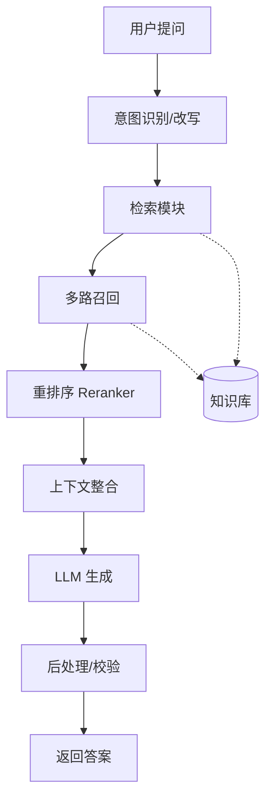
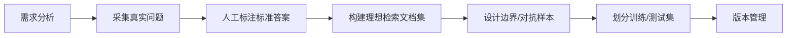
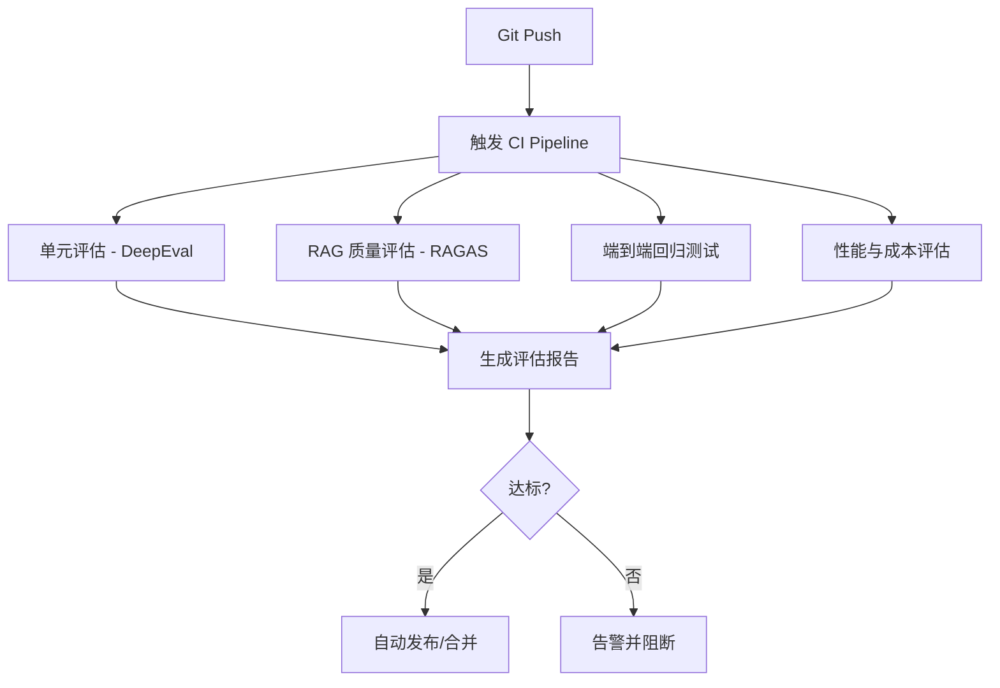
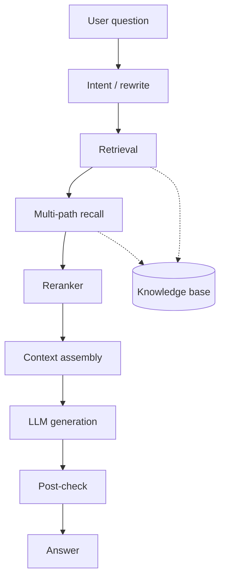
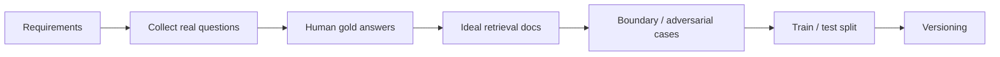
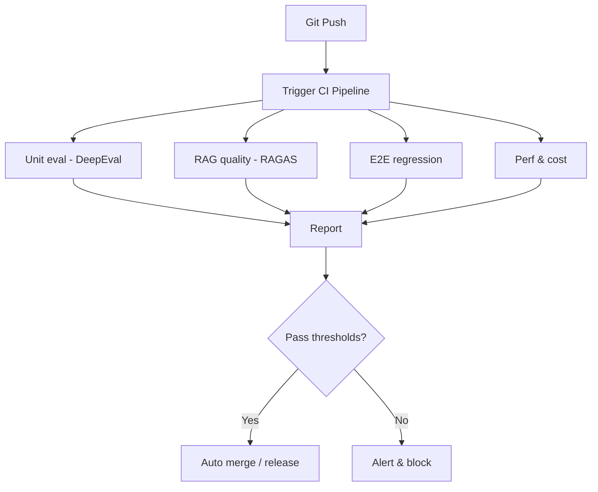

---

title: "Agent评估：Agent到底靠不靠谱"
titleEn: "Agent Evaluation: Can You Trust Your Agent?"
description: "Agent 上线后效果翻车？本文从评估指标设计、数据集构建、主流框架对比到 CI/CD 自动化集成，系统梳理了 RAG Agent 评测的完整方法论，帮你回答 Agent 到底靠不靠谱。"
descriptionEn: "When Agents fail after launch, you need a real eval system. This article covers metrics, datasets, RAGAS/DeepEval, CI automation, and online feedback loops for RAG Agents."
pubDate: 2026-08-12
---
# 一、引言：为什么 Agent 评测如此重要？

前段时间，我帮团队搭建了一个 RAG Agent，内部测试时感觉效果相当不错——回答流畅、引用规范，偶尔还能抖个机灵。但正式上线后，用户反馈却让人大跌眼镜：“答非所问”“关键信息漏了”“明明文档里写了 A，它偏说 B”“幻觉严重，好多数据查无此证”。团队赶紧复盘，发现一个残酷的事实：我们之前所谓的“测试”，只是拿几条熟悉的 prompt 跑了一遍，感觉对了就上线了。没有科学的评测体系，Agent 的表现完全是在“盲飞”。

这其实不是个例。Agent 系统远比传统软件复杂：

- **非确定性**：同一个问题换种问法，结果可能完全不同。
- **多步骤耦合**：意图识别、检索、推理、工具调用、生成，任何一个环节出错都可能导致最终答案翻车。
- **强依赖外部**：数据质量、检索策略、API 稳定性等都会直接影响最终体验。

传统的单元测试、集成测试那一套，在 Agent 面前几乎失灵。因此，这篇文章想和你系统性地聊聊 Agent 评测这件事。我会从评估指标设计、评估方法选择、评估数据集构建，到主流评估框架的横向对比，再到如何把评估嵌入 CI/CD 实现自动化，最后给出不同阶段的选型建议。其中，**RAG Agent** 作为当前落地最广的 Agent 形态，会是本文重点深入的方向。

读完这篇文章，你至少能回答三个问题：**我的 Agent 到底靠不靠谱？哪里不靠谱？怎么让它更靠谱？**

# 二、Agent 评测的核心维度

在开始设计具体指标之前，我们先对 Agent 评测建立一个全局视角。我把 Agent 评测归纳为五大维度，下面这个树状结构可以帮你快速理清脉络：

- **任务完成质量**
    - 最终答案正确性
    - 任务成功率
    - 用户满意度
- **推理能力**
    - 推理链路正确性
    - 多步推理一致性
    - 逻辑完整性
- **工具使用能力**
    - 工具选择准确率
    - 参数传递正确性
    - 调用顺序合理性
- **鲁棒性与安全性**
    - 对抗样本鲁棒性
    - 边界条件处理
    - 越狱/注入防护
    - 幻觉率
- **效率与成本**
    - 响应延迟 P50/P99
    - Token 消耗
    - 工具调用次数
    - 端到端成本

接下来逐一展开每个维度关注什么、容易出什么问题。

## 1. 任务完成质量

这是最直观的维度，考察 Agent 最终给出的答案对不对、有没有完成任务。但“对不对”本身就不容易定义——有些任务是客观的（如“查询北京今天的天气”），有些是主观的（如“帮我写一封有温度的道歉邮件”）。对于客观任务，可以采用精确匹配或语义相似度；对于主观任务，则更多依赖人工评估或 LLM-as-a-Judge。

这里最常见的坑是：只看最终答案，不看中间过程，结果发现答案对了但推理完全跑偏，下次换个问法就挂了。

## 2. 推理能力

Agent 的思考过程是否合理、逻辑是否自洽。比如一个数学题，Agent 给出了正确答案，但中间推导步骤有错误，这就算推理能力不足。评估推理能力通常需要让 Agent 暴露思考链路（CoT），然后逐条检查逻辑。目前比较实用的做法是，用 LLM 对推理链进行打分，并结合人工抽检校验。

## 3. 工具使用能力

Agent 区别于普通 LLM 的核心能力之一。它会调用搜索、计算器、数据库、API 等外部工具。评估时关注：该用工具的时候用了吗？工具选对了吗？参数传对了吗？调用顺序合理吗？很多时候，工具调用“差之毫厘，谬以千里”，比如检索时用了错误的过滤条件，或者调用 API 时少传了一个必填参数，直接导致后续全盘皆输。

## 4. 鲁棒性与安全性

真实用户会问出各种奇怪的问题，有些是边界情况，有些是恶意攻击。你的 Agent 能不能在 prompt 中夹带越狱指令时依然坚守底线？能不能在检索库为空时优雅降级，而不是胡乱编造？能不能在用户输入拼写错误、语序混乱时依然正确理解意图？这部分评估需要专门构建对抗样本和边界测试集。

## 5. 效率与成本

Agent 响应快不快、贵不贵，直接影响用户体验和商业可行性。即使准确率再高，如果每次回答都要等 30 秒、消耗上千 Token，用户也会流失。评估时要关注端到端延迟、每一步的耗时分布、Token 消耗量，以及工具 API 的调用成本。

这五个维度不是孤立的，它们相互制约。比如，为了提高准确率，可能会增加检索轮次和推理步骤，但代价是延迟和成本上升。评测体系最终要帮你在这些维度之间找到最优平衡点。

# 三、RAG Agent 评测深入

RAG（Retrieval-Augmented Generation）是目前最主流的 Agent 落地模式。它的基本链路是：用户提问 → 意图识别 → 检索 → 重排序 → 上下文整合 → 生成 → 后处理。下面这张架构图可以帮你理解全链路：



RAG Agent 有一个“双重质量”特性：**检索质量**决定了给 LLM 喂的“食材”好不好，**生成质量**决定了 LLM 用这些食材做出的“菜”香不香。两者缺一不可——检索拉胯，再强的 LLM 也巧妇难为无米之炊；生成拉胯，检索再精准也可能答非所问。

## 3.1 检索质量评估指标

检索是 RAG 的入口，检索质量直接决定了后续生成的上限。下面这张表格汇总了最核心的检索评估指标：

| 指标         | 英文名            | 含义                                 | 适用场景                   | 计算方式                            |
| ------------ | ----------------- | ------------------------------------ | -------------------------- | ----------------------------------- |
| 命中率       | Hit Rate          | Top-K 检索结果中包含正确答案的比例   | 评估检索是否能找到相关文档 | 命中题目数 / 总题目数               |
| 平均倒数排名 | MRR               | 正确答案在检索结果中的平均排名的倒数 | 关注正确答案的排序位置     | (1/rank) 的平均值                   |
| 精确率       | Precision         | 检索结果中相关文档占比               | 评估检索的“纯度”           | 相关文档数 / 检索文档总数           |
| 召回率       | Recall            | 所有相关文档中被检索到的比例         | 评估检索的“覆盖度”         | 检索到的相关文档数 / 全部相关文档数 |
| NDCG         | NDCG              | 考虑排序位置加权的相关性评分         | 评估排序质量               | 折损累积增益归一化                  |
| 上下文相关性 | Context Relevancy | 检索到的内容与实际问题的关联程度     | LLM 辅助判断               | LLM 打分                            |

这些指标各有侧重，实际使用时需要根据场景组合选择。以下是一些踩坑经验：

- **Hit Rate 高不等于检索好**：如果 Top-K 设得很大（比如 K=100），Hit Rate 天然就高，但大量无关文档会塞爆上下文窗口，反而降低生成质量。所以 Hit Rate 一定要结合 K 值来看，K 通常取 3、5、10。
- **MRR 适合答案唯一性强的场景**：比如 FAQ 问答，用户期望的就是那一条最匹配的答案。但对于需要综合多篇文档才能回答的问题，MRR 就力不从心了。
- **Precision 和 Recall 要一起看**：高 Precision 低 Recall 意味着检索结果很“干净”但漏了很多相关内容；高 Recall 低 Precision 意味着捞了很多文档但大部分不相关。两者需要权衡，F1 Score 是常用的调和指标。
- **NDCG 适合明确相关度分级的场景**：比如人工标注了文档相关性为 0/1/2/3 四个等级，NDCG 能很好地反映排序质量。但如果只有“相关/不相关”的二元标注，NDCG 退化为 Average Precision。
- **Context Relevancy 依赖 LLM 判断**：虽然灵活，但 LLM 自身也有偏见，而且增加评估成本。建议用于抽检，而不是全量自动化。

## 3.2 生成质量评估指标

检索结果拿到后，LLM 基于这些上下文生成最终答案。生成质量评估的核心是：**答案是否忠实于检索到的文档、是否切题、是否完整**。同样用一张表格汇总：

| 指标         | 英文名                   | 含义                                     | 评估方式                                |
| ------------ | ------------------------ | ---------------------------------------- | --------------------------------------- |
| 忠实度       | Faithfulness             | 生成内容是否基于检索到的文档，不凭空捏造 | LLM 判断生成内容是否有检索来源支撑      |
| 答案相关性   | Answer Relevancy         | 生成的答案是否切题，有没有答非所问       | LLM 对比问题和答案的语义匹配度          |
| 上下文精确率 | Context Precision        | 检索到的内容是否都对生成答案有用         | 逐条判断检索片段是否被答案引用          |
| 上下文召回率 | Context Recall           | 答案所需的信息是否都被检索到了           | 逐条判断答案信息是否有检索来源          |
| 幻觉率       | Hallucination Rate       | 生成内容中捏造事实的比例                 | 人工标注或 LLM 判断无检索来源支撑的比例 |
| 信息完整性   | Information Completeness | 是否遗漏了重要信息                       | 对比标准答案覆盖关键信息点              |

生成评估指标的选择与使用，同样有几个关键点：

- **忠实度是最核心的底线指标**：RAG 的初衷就是让 LLM“有据可依”，如果答案还是凭空捏造，RAG 就失去了意义。评估忠实度时，建议把答案拆成多个原子事实，逐个检查是否有检索文档支撑。
- **答案相关性和忠实度可能存在冲突**：有时候为了更贴切地回答用户问题，LLM 会适当发挥，引入一些检索文档中没有的背景知识。这时忠实度会下降，但答案相关性可能上升。需要根据产品定位决定容忍度——如果是医疗、法律等严肃场景，宁可牺牲相关性也要保证忠实度。
- **上下文精确率和召回率共同衡量“上下文利用效率”**：高 Context Precision 意味着检索到的内容大部分被用上了，没有浪费上下文窗口；高 Context Recall 意味着答案所需的每条信息都能在检索结果中找到来源。两者结合，可以帮助你优化检索策略和 Chunk 大小。
- **幻觉率很难完全自动化评估**：LLM 判断幻觉的能力有限，尤其是对于一些需要专业知识判断的领域。建议采用“LLM 初筛 + 人工抽检”的方式，把幻觉率控制在一个可接受的范围。

## 3.3 端到端评估指标

除了检索和生成的独立评估，我们还需要从整体视角衡量 Agent 的表现。这些指标更贴近用户体验和业务价值：

- **任务成功率**：用户的问题是否被真正解决？注意，这里不只是“给出了一个答案”，而是“给出了一个用户可用的答案”。比如用户问“帮我订一张明天去上海的机票”，Agent 需要真正完成订票动作才算成功。
- **用户满意度**：可以通过点赞/点踩、评分、NPS 等方式收集。主观但重要，因为最终用户说了算。
- **首次解决率**：用户第一次提问就被解决的比例。高首次解决率意味着 Agent 的理解和回答能力足够精准，减少用户反复追问的挫败感。
- **平均对话轮次**：用户需要几轮对话才能完成目标。轮次越多，体验越差，也意味着 Agent 的理解和引导能力不足。

端到端评估需要结合线上真实数据，这是离线评估无法替代的。我们会在第七节详细展开。

# 四、评估数据集的构建

有了评估指标，下一步就是构建评估数据集。数据集的质量直接决定了评估结果的可信度。下面这张流程图展示了标准的数据集构建流程：



评估数据集通常有三种来源：

1. **人工标注集**：由领域专家或标注团队手工构建，每个问题都配有标准答案、理想检索文档、关键信息点等。这是质量最高的数据集，但成本也最高。适用于核心场景的精准评估，比如医疗问诊、法律咨询等容错率极低的领域。
2. **合成数据集**：利用 LLM 自动生成 QA 对。比如，给定一批文档，让 LLM 基于文档内容生成问题和答案。这种方式效率极高，可以快速构建大规模数据集，但需要人工校验，因为 LLM 生成的问题可能不符合真实用户的语言习惯，答案也可能存在偏差。下面是一个合成数据集的 Python 示例：

```python
import json
from openai import OpenAI

client = OpenAI()

def generate_qa_pairs(documents: list[str], num_pairs: int = 10) -> list[dict]:
    """
    基于文档内容，使用 LLM 自动生成 QA 对。
    """
    qa_pairs = []
    for doc in documents:
        prompt = f"""你是一个专业的测试数据生成器。请基于以下文档内容，生成 {num_pairs} 个高质量的问题和答案对。
要求：
- 问题必须直接基于文档内容，不能凭空编造
- 答案必须准确、完整，引用原文中的具体信息
- 问题类型要多样化：事实查询、对比分析、总结归纳等
- 返回格式为 JSON 数组，每个元素包含 "question" 和 "answer" 字段

文档内容：
{doc[:3000]}  # 限制长度，避免超出 token 限制
"""
        response = client.chat.completions.create(
            model="gpt-4o",
            messages=[{"role": "user", "content": prompt}],
            response_format={"type": "json_object"},
            temperature=0.7
        )
        result = json.loads(response.choices[0].message.content)
        qa_pairs.extend(result.get("qa_pairs", []))
    return qa_pairs

# 使用示例
documents = [
    "RAG 是一种结合检索和生成的技术，它先从知识库中检索相关文档，再让 LLM 基于这些文档生成答案。",
    "RAG 的核心优势在于能够有效减少幻觉，让 LLM 的回答有据可依。"
]
qa_pairs = generate_qa_pairs(documents, num_pairs=3)
for qa in qa_pairs:
    print(f"Q: {qa['question']}\nA: {qa['answer']}\n")
```

3. **线上反馈数据**：从生产环境的日志中提取真实的用户问题和 Agent 回答，经过清洗和标注后纳入评估集。这种数据最真实，反映的是用户实际使用场景，但噪声也最大——用户可能输入不完整、有错别字、甚至恶意攻击。需要建立一套数据清洗和标注流程，把低质量数据过滤掉。

**建议的策略**：线上反馈数据作为基础，合成数据快速扩充规模，人工标注数据作为核心评测集的“金标准”。三者结合，兼顾成本、效率和质量。

# 五、热门评估框架横向对比

工欲善其事，必先利其器。目前市面上已经有不少优秀的 Agent 评估框架，下面这张表格对比了最主流的六个：

| 框架名称        | 定位                | 核心能力                                    | 支持的自定义指标     | 是否支持 RAG 评估 | 优缺点                                       |
| --------------- | ------------------- | ------------------------------------------- | -------------------- | ----------------- | -------------------------------------------- |
| RAGAS           | RAG 专用评估        | 忠实度/答案相关性/上下文精确率/上下文召回率 | 支持自定义 Prompt    | ✅ 原生支持        | 专为 RAG 设计，开箱即用；不支持 agent 多步骤 |
| DeepEval        | 通用 LLM 评估       | 多种内置指标 + 单元测试风格                 | 支持自定义指标和阈值 | ✅ 支持            | 类似 pytest 风格，上手快；社区较小           |
| LangSmith       | 全链路可观测 + 评估 | 追踪、数据集管理、在线评估                  | 支持自定义评估器     | ✅ 支持            | LangChain 生态，功能全；有付费墙             |
| Phoenix (Arize) | 可观测性平台        | 追踪、检索可视化、漂移检测                  | 支持自定义评估器     | ✅ 优秀            | 检索可视化强大，开源；学习曲线较陡           |
| Trulens         | 反馈函数评估        | 答案/上下文/基础的评估铁三角                | 支持自定义反馈函数   | ✅ 原生支持        | 概念清晰，模块化；社区活跃度一般             |
| MLflow Eval     | ML 实验管理 + 评估  | 多模型对比、结果可视化                      | 支持自定义指标       | ⚠️ 通用            | 实验管理强；Agent 专项能力弱                 |

下面重点展开 RAGAS 和 DeepEval，因为它们是当前最实用的两个框架。

## 5.1 RAGAS：RAG 评估的瑞士军刀

RAGAS（RAG Assessment）是专门为 RAG 系统设计的评估框架，提供了 Faithfulness、Answer Relevancy、Context Precision、Context Recall 等核心指标。它的设计哲学是：评估指标本身也依赖 LLM 来判断，所以需要精心设计 Prompt 来保证评估的准确性。

RAGAS 的使用非常简单，几行代码就能完成评估：

```python
from datasets import Dataset
from ragas import evaluate
from ragas.metrics import faithfulness, answer_relevancy, context_precision, context_recall

# 准备评估数据：每个样本包含问题、答案、检索到的上下文、标准答案（可选）
eval_dataset = Dataset.from_dict({
    "question": ["什么是 RAG？", "RAG 有哪些优势？"],
    "answer": [
        "RAG 是一种结合检索和生成的技术，它先从知识库中检索相关文档，再让 LLM 基于这些文档生成答案。",
        "RAG 的核心优势在于减少幻觉、提高答案的可追溯性，以及能够利用最新知识。"
    ],
    "contexts": [
        ["RAG 是一种结合检索和生成的技术..."],
        ["RAG 的优势包括减少幻觉、提高可追溯性、利用最新知识..."]
    ],
    "ground_truth": [
        "RAG 是 Retrieval-Augmented Generation 的缩写，是一种结合检索和生成的技术。",
        "RAG 可以减少幻觉、提高答案可追溯性、利用最新知识。"
    ]
})

# 执行评估
result = evaluate(
    eval_dataset,
    metrics=[faithfulness, answer_relevancy, context_precision, context_recall]
)
print(result)
# 输出示例：
# {'faithfulness': 0.95, 'answer_relevancy': 0.88, 'context_precision': 0.92, 'context_recall': 0.85}
```

RAGAS 的各个指标可以单独使用，也可以组合使用。它默认使用 OpenAI 的 API 作为评判 LLM，但你可以替换成任何兼容 OpenAI 接口的模型，比如本地部署的 Llama 或 Qwen，这样就能控制评估成本。不过需要注意，评判 LLM 自身的能力也会影响评估结果的准确性，建议使用能力较强的模型，并定期做人工校验。

## 5.2 DeepEval：像写单元测试一样评估 Agent

DeepEval 的最大特色是它的单元测试风格。如果你熟悉 pytest，上手 DeepEval 几乎零成本。它把评估指标封装成“测试用例”，你可以定义断言、设置阈值，然后像跑测试一样跑评估。下面是一个完整的示例：

```python
from deepeval import assert_test
from deepeval.metrics import FaithfulnessMetric, AnswerRelevancyMetric
from deepeval.test_case import LLMTestCase

# 定义测试用例
test_case = LLMTestCase(
    input="RAG 有哪些优势？",
    actual_output="RAG 可以减少幻觉、提高答案可追溯性，并且能够利用最新知识。",
    retrieval_context=[
        "RAG 的优势包括减少幻觉、提高可追溯性、利用最新知识。"
    ]
)

# 定义评估指标并设置阈值
faithfulness_metric = FaithfulnessMetric(threshold=0.8)
answer_relevancy_metric = AnswerRelevancyMetric(threshold=0.7)

# 运行测试
def test_rag_quality():
    assert_test(test_case, [faithfulness_metric, answer_relevancy_metric])
    # 如果忠实度分数低于 0.8 或答案相关性分数低于 0.7，测试会失败
```

DeepEval 还支持自定义指标、集成到 CI/CD Pipeline（后面会讲），以及生成详细的评估报告。它的社区虽然不如 RAGAS 大，但迭代速度很快，文档也比较完善。

# 六、评估流程与自动化

评估不应该是一次性的，而应该成为开发流程的一部分。理想的状态是：每次代码变更，自动触发评估 Pipeline，不达标就不让合并。下面这张架构图展示了一个典型的 CI/CD 集成方案：



下面是一个 GitHub Actions 的配置示例，展示如何把 DeepEval 和 RAGAS 集成到 CI 流程中：

```yaml
name: Agent Evaluation Pipeline

on:
  push:
    branches: [main]
  pull_request:
    branches: [main]

jobs:
  evaluate:
    runs-on: ubuntu-latest
    steps:
      - uses: actions/checkout@v3

      - name: Set up Python
        uses: actions/setup-python@v4
        with:
          python-version: '3.11'

      - name: Install dependencies
        run: |
          pip install ragas deepeval openai

      - name: Run RAGAS evaluation
        env:
          OPENAI_API_KEY: ${{ secrets.OPENAI_API_KEY }}
        run: |
          python ragas_eval.py

      - name: Run DeepEval tests
        env:
          OPENAI_API_KEY: ${{ secrets.OPENAI_API_KEY }}
        run: |
          python -m pytest deepeval_tests.py --tb=short

      - name: Check thresholds
        run: |
          # 如果评估分数低于阈值，退出码非 0，阻断 CI
          python check_thresholds.py
```

这里有一个重要的提醒：**评估自动化不等于“无人值守”**。自动化评估最大的价值在于快速发现回归问题，但它无法完全替代人工判断。对于关键场景，比如医疗、金融、法律等领域的 Agent，建议在自动化评估的基础上，加入人工抽检环节。自动化评估用于“快速过滤”，人工抽检用于“兜底核验”。

# 七、线上监控与反馈闭环

离线评估再完善，也无法完全模拟线上真实环境的复杂性。用户的实际提问方式、输入质量、上下文长度，都可能在线上出现离线评估集里没有覆盖的情况。所以，线上监控和反馈闭环是评测体系的最后一块拼图。

线上评估和离线评估有几个关键差异：

- **时效性**：线上要求实时或准实时，不能等几小时才出结果。
- **数据规模**：线上是全量或抽样，数据量远超离线评估集。
- **标注依赖**：线上无法像离线那样对每条数据做人工标注，更多依赖用户行为信号（点赞/点踩/复述/中断）和 LLM 自动标注。

建议重点监控以下线上指标：

- **P99 延迟**：99% 的请求在多少毫秒内完成，这决定了用户体验的“天花板”。
- **Token 消耗**：平均每次请求消耗的 Token 数量，直接关联成本。
- **检索召回率波动**：如果知识库更新后检索召回率突然下降，说明新数据可能有问题。
- **用户反馈分**：点赞率、点踩率、用户评分等，是最直接的满意度信号。

更重要的是建立**反馈闭环**：用户投诉 → 自动聚类 → 加入回归测试集 → 驱动优化。具体来说，当用户点踩或投诉后，系统自动收集该问题及其上下文，通过聚类算法将相似问题归为一类，然后由人工或 LLM 标注标准答案，纳入回归测试集。下次发版前，这些曾经出过问题的问题会被重新测试，确保不再重蹈覆辙。

# 八、总结与选型建议

回顾全文，Agent 评测是一个系统工程，没有银弹。不同的团队规模、项目阶段、预算，需要选择不同的评估策略。

- **先跑通，再测准**：不要一开始就追求完美的评估体系，先用 RAGAS 或 DeepEval 快速搭建一个可用的评估流程，随着系统迭代逐步完善。
- **评估指标要结合业务场景**：不要迷恋指标本身，要回到用户价值。比如一个客服 Agent，首次解决率可能比忠实度更重要；一个法律咨询 Agent，则忠实度是底线。
- **自动化 + 人工，两条腿走路**：自动化评估负责效率和覆盖面，人工评估负责准确性和兜底。
- **评估是持续迭代的，不是一劳永逸的**：评估集需要不断更新，评估指标需要不断校准，评估流程需要不断优化。

正如我在引言里说的，Agent 上线只是开始，持续的评测和迭代才是 Agent 产品竞争力的护城河。希望这篇文章能帮你搭建起自己的 Agent 评测体系，让你的 Agent 不再“盲飞”，真正变得靠谱。


<!-- i18n:en -->

# 1. Why Agent Evaluation Matters

I once helped a team ship a RAG Agent that felt strong in internal testing—fluent answers, neat citations, even a bit of wit. After launch, user feedback was brutal: “off-topic,” “missing key facts,” “the doc says A but it says B,” “hallucinations everywhere.” A retrospective found the hard truth: our so-called “tests” were a few familiar prompts. Without a real evaluation system, the Agent was flying blind.

That story is common. Agents are far harder than classic software:

- **Non-determinism**: paraphrase the same question and the path can change completely.
- **Multi-step coupling**: intent, retrieval, reasoning, tool use, generation—any hop can break the final answer.
- **External dependence**: data quality, retrieval strategy, and API health all show up in UX.

Unit tests and integration tests alone almost stop working here. This article walks through metric design, evaluation methods, datasets, framework comparisons, CI/CD automation, and stage-by-stage choices. **RAG Agents**, today’s most common production shape, get the deepest treatment.

By the end you should answer three questions: **Is my Agent reliable? Where does it fail? How do I make it more reliable?**

# 2. Core Evaluation Dimensions

Before inventing metrics, build a map. I group Agent evaluation into five dimensions:

- **Task completion quality**
  - Final answer correctness
  - Task success rate
  - User satisfaction
- **Reasoning**
  - Reasoning-chain correctness
  - Multi-step consistency
  - Logical completeness
- **Tool use**
  - Tool-selection accuracy
  - Argument correctness
  - Call-order quality
- **Robustness & safety**
  - Adversarial robustness
  - Boundary handling
  - Jailbreak / injection defense
  - Hallucination rate
- **Efficiency & cost**
  - Latency P50 / P99
  - Token usage
  - Tool-call count
  - End-to-end cost

## 1. Task completion quality

The most intuitive dimension: did the Agent finish the job correctly? “Correct” is ambiguous—objective tasks (“Beijing weather today”) allow exact/semantic match; subjective ones (“write a warm apology email”) need humans or LLM-as-a-Judge.

Common trap: only scoring the final answer. The answer looks right while the middle reasoning is wrong—so the next paraphrase fails.

## 2. Reasoning

Is the thought process coherent? A math Agent can output the right number with a broken derivation. Expose chain-of-thought and score step by step—often with an LLM judge plus human spot checks.

## 3. Tool use

This is a core Agent skill beyond plain LLMs: search, calculator, DB, APIs. Did it call a tool when needed? The right tool? Correct args? Sensible order? Tiny mistakes (wrong filter, missing required field) cascade into total failure.

## 4. Robustness & safety

Real users ask weird things—edges and attacks. Can the Agent refuse jailbreaks in the prompt? Degrade gracefully on empty retrieval instead of inventing? Still understand typos and scrambled word order? Build dedicated adversarial and boundary sets.

## 5. Efficiency & cost

Speed and price decide UX and commercial viability. High accuracy with 30s waits and thousands of tokens still loses users. Track end-to-end latency, per-stage time, tokens, and tool API cost.

These dimensions trade off. More retrieval rounds can raise accuracy and also latency/cost. A good eval system helps you find the balance.

# 3. Deep Dive: RAG Agent Evaluation

RAG is the dominant production Agent pattern: question → intent/rewrite → retrieval → rerank → context assembly → generation → post-check.



RAG has dual quality: **retrieval** decides whether the LLM gets good ingredients; **generation** decides whether those ingredients become a good dish. Weak retrieval starves even a strong LLM; weak generation wastes perfect retrieval.

## 3.1 Retrieval metrics

| Metric | Meaning | Typical use | How |
| --- | --- | --- | --- |
| Hit Rate | Top-K contains a relevant gold doc | Can we find anything useful? | hits / total |
| MRR | Mean reciprocal rank of first relevant | Ranking position | mean(1/rank) |
| Precision | Share of retrieved docs that are relevant | Retrieval “purity” | relevant / retrieved |
| Recall | Share of all relevant docs that were retrieved | Coverage | retrieved relevant / all relevant |
| NDCG | Position-weighted relevance | Ranking quality | normalized DCG |
| Context Relevancy | How related retrieved text is to the question | LLM-assisted judgment | LLM score |

Pitfalls from practice:

- **High Hit Rate ≠ good retrieval.** Huge K (e.g. 100) inflates Hit Rate and floods the context window. Always report Hit Rate with K (often 3/5/10).
- **MRR fits unique-answer FAQ.** Multi-doc synthesis questions need more than MRR.
- **Read Precision with Recall.** High P/low R is “clean but incomplete”; high R/low P is “noisy.” F1 is a common compromise.
- **NDCG needs graded labels** (0/1/2/3). Binary labels mostly collapse it toward average precision.
- **Context Relevancy depends on the judge LLM**—good for sampling, expensive/noisy for full automation.

## 3.2 Generation metrics

| Metric | Meaning | How |
| --- | --- | --- |
| Faithfulness | Answer grounded in retrieved docs | LLM checks support |
| Answer Relevancy | On-topic vs off-topic | LLM semantic match |
| Context Precision | Retrieved chunks actually used / useful | Per-chunk usefulness |
| Context Recall | Needed answer facts exist in retrieval | Per-fact coverage |
| Hallucination Rate | Share of invented claims | Human / LLM unsupported ratio |
| Information Completeness | Missing key points vs gold | Gold keypoint coverage |

Notes:

- **Faithfulness is the floor.** If answers invent facts, RAG failed its purpose. Split answers into atomic claims and check support.
- **Relevancy can fight faithfulness.** Extra background may help the user and hurt faithfulness. In medical/legal domains, prefer faithfulness.
- **Context Precision + Recall** measure context efficiency and help tune chunk size / recall strategy.
- **Hallucination is hard to fully automate**—use LLM prefilter + human spot checks in high-stakes domains.

## 3.3 End-to-end metrics

Closer to user value:

- **Task success rate**: not “produced text,” but “usable outcome” (e.g. actually booking the flight).
- **Satisfaction**: thumbs, ratings, NPS.
- **First-contact resolution**: solved on the first ask.
- **Average turns**: more turns usually means worse understanding/guidance.

These need live traffic—offline sets cannot fully replace them (Section 7).

# 4. Building Evaluation Datasets

Metrics without datasets are theater. A standard flow:



Three sources:

1. **Human-labeled sets**: highest quality, highest cost—core scenarios with tiny error budget.
2. **Synthetic sets**: LLM-generated QA from docs—fast scale, needs human review. Example:

```python
import json
from openai import OpenAI

client = OpenAI()

def generate_qa_pairs(documents: list[str], num_pairs: int = 10) -> list[dict]:
    """
    Auto-generate QA pairs from document content with an LLM.
    """
    qa_pairs = []
    for doc in documents:
        prompt = f"""You are a professional test-data generator. Based on the document below,
generate {num_pairs} high-quality question-answer pairs.
Requirements:
- Questions must be grounded in the document — no invented facts
- Answers must be accurate and complete, citing concrete details from the text
- Diversify question types: fact lookup, comparison, summarization, etc.
- Return a JSON array; each element has "question" and "answer" fields

Document:
{doc[:3000]}  # truncate to stay within the token budget
"""
        response = client.chat.completions.create(
            model="gpt-4o",
            messages=[{"role": "user", "content": prompt}],
            response_format={"type": "json_object"},
            temperature=0.7
        )
        result = json.loads(response.choices[0].message.content)
        qa_pairs.extend(result.get("qa_pairs", []))
    return qa_pairs

# Usage example
documents = [
    "RAG combines retrieval and generation: it retrieves relevant docs from a knowledge base, then has the LLM answer grounded in those docs.",
    "RAG's core strength is reducing hallucinations so LLM answers stay evidence-based."
]
qa_pairs = generate_qa_pairs(documents, num_pairs=3)
for qa in qa_pairs:
    print(f"Q: {qa['question']}\nA: {qa['answer']}\n")
```

3. **Online feedback**: real questions/answers from logs—most realistic, noisiest; needs cleaning and labeling.

**Recommended mix**: online feedback as the base, synthetic data for scale, human gold as the calibration standard.

# 5. Framework Comparison

| Framework | Focus | Strengths | Custom metrics | RAG | Trade-offs |
| --- | --- | --- | --- | --- | --- |
| RAGAS | RAG-native | Faithfulness / relevancy / context P&R | Custom prompts | Native | Great out of box; weak multi-step Agent flows |
| DeepEval | General LLM eval | Built-ins + pytest style | Custom + thresholds | Yes | Fast to learn; smaller community |
| LangSmith | Observability + eval | Traces, datasets, online eval | Custom evaluators | Yes | Full LangChain stack; paid tiers |
| Phoenix (Arize) | Observability | Retrieval viz, drift | Custom | Strong | Powerful; steeper learning curve |
| TruLens | Feedback functions | Answer/context/grounding triad | Custom feedback | Native | Clear modular ideas; quieter community |
| MLflow Eval | Experiment mgmt | Multi-model compare | Custom | Generic | Strong experiments; weak Agent specifics |

## 5.1 RAGAS

RAGAS is built for RAG metrics and LLM-as-judge prompts:

```python
from datasets import Dataset
from ragas import evaluate
from ragas.metrics import faithfulness, answer_relevancy, context_precision, context_recall

# Evaluation data: question, answer, retrieved contexts, optional ground truth
eval_dataset = Dataset.from_dict({
    "question": ["What is RAG?", "What are RAG's advantages?"],
    "answer": [
        "RAG combines retrieval and generation: it retrieves relevant docs, then has the LLM answer from them.",
        "RAG's core strengths are fewer hallucinations, better traceability, and access to up-to-date knowledge."
    ],
    "contexts": [
        ["RAG combines retrieval and generation..."],
        ["RAG advantages include fewer hallucinations, better traceability, and up-to-date knowledge..."]
    ],
    "ground_truth": [
        "RAG stands for Retrieval-Augmented Generation — a pattern that combines retrieval and generation.",
        "RAG can reduce hallucinations, improve answer traceability, and use the latest knowledge."
    ]
})

# Run evaluation
result = evaluate(
    eval_dataset,
    metrics=[faithfulness, answer_relevancy, context_precision, context_recall]
)
print(result)
# Example output:
# {'faithfulness': 0.95, 'answer_relevancy': 0.88, 'context_precision': 0.92, 'context_recall': 0.85}
```

Use metrics alone or together. Default judge is OpenAI-compatible—swap to local Llama/Qwen to control cost, and still run periodic human checks because the judge’s strength biases scores.

## 5.2 DeepEval

If you know pytest, DeepEval feels natural—metrics as assertions with thresholds:

```python
from deepeval import assert_test
from deepeval.metrics import FaithfulnessMetric, AnswerRelevancyMetric
from deepeval.test_case import LLMTestCase

# Define a test case
test_case = LLMTestCase(
    input="What are RAG's advantages?",
    actual_output="RAG can reduce hallucinations, improve answer traceability, and use up-to-date knowledge.",
    retrieval_context=[
        "RAG advantages include fewer hallucinations, better traceability, and up-to-date knowledge."
    ]
)

# Metrics with thresholds
faithfulness_metric = FaithfulnessMetric(threshold=0.8)
answer_relevancy_metric = AnswerRelevancyMetric(threshold=0.7)

# Run the test
def test_rag_quality():
    assert_test(test_case, [faithfulness_metric, answer_relevancy_metric])
    # Fails if faithfulness < 0.8 or answer relevancy < 0.7
```

It also supports custom metrics, CI integration, and detailed reports.

# 6. Automation & CI/CD

Evaluation should gate merges, not be a one-off notebook:



```yaml
name: Agent Evaluation Pipeline

on:
  push:
    branches: [main]
  pull_request:
    branches: [main]

jobs:
  evaluate:
    runs-on: ubuntu-latest
    steps:
      - uses: actions/checkout@v3

      - name: Set up Python
        uses: actions/setup-python@v4
        with:
          python-version: '3.11'

      - name: Install dependencies
        run: |
          pip install ragas deepeval openai

      - name: Run RAGAS evaluation
        env:
          OPENAI_API_KEY: ${{ secrets.OPENAI_API_KEY }}
        run: |
          python ragas_eval.py

      - name: Run DeepEval tests
        env:
          OPENAI_API_KEY: ${{ secrets.OPENAI_API_KEY }}
        run: |
          python -m pytest deepeval_tests.py --tb=short

      - name: Check thresholds
        run: |
          # Non-zero exit if scores are below threshold — block the CI pipeline
          python check_thresholds.py
```

**Automation ≠ unattended ops.** Auto eval catches regressions fast; it does not replace humans in medical/finance/legal Agents. Use automation to filter, humans to verify.

# 7. Online Monitoring & Feedback Loop

Offline sets never cover all live phrasing, input quality, or context lengths. Online monitoring closes the system.

Offline vs online:

- **Freshness**: near-real-time signals, not hours later
- **Scale**: full traffic or heavy sampling
- **Labels**: behavioral signals (up/down/retry/abort) and LLM auto-labels instead of full human annotation

Watch at least:

- **P99 latency** — UX ceiling
- **Tokens per request** — cost
- **Retrieval recall drift** after KB updates
- **Feedback scores** — thumbs and ratings

Build the loop: complaint → cluster → gold label → regression set → release gate. Failures become permanent tests so they do not return.

# 8. Closing & Selection Tips

Agent evaluation is systems work—no silver bullet.

- **Ship a thin loop first**, then sharpen it (RAGAS/DeepEval is enough to start).
- **Tie metrics to business value** (first-contact resolution vs faithfulness).
- **Automation + humans**, always.
- **Treat datasets/metrics/process as living artifacts.**

Launch is the beginning. Continuous evaluation is the moat. Stop flying blind—make the Agent reliably good.
