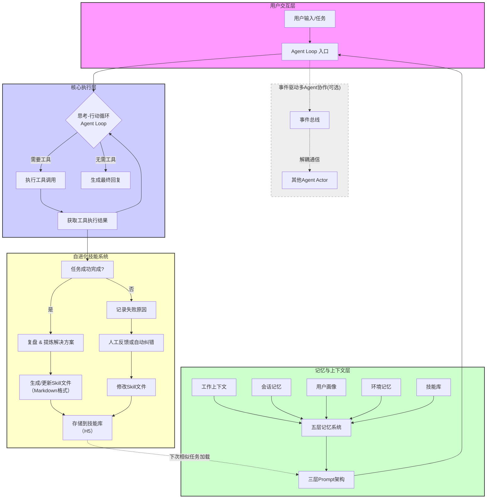

# 深度解析Hermes框架：AI Agent的“爱马仕”是如何实现自我进化的？
## 引言：当AI学会“自我成长”
还记得你第一次教AI助手完成一个复杂任务，第二天它却忘得一干二净的无奈吗？在2026年的AI世界里，这个问题正在被一个名为**Hermes**的框架彻底改变。

Hermes并非一个单一的产品，而是一个技术生态的统称——它既指代由Nous Research开源的**Hermes Agent**框架，也涵盖了以**HermesAI**为代表的一系列以函数调用为核心的设计范式。如果说传统的AI Agent是“召之即来、挥之即去”的工具，那么Hermes框架下的Agent则更像一匹**会持续进化的骏马**——它能记住你的偏好，从过往任务中提炼经验，并且越用越聪明。

本文将带你全面拆解Hermes框架的核心机制，探索它如何通过“自进化技能系统”、“三层/五层记忆架构”和“事件驱动协作模型”重新定义AI Agent的能力边界。

## 一、核心机制：Agent如何实现“自我进化”？

传统AI Agent最大的痛点在于**“金鱼记忆”**——每次对话从零开始，用户今天教会它的技能，明天就全然忘记。Hermes通过一套精密的“学习循环”机制破解了这一难题。

下面这张 Mermaid 流程图完整展示了 Hermes Agent 的**核心架构全景**——从用户交互入口、思考-行动循环，到记忆系统、自进化技能闭环，再到可选的事件驱动多 Agent 协作扩展，一目了然。

> **图示说明**：图中 **「事件驱动多Agent协作(可选)」** 模块采用虚线框与虚线箭头，表示该能力为**可选扩展**——并非所有 Hermes Agent 都需要启用多 Agent 协作。虚线箭头 `B -.-> P` 表示当 Agent Loop 入口（B）需要跨 Agent 协同处理任务时，会通过事件总线（P）以**松耦合、异步**的方式触发协作，不阻塞主执行流程。这种设计既保持了单 Agent 场景的简洁性，又为复杂分布式场景保留了灵活的扩展入口。
---

### 1.1 自进化技能系统（Self-Evolving Skills）

Hermes最革命性的创新在于其**闭环自学习机制**。当Agent成功完成一个复杂任务后（比如“部署一个Nginx服务并配置SSL证书”），它会自动复盘整个执行过程，将解决方案提炼成一个结构化的**Skill文件**（通常是Markdown格式）存储在本地目录中。这个提炼过程并非简单的日志记录，而是包含以下关键步骤：首先，Agent 会提取任务中的**关键决策点**（如「选择 Let's Encrypt 而非自签名证书」）；其次，记录每一步工具调用的**输入输出快照**；最后，将整个流程组织成**可复用的步骤序列**，并标注每一步的预期结果和异常处理策略。这种结构化使得 Skill 文件不仅是回忆，更是一份可执行的「操作手册」。
下次遇到类似任务时，Hermes会自动检索并加载相关技能，将其作为系统提示词的一部分注入当前会话，从而直接复用之前的经验。更关键的是，**当用户对Skill的执行结果提出反馈时，Hermes不仅会调整当前输出，还会自动回溯并修改对应的Skill文件本身**，使该技能在未来能直接应用改进后的方案。这意味着：你部署 Nginx 时踩过的坑、优化过的配置、甚至特定云服务商的 API 调用细节，都会沉淀为永久资产，而不是随着对话结束而消失。这种「越用越强」的正反馈循环，正是 Hermes 区别于传统 Agent 框架的核心壁垒。
### 1.2 三层Prompt架构与思考-行动循环

从源码层面看，Hermes Agent（v0.14.0）的核心设计哲学体现在其**分层System Prompt架构**上：

- **稳定层（stable）**：定义Agent身份、工具使用指导、技能提示等生命周期内不变的内容。
- **上下文层（context）**：包含项目特定的AGENTS.md、.cursorrules等随场景切换的文件。
- **易变层（volatile）**：每轮对话都变化的记忆快照、用户画像、时间戳等信息。

这种设计的精妙之处在于**缓存友好**——不变的部分只构建一次并缓存，后续轮次复用，对LLM提供商的prefix cache非常友好，能显著减少重复token的计费。

而Agent的执行核心——**思考-行动循环（Agent Loop）**——逻辑清晰：发送消息 → 检查是否有工具调用 → 有则执行并继续循环 → 没有则返回最终响应。整个循环不到10行核心代码，却支撑起了复杂的自我进化能力。

## 二、记忆系统

如果说技能系统是Hermes的“肌肉”，那记忆系统就是它的“大脑”。为了解决AI智能体普遍存在的“金鱼记忆”问题，Hermes设计了一套纵深记忆架构。

### 2.1 Hermes Agent的五层记忆

根据不同的实现版本，Hermes的记忆系统有“三层”和“五层”两种划分，但核心逻辑一致：

| 记忆层级              | 生命周期   | 存储内容                         |
| --------------------- | ---------- | -------------------------------- |
| **工作上下文**        | 单次请求   | 当前步骤的思维链                 |
| **会话记忆**          | 单次会话   | 对话摘要，压缩长上下文           |
| **持久记忆/用户画像** | 跨会话持久 | 用户偏好、编码风格、工作习惯     |
| **环境记忆**          | 跨项目持久 | 项目环境、技术栈、踩过的坑       |
| **技能库（Skills）**  | 永久       | 可复用的、经过验证的解决方案集合 |

### 2.2 记忆检索机制

Hermes并非简单地堆砌记忆，而是通过**FTS5全文搜索引擎**在新对话中按需检索相关历史记忆片段，而非全量加载。这确保了上下文长度恒定、响应迅速，同时实现了跨会话的知识召回。

可选集成的**Honcho用户建模系统**甚至能进行辩证分析——不仅记录用户所言，还能推断其未明说的偏好甚至言行矛盾之处，从而构建更深入的用户画像。

## 三、通信与协作：事件驱动的多Agent体系

对于更复杂的企业级场景，Hermes还提供了一套**事件驱动型多Agent协作框架**，借鉴分布式消息中间件与Actor模型的思想。

### 3.1 Agent即Actor

在这个框架中，每个Agent被视为一个独立的**Actor**——拥有自己的消息队列（Mailbox）、状态存储（State Store）和工具集（Toolbox），通过事件总线（Event Bus）进行异步通信。

这与LangChain、AutoGen等依赖“全局规划器（Planner）”的中心化调度模式形成鲜明对比。当Agent数量增多时，中心化调度的上下文窗口会被对话历史迅速占满，决策质量断崖下降。而Hermes的**去中心化拓扑**天然适合分布式部署——每个Agent自主订阅相关事件（如`OrderCreated`、`AnomalyDetected`），并根据本地状态机触发动作，无需中央协调者。

### 3.2 事件驱动协作模型

Hermes中Agent之间的通信不采用同步HTTP调用，而是通过**领域事件（Domain Event）**解耦。一个完整的业务流程由多个事件串联成有向无环图（DAG）。

核心组件包括：
- **Event Gateway**：基于Apache Pulsar或Kafka的事件路由、持久化与重放
- **Agent Runtime**：运行Agent逻辑，维护基于`transitions`库的有限状态机
- **Tool Registry**：基于etcd + gRPC的工具注册与发现
- **Memory Mesh**：基于Milvus的共享记忆层，支持相似度检索
- **Observer**：基于Prometheus的可观测性监控

这种设计保证了**至少一次（At-least-once）**的事件交付，并通过幂等消费机制（Redis记录已处理event_id）避免重复处理。

## 四、HermesAI：函数调用优先的轻量级范式

除了Nous Research的Hermes Agent，社区中还活跃着另一股力量——**HermesAI**。它并非现成的第三方黑盒，而是一套**以函数调用（Function Calling）为绝对核心、采用确定性状态机驱动的轻量级Agent设计范式**。

其设计铁律值得所有Agent开发者借鉴：

1. **无隐式推理**：每一步工具调用都必须显式声明，便于观测和中断
2. **状态不可变**：Agent上下文采用不可变数据结构，每次更新生成新版本，支持快照回滚
3. **工具即契约**：所有工具使用Pydantic定义入参Schema，强制类型校验，杜绝LLM凭空捏造参数

在生产实践中，HermesAI的**Router-Worker模式**表现尤为出色：Router Agent负责拆解任务，将子任务分发给拥有独立Prompt和工具集的Worker Agent，有效降低了单次LLM调用的上下文长度。基于此框架，有团队已在内部落地了SQL智能运维助手和云成本分析Agent，日均处理任务5000+，P95延迟控制在1.8秒以内。

## 五、生产部署与生态展望

### 5.1 部署方案

Hermes支持多种部署方式，包括**Docker Swarm高可用集群方案**（适合企业内网）和**Windows一键整合包**（适合个人开发者零基础体验）。其水平扩展按业务域分区，事件分区则按业务ID哈希进行，确保同一订单的事件顺序处理。

### 5.2 生态定位：Hermes vs OpenClaw

在2026年的开源Agent生态中，Hermes常被拿来与OpenClaw对比。两者并非替代关系，而是服务于不同场景：

| 对比维度     | Hermes                                  | OpenClaw                                  |
| ------------ | --------------------------------------- | ----------------------------------------- |
| **核心理念** | 自进化 + 持久记忆，打造共同成长的AI伙伴 | 网关路由 + 本地优先，打造稳定的AI执行中枢 |
| **技能系统** | AI自动生成，自我改进                    | 人工编写和维护                            |
| **适用场景** | 个人助手、长尾任务自动化                | 企业级工作流、生产环境集成                |

## 结语

Hermes框架的出现，标志着AI Agent正从**“被调用的工具”**向**“共同成长的伙伴”**演进。无论是Hermes Agent的自进化技能系统、五层纵深记忆架构，还是HermesAI的轻量级函数调用范式，亦或是事件驱动的多Agent协作模型，都在解决一个核心问题：**如何让AI在持续使用中变得越来越懂你、越来越有用**。

可以预见，随着自改进Agent技术边界的不断拓展，我们与AI的关系将从“使用者与工具”演变为“伙伴与伙伴”。而Hermes，正在为这个未来铺设基础设施。