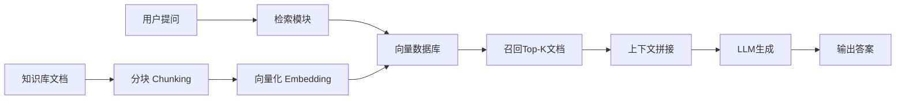
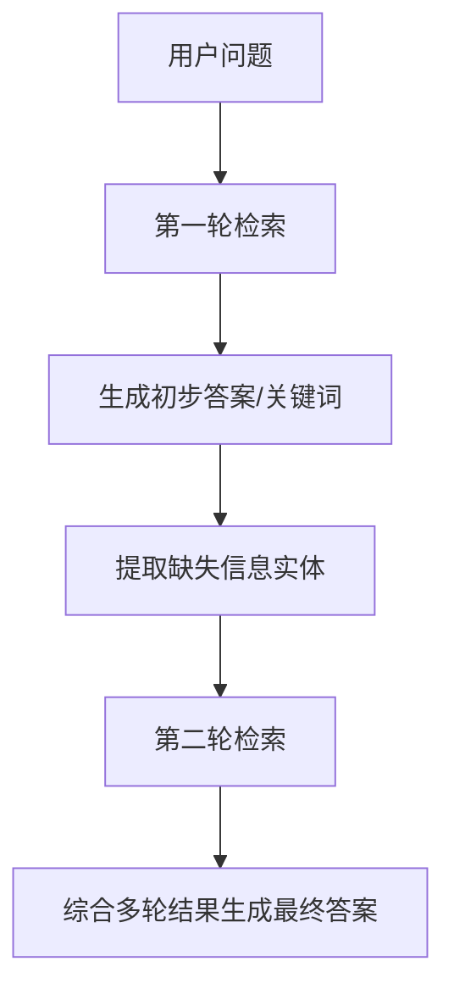
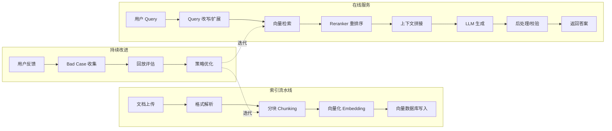
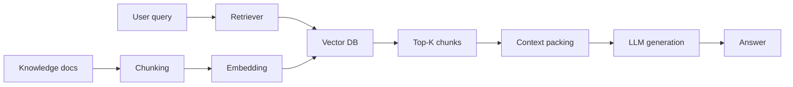
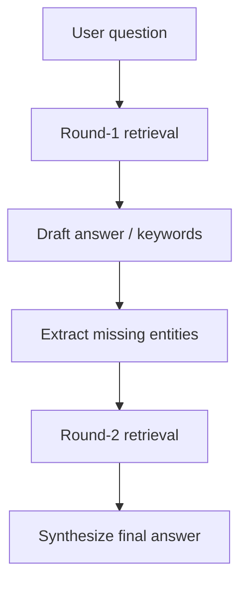
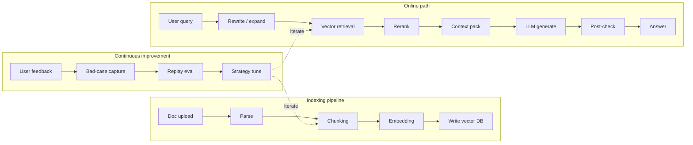

# RAG Basics：从入门到落地，一篇搞定检索增强生成

> RAG（Retrieval-Augmented Generation）可能是 2024-2026 年间 LLM 应用落地中最被低估也最被高估的技术。说被低估，是因为很多人只把它当作“让 LLM 查一下外部资料”的简单技巧；说被高估，是因为真正把 RAG 做好的团队少之又少——检索质量、上下文注入、生成幻觉、端到端延迟，每一个环节都有无数细节。本文将从 RAG 的本质出发，系统拆解其核心组件、关键技术选型、评估方法及工程落地最佳实践，帮助你从“知道 RAG”进阶到“用好 RAG”。

---

## 一、RAG 的本质：为什么需要检索增强生成？

### 1.1 LLM 的固有缺陷

大语言模型虽然强大，但存在三个根本性局限：

- **知识截止**：模型训练数据只覆盖某个时间点之前的信息，无法回答“昨天发生的事”。
- **幻觉问题**：当模型不知道答案时，它会“编造”而非“承认不知道”，这在医疗、法律等严肃场景中不可接受。
- **私有知识无法注入**：企业内部的文档、数据库、业务规则无法通过预训练让模型掌握。

### 1.2 RAG 的核心思想

RAG 的思路极其朴素：**与其让 LLM 凭记忆回答，不如先帮它找到相关资料，再让它基于资料作答。** 这个“先检索、后生成”的范式，将 LLM 从一个“记忆机器”转变为一个“阅读理解机器”。

RAG 的标准流程可以概括为三步：
1. **索引（Indexing）**：将外部知识库（文档、网页、数据库）预处理成可检索的向量索引。
2. **检索（Retrieval）**：根据用户问题，从索引中召回最相关的文档片段。
3. **生成（Generation）**：将检索到的片段与用户问题拼接成 Prompt，交给 LLM 生成答案。



### 1.3 RAG vs 微调：如何选择？

很多团队会在 RAG 和模型微调之间犹豫。我的建议是：**优先 RAG，微调作为补充。**

| 对比维度 | RAG | 微调 |
|---------|-----|------|
| 知识更新 | 即时生效，替换文档即可 | 需要重新训练，周期长、成本高 |
| 可解释性 | 答案可追溯来源文档 | 黑箱，难以解释为什么这样回答 |
| 幻觉风险 | 较低，有上下文约束 | 较高，模型可能“自由发挥” |
| 实现成本 | 低，无需训练 | 高，需要数据准备和训练资源 |
| 适用场景 | 知识密集型问答、客服、文档检索 | 风格迁移、特定格式输出、领域术语微调 |

两者并非互斥。成熟的方案往往是：**RAG 负责知识，微调负责“说话方式”**。

---

## 二、索引阶段：决定 RAG 质量的上限

“垃圾进，垃圾出”在 RAG 中体现得淋漓尽致。索引阶段的质量直接决定了检索阶段的召回率，而检索质量又决定了生成阶段的上限。索引阶段的三个核心环节是：**文档加载、文本分块、向量化**。

### 2.1 文档加载与解析

不同的数据源需要不同的加载器。主流的文档加载方案包括：

- **非结构化文档**：PDF、Word、PPT、Excel 等——使用 `Unstructured` 库或 `pypdf`、`python-docx` 等专用解析器。建议配合 OCR 处理扫描件，并使用表格识别保留结构信息。
- **网页/HTML**：`BeautifulSoup` 或 `trafilatura`，重点清洗正文、去除导航/广告噪声。
- **数据库/SQL**：直接查询结构化数据，通过 LLM 生成 SQL（即 Text-to-SQL），或通过 ETL 将数据导出为文本格式。
- **代码仓库**：`tree-sitter` 解析代码结构，按函数/类拆分 Chunk，保留调用关系元数据。

关键原则：**加载器必须保留文档的结构化元数据**——章节标题、页码、表格结构、代码注释等信息在后续检索与生成中至关重要。

### 2.2 文本分块：尺寸与策略的深度博弈

分块（Chunking）是 RAG 中最容易被忽视、却影响最深远的工程决策。分块策略需要同时考虑三个约束：

- **LLM 上下文窗口**：你的输入不能超过模型限制。
- **检索粒度**：Chunk 太小，语义不完整，缺乏上下文；Chunk 太大，噪声过多且可能截断关键信息。
- **向量语义一致性**：每个 Chunk 应尽可能围绕“一个主题”，否则相似的语义会被错误混合。

推荐的实战策略如下。

**固定尺寸分块**：按固定 Token 数切分，叠加重叠区域（Overlap）来减少上下文断裂。重叠比例建议控制在 10%-20%。实现简洁，适合通用场景。以下是 Python 代码示例：

```python
from langchain.text_splitter import RecursiveCharacterTextSplitter

text_splitter = RecursiveCharacterTextSplitter(
    chunk_size=512,        # 每个 Chunk 最大 Token 数
    chunk_overlap=50,      # 重叠 Token 数，保持上下文连续
    separators=["\n\n", "\n", "。", ".", " "],  # 优先按语义边界切分
)
chunks = text_splitter.split_text(document)
```

**语义分块**：利用 `SentenceTransformer` 计算相邻句子的 Embedding 相似度，当相似度低于阈值时切分，从而在语义边界处分块。这种方法生成的 Chunk 语义更完整，但增加了计算开销。需要注意的是，大模型通常作为判别器做二分类判断，而非生成式输出。

```python
from sentence_transformers import SentenceTransformer

model = SentenceTransformer("all-MiniLM-L6-v2")

def semantic_chunk(sentences, threshold=0.6):
    embeds = model.encode(sentences)
    chunks, current_chunk = [], [sentences[0]]
    for i in range(1, len(sentences)):
        sim = cosine_similarity(embeds[i-1:i], embeds[i:i+1])[0][0]
        if sim > threshold:
            current_chunk.append(sentences[i])
        else:
            chunks.append(" ".join(current_chunk))
            current_chunk = [sentences[i]]
    return chunks
```

**文档结构保留分块**：对于 Markdown、HTML、PDF 等格式，按标题层级切分，确保每个 Chunk 携带其所在章节的上下文。例如，一个 Chunk 的前缀为 `## 3.2 模型架构 > 3.2.1 Transformer 层`，确保检索时不丢失父子层级关系。LangChain 的 `MarkdownHeaderTextSplitter` 可以实现这一逻辑。

### 2.3 向量化：Embedding 模型选型指南

Embedding 模型将文本转换为稠密向量，其质量直接影响检索精度。选型需要关注以下维度：

- **模型大小与性能**：`text-embedding-3-small/large`（OpenAI）、`BGE-M3`（BAAI）、`Cohere Embed v3`、`GTE-Qwen2-7B`（阿里巴巴）等。更大的模型通常精度更高，但延迟和成本也更高。
- **语言支持**：如果你的知识库以中文为主，优先选择在 C-MTEB 榜单上表现优异的模型，如 `BGE-M3`、`text2vec-large-chinese`。
- **维度与存储**：Embedding 维度越高，向量检索精度越高，但存储和计算开销也越大。768 维对大多数场景已足够，1536 维适合复杂语义需求。
- **本地部署 vs API**：API 模型（如 OpenAI）质量稳定但成本随调用量线性增长，适合快速验证；本地部署（如 BGE、GTE）初始投入高，但长期成本可控，且数据不出域，适合合规要求高的场景。

评估 Embedding 质量的最直接方式是在你的数据集上做 **MTEB 评测**或人工抽样验证。

---

## 三、检索阶段：从“搜到”到“搜对”

### 3.1 向量检索基础

当用户问题到来时，系统将其转换为向量，然后在向量数据库中检索最相似的 Top-K 文档片段。最常用的相似度度量是**余弦相似度**和**点积**（对于归一化向量，两者等价）。

向量数据库的选择取决于数据规模与部署需求：

| 数据库 | 特点 | 适用场景 |
|--------|------|---------|
| Chroma | 轻量、嵌入式、易上手 | 本地开发、PoC 验证 |
| FAISS | Meta 开源、纯库、性能极高 | 亿级向量、研究实验 |
| Milvus/Zilliz | 分布式、云原生、支持 GPU 加速 | 生产级大规模部署 |
| Qdrant | Rust 实现、API 友好、支持过滤 | 需要复杂元数据过滤 |
| Pinecone | 全托管云服务、零运维 | 不想维护基础设施的团队 |

### 3.2 多路召回：让检索“不偏科”

单一向量检索可能漏掉重要信息。业界的主流方案是**多路召回 + 融合排序**：

- **向量召回**：捕捉语义相似性，适合同义问题。
- **关键词召回**：基于 BM25 或 Elasticsearch，精确匹配专有名词（如产品型号、人名）。
- **SQL 召回**：对于结构化数据，直接查询数据库。

```python
def multi_stage_recall(query, top_k=10):
    # 1. 向量召回
    vec_results = vector_db.search(query, top_k=top_k)
    
    # 2. BM25 关键词召回
    bm25_results = bm25_index.search(query, top_k=top_k)
    
    # 3. 合并结果并去重
    all_results = merge_and_deduplicate(vec_results, bm25_results)
    
    # 4. 重排序 Reranker 重新打分
    reranked = reranker.rerank(query, all_results, top_k=5)
    return reranked
```

### 3.3 重排序：精度提升的“最后一公里”

向量检索的 Top-K 结果可能包含噪声，而 Reranker 的作用是用更精细的模型重新评估相关性，将最相关的文档排在前面。常用的 Reranker 包括 `Cohere Rerank`、`BGE-Reranker`、`cross-encoder/ms-marco-MiniLM-L-6-v2`。

```python
from sentence_transformers import CrossEncoder

reranker = CrossEncoder("cross-encoder/ms-marco-MiniLM-L-6-v2")

def rerank(query, documents, top_k=5):
    pairs = [[query, doc] for doc in documents]
    scores = reranker.predict(pairs)
    ranked = sorted(zip(documents, scores), key=lambda x: x[1], reverse=True)
    return [doc for doc, score in ranked[:top_k]]
```

重排序的代价是计算开销，因此典型的流程是：**向量检索召回 Top-50 → Reranker 重新排序取 Top-5**，兼顾召回率和精度。

### 3.4 混合检索 + RRF 融合

当多路召回的结果需要合并时，**RRF（Reciprocal Rank Fusion）** 是一种简单而有效的排序融合算法。它将不同召回通道的排名分数进行倒数加权求和，不依赖绝对分数，天然对不同通道友好：

```python
def rrf(results_lists, k=60):
    """
    results_lists: 多个召回通道的结果列表，每个列表按相关性降序排列
    """
    scores = {}
    for rank_list in results_lists:
        for rank, doc_id in enumerate(rank_list):
            scores[doc_id] = scores.get(doc_id, 0) + 1.0 / (k + rank + 1)
    return sorted(scores.items(), key=lambda x: x[1], reverse=True)
```

---

## 四、生成阶段：从“有据”到“可信”

### 4.1 Prompt 设计：让 LLM “有据可依”

生成阶段的核心是 Prompt 设计。一个好的 RAG Prompt 应该包含以下要素：

```text
你是一个基于给定资料回答问题的助手。你必须严格依据以下参考资料回答。
如果资料中没有答案，请直接说“我不知道”，不要自行编造。

参考资料：
{retrieved_context}

用户问题：{query}

回答要求：
1. 优先从参考资料中提取信息
2. 如果参考资料中存在矛盾，请指出并说明
3. 引用来源时标注 [来源：文档名]
4. 如果信息不完整，明确说明缺失了什么
```

关键技巧：
- **强制引用**：要求 LLM 在回答中标注信息来源于哪份参考资料，便于追溯。
- **拒绝模板**：明确告知 LLM “当资料中没有答案时，直接说不知道”，这是减少幻觉最有效的手段。
- **拆解复杂问题**：对长问题，可先让 LLM 拆解为多个子问题再分别检索。

### 4.2 幻觉抑制：三层防护

RAG 的核心目标是减少幻觉，但仍需多层防护：

**第一层：检索质量门槛**。若检索结果与问题的相关性低于阈值，直接拒绝回答，引导用户重新表述问题。例如计算检索到的平均相关性分数，低于 0.6 时触发“未找到足够相关信息”的回复。这需要在检索阶段记录每个 Chunk 的相似度分数。

**第二层：生成后校验**。利用另一个 LLM 检查生成的答案是否忠实于检索到的资料（Faithfulness Evaluation）。例如使用 RAGAS 的 `faithfulness` 指标，将答案拆成原子事实，逐一判断是否有检索文档支撑。若忠实度分数低于阈值（如 0.7），则触发重新生成或降级回复。

**第三层：用户反馈闭环**。在生产环境中收集用户“点赞/点踩”信号，将低质量回答的 case 积累为评测数据集，定期迭代 Prompt 或检索策略。

```python
from ragas.metrics import faithfulness
from ragas import evaluate

# 生成答案后自动评估忠实度
faithfulness_score = evaluate(
    dataset,
    metrics=[faithfulness]
)
# 如果分数低于阈值，降级为"根据现有资料无法可靠回答"
if faithfulness_score < 0.7:
    return "根据当前资料，我无法给出可靠的答案，建议人工确认。"
```

### 4.3 上下文窗口的“甜蜜点”

LLM 的上下文窗口越来越大（GPT-4 支持 128K），但**不要填满**。实践中建议：
- 总 Context Token 数控制在窗口大小的 **60%-70%**，为系统指令和输出留出空间。
- 优先塞入相关性最高的 Top-K（通常 K=3~5），而非越多越好——检索引入的噪声会污染生成质量。
- 当文档碎片过多时，先让 LLM 对多个检索片段做二次摘要，再将摘要拼接成最终上下文，类似于“摘要-生成”两阶段模式。

---

## 五、高级 RAG 技术与模式

### 5.1 自查询检索

当用户问题包含明确的结构化条件时（如时间范围、作者、类别），可以让 LLM 将问题解析为结构化查询：

```python
from typing import Optional
from pydantic import BaseModel

class SearchQuery(BaseModel):
    query_text: str           # 语义检索文本
    author: Optional[str]     # 过滤条件：作者
    date_range: Optional[str] # 过滤条件：时间范围
    category: Optional[str]   # 过滤条件：分类

# 用 LLM 将用户输入解析为结构化的 SearchQuery
# 例如用户输入："2024年关于Transformer的论文"
# 解析结果：query_text="Transformer 论文", date_range="2024"
```

### 5.2 多模态 RAG

当检索内容包含图片、表格、音频等多模态数据时，可采用以下策略：
- **图文联合 Embedding**：使用 `CLIP`、`BLIP-2` 等模型将图像和文本映射到同一语义空间。
- **混合索引**：分别建立文本向量索引和图像向量索引，检索时同时查询并融合结果。
- **文本摘要替代**：对图片/表格先通过多模态 LLM（如 GPT-4V）生成文本描述，再将描述作为纯文本向量存储。

### 5.3 重写-检索-生成（Rewrite-Retrieve-Generate）

用户原始问题可能表述不清、包含口语化表达或指代不明，直接检索效果不佳。通过**问题重写**步骤，让 LLM 将原始问题改写为更清晰、更适合检索的形式，再进入标准检索流程。

```python
def rewrite_query(original_query: str, conversation_history: list = None) -> str:
    """
    使用 LLM 改写用户问题，补全指代、规范化表述
    """
    prompt = f"""
    请将以下用户问题改写为更清晰、关键词明确的检索查询。
    保留所有关键实体和条件，补全可能缺失的指代信息。
    
    原始问题：{original_query}
    对话历史：{conversation_history}
    
    只输出改写后的查询文本：
    """
    return llm.generate(prompt)
```

这种模式在对话式 RAG 中尤其重要，因为用户的后续问题往往依赖历史上下文中的实体。

### 5.4 递归检索与多步推理

对于复杂问题，单次检索往往不够。递归检索的思路是：先检索到相关文档片段，从中提取新的关键实体，再基于新实体发起第二轮检索，最终综合多轮检索结果生成答案。



这种模式在医疗诊断、法律条文检索等需要逐步深入的专业场景中效果显著。

---

## 六、RAG 评估：如何衡量 RAG 好不好？

### 6.1 核心评估指标

RAG 评估需要分别衡量检索质量和生成质量：

| 指标 | 英文名 | 含义 | 计算方式 |
|------|--------|------|---------|
| 命中率 | Hit Rate | Top-K 检索结果中包含正确答案的比例 | 命中数 / 总查询数 |
| 平均倒数排名 | MRR | 正确答案在检索结果中的平均排名的倒数 | 1/rank 的平均值 |
| 忠实度 | Faithfulness | 生成答案是否忠实于检索到的资料 | LLM 判断或人工标注 |
| 答案相关性 | Answer Relevancy | 答案是否切题 | LLM 判断或人工标注 |
| 上下文召回率 | Context Recall | 答案所需的信息是否都被检索到 | 逐条判断是否有检索来源 |

### 6.2 推荐评估框架

- **RAGAS**：RAG 专用评估，提供 Faithfulness、Answer Relevancy、Context Precision、Context Recall 四大指标，使用几行 Python 即可完成评估。
- **DeepEval**：单元测试风格的评估框架，支持自定义阈值和 CI/CD 集成。
- **人工评估**：小样本（50-100 条）的人工标注仍然是验证评估结果可信度的“金标准”，建议定期进行。

---

## 七、工程化落地与常见陷阱

### 7.1 常见陷阱与应对

| 陷阱 | 表现 | 解决方案 |
|------|------|---------|
| 分块过小 | 信息碎片化，LLM 无法理解完整语义 | 增加 Chunk 大小至 512-1024，并增加 Overlap |
| 分块过大 | 上下文被噪声稀释，重点被淹没 | 按章节或段落语义切分，使用 Reranker 精选 Top-K |
| 向量检索维度不够 | 语义区分度不足 | 换用更大维度 Embedding 或专用领域模型 |
| 未处理多轮对话 | 指代不明，“那个”无法追溯到上文实体 | 每轮检索时携带最近 3~5 轮的对话摘要 |
| 系统 Prompt 未约束 | LLM 超出检索资料“自由发挥” | 添加硬性约束：“必须基于参考资料回答” |

### 7.2 RAG 上线 Checklist

在生产环境中落地 RAG，以下问题必须提前考虑：

- [ ] 知识库更新频率？（每小时/每天/每周 → 决定索引重建策略）
- [ ] 检索延迟预算？（P95 < 200ms/500ms/1s → 决定是否用 GPU 加速）
- [ ] 是否需要多租户隔离？（按知识库或团队划分检索范围）
- [ ] 文档访问权限如何控制？（某些文档只有特定用户可见 → 需在检索时过滤）
- [ ] 降级策略是什么？（LLM 不可用或超时时如何响应）
- [ ] 如何记录用户反馈并形成改进闭环？

### 7.3 生产级 RAG 架构参考



---

## 总结与展望

RAG 不是一个静态的技术，而是一个持续进化的工程系统。它的核心公式可以概括为：

> **RAG = 高质量索引 + 精准检索 + 受控生成 + 持续评估**

这个链条上的每一个环节都有丰富的优化空间，且环环相扣——索引决定了检索的天花板，检索决定了生成的输入质量，而评估则驱动了整个系统的持续改进。

展望未来，RAG 的发展方向将围绕三个维度展开：一是**多模态 RAG**，让图像、音频、视频与文本检索深度融合；二是**Agentic RAG**，让 RAG 系统具备主动规划、多轮检索与自我验证的能力，而非单次被动响应；三是**轻量化与实时化**，通过边缘部署、量化压缩和流式检索，让 RAG 在端侧设备上低延迟运行。

无论技术如何演进，RAG 的本质始终是让 LLM “有据可依”。在“幻觉”被彻底解决之前，RAG 仍将是 LLM 应用走向生产可靠性的必经之路。


<!-- i18n:en -->

# RAG Basics: From First Principles to Production

> RAG (Retrieval-Augmented Generation) may be the most underrated *and* overhyped LLM technique of 2024–2026. Underrated because many treat it as “just look stuff up.” Overhyped because teams that truly ship great RAG are rare—retrieval quality, context packing, hallucinations, and end-to-end latency each hide sharp edges. This note starts from first principles and walks the full chain: components, key choices, evaluation, and production pitfalls—so you move from “knowing RAG” to “shipping RAG.”

---

## 1. Why RAG Exists

### 1.1 Inherent LLM limits

LLMs are powerful, but three limits remain fundamental:

- **Knowledge cutoff**: training data stops at a point in time; yesterday’s events are invisible.
- **Hallucination**: when the model does not know, it often invents instead of admitting uncertainty—unacceptable in medicine, law, and similar domains.
- **Private knowledge**: internal docs, databases, and business rules cannot be injected via pretraining alone.

### 1.2 Core idea

The idea is simple: **instead of answering from memory alone, retrieve relevant material first, then answer grounded in that material.** “Retrieve then generate” turns the LLM from a memory machine into a reading-comprehension machine.

The standard pipeline has three steps:

1. **Indexing**: preprocess external knowledge (docs, pages, DBs) into a searchable vector index.
2. **Retrieval**: given a user question, recall the most relevant chunks.
3. **Generation**: splice retrieved chunks with the question into a prompt and let the LLM answer.



### 1.3 RAG vs fine-tuning

Teams often hesitate between RAG and fine-tuning. My default: **prefer RAG first; fine-tune as a complement.**

| Dimension | RAG | Fine-tuning |
| --- | --- | --- |
| Knowledge updates | Instant—swap docs | Retrain; slow and costly |
| Explainability | Answers can cite sources | Black box |
| Hallucination risk | Lower under context constraints | Higher; freer generation |
| Implementation cost | Low; no training | High; data + compute |
| Best fit | Knowledge QA, support, doc search | Style transfer, fixed formats, domain jargon |

They are not mutually exclusive. Mature systems often use **RAG for knowledge and fine-tuning for how the model speaks.**

---

## 2. Indexing Sets the Ceiling

Garbage in, garbage out applies brutally to RAG. Index quality caps recall; recall caps generation. Three core stages: **load/parse, chunk, embed.**

### 2.1 Document loading & parsing

Different sources need different loaders:

- **Unstructured docs** (PDF, Word, PPT, Excel): `Unstructured`, `pypdf`, `python-docx`, etc. Pair OCR for scans and keep table structure when possible.
- **Web/HTML**: `BeautifulSoup` or `trafilatura`—keep body text, strip nav/ads.
- **Databases/SQL**: query structured data directly, use Text-to-SQL, or ETL to text.
- **Code repos**: `tree-sitter` for structure; chunk by function/class; keep call-graph metadata.

Key rule: **loaders must preserve structural metadata**—section titles, page numbers, table layout, code comments—all matter later for retrieval and generation.

### 2.2 Chunking: size vs strategy

Chunking is easy to ignore and hard to undo. Balance three constraints:

- **Context window**: inputs must fit the model.
- **Retrieval granularity**: too small → incomplete semantics; too large → noise and truncated signal.
- **Semantic coherence**: each chunk should center on one topic, or similar meanings get muddled.

Practical strategies:

**Fixed-size chunking**: split by token count with overlap (about 10%–20%) to reduce boundary breakage. Simple and general-purpose:

```python
from langchain.text_splitter import RecursiveCharacterTextSplitter

text_splitter = RecursiveCharacterTextSplitter(
    chunk_size=512,        # max tokens per chunk
    chunk_overlap=50,      # overlap tokens to keep context continuity
    separators=["\n\n", "\n", "。", ".", " "],  # prefer semantic boundaries (incl. Chinese period)
)
chunks = text_splitter.split_text(document)
```

**Semantic chunking**: embed adjacent sentences with `SentenceTransformer` and split when similarity drops below a threshold. Chunks are more coherent, at higher compute cost. Note: large models here usually act as binary discriminators, not free-form generators.

```python
from sentence_transformers import SentenceTransformer

model = SentenceTransformer("all-MiniLM-L6-v2")

def semantic_chunk(sentences, threshold=0.6):
    embeds = model.encode(sentences)
    chunks, current_chunk = [], [sentences[0]]
    for i in range(1, len(sentences)):
        sim = cosine_similarity(embeds[i-1:i], embeds[i:i+1])[0][0]
        if sim > threshold:
            current_chunk.append(sentences[i])
        else:
            chunks.append(" ".join(current_chunk))
            current_chunk = [sentences[i]]
    return chunks
```

**Structure-aware chunking**: for Markdown/HTML/PDF, split by heading hierarchy so each chunk carries section context—e.g. prefix `## 3.2 Model Architecture > 3.2.1 Transformer Layers`. LangChain’s `MarkdownHeaderTextSplitter` covers this pattern.

### 2.3 Embedding model selection

Embeddings turn text into dense vectors; quality drives retrieval precision. Watch these dimensions:

- **Size vs quality**: `text-embedding-3-small/large` (OpenAI), `BGE-M3` (BAAI), `Cohere Embed v3`, `GTE-Qwen2-7B`, etc. Larger usually means better—and slower/costlier.
- **Language**: for Chinese-heavy corpora, prefer strong C-MTEB models such as `BGE-M3` or `text2vec-large-chinese`.
- **Dimension & storage**: higher dims often help, but cost more. 768 is enough for many cases; 1536 for harder semantics.
- **Local vs API**: APIs are stable for PoCs but scale linearly in cost; local (BGE/GTE) costs more upfront, stays in-domain, and suits compliance-heavy settings.

The most direct quality check is **MTEB on your data** or careful human sampling.

---

## 3. Retrieval: From “Found” to “Found Right”

### 3.1 Vector retrieval basics

On query, embed the question and search the vector DB for Top-K similar chunks. Common metrics: **cosine similarity** and **dot product** (equivalent for normalized vectors).

Pick a vector store by scale and ops needs:

| Store | Traits | Fit |
| --- | --- | --- |
| Chroma | Light, embedded, easy | Local / PoC |
| FAISS | Meta OSS, library-only, very fast | Billion-scale / research |
| Milvus/Zilliz | Distributed, cloud-native, GPU | Large production |
| Qdrant | Rust, friendly APIs, filtering | Complex metadata filters |
| Pinecone | Fully managed | Teams that skip infra |

### 3.2 Multi-path recall

Single vector recall misses things. The common pattern is **multi-path recall + fusion ranking**:

- **Vector recall**: semantic similarity; good for paraphrases.
- **Keyword recall**: BM25 / Elasticsearch; exact proper nouns (SKU, names).
- **SQL recall**: structured data queried directly.

```python
def multi_stage_recall(query, top_k=10):
    # 1. Vector recall
    vec_results = vector_db.search(query, top_k=top_k)

    # 2. BM25 keyword recall
    bm25_results = bm25_index.search(query, top_k=top_k)

    # 3. Merge and deduplicate
    all_results = merge_and_deduplicate(vec_results, bm25_results)

    # 4. Rerank with a reranker
    reranked = reranker.rerank(query, all_results, top_k=5)
    return reranked
```

### 3.3 Reranking: the last mile of precision

Top-K from vector search can be noisy. A reranker re-scores with a finer model. Common choices: `Cohere Rerank`, `BGE-Reranker`, `cross-encoder/ms-marco-MiniLM-L-6-v2`.

```python
from sentence_transformers import CrossEncoder

reranker = CrossEncoder("cross-encoder/ms-marco-MiniLM-L-6-v2")

def rerank(query, documents, top_k=5):
    pairs = [[query, doc] for doc in documents]
    scores = reranker.predict(pairs)
    ranked = sorted(zip(documents, scores), key=lambda x: x[1], reverse=True)
    return [doc for doc, score in ranked[:top_k]]
```

Reranking costs compute, so the usual trade-off is: **vector recall Top-50 → rerank to Top-5**.

### 3.4 Hybrid retrieval + RRF fusion

When merging paths, **RRF (Reciprocal Rank Fusion)** is simple and effective—rank-based, score-agnostic across channels:

```python
def rrf(results_lists, k=60):
    """
    results_lists: ranked result lists from multiple recall channels (best first)
    """
    scores = {}
    for rank_list in results_lists:
        for rank, doc_id in enumerate(rank_list):
            scores[doc_id] = scores.get(doc_id, 0) + 1.0 / (k + rank + 1)
    return sorted(scores.items(), key=lambda x: x[1], reverse=True)
```

---

## 4. Generation: From Grounded to Trustworthy

### 4.1 Prompt design: answer from evidence

Generation quality lives in the prompt. A solid RAG prompt usually includes:

```text
You are an assistant that answers only from the provided reference material.
If the material does not contain the answer, say "I don't know" — do not invent.

Reference material:
{retrieved_context}

User question: {query}

Answer requirements:
1. Prefer extracting facts from the references
2. If references conflict, call that out
3. Cite sources as [Source: document name]
4. If information is incomplete, state what is missing
```

Key techniques:

- **Forced citation**: require source labels for traceability.
- **Refuse template**: explicitly say “if the docs lack the answer, say you don’t know”—still the strongest anti-hallucination lever.
- **Decompose hard questions**: split long queries into sub-questions and retrieve per sub-question.

### 4.2 Three layers of hallucination control

RAG reduces hallucination but still needs defense in depth:

**Layer 1 — retrieval quality gate.** If average relevance is below a threshold (e.g. 0.6), refuse and ask the user to rephrase. Persist per-chunk similarity scores at retrieval time.

**Layer 2 — post-generation check.** Use another LLM (or RAGAS `faithfulness`) to verify the answer is supported by retrieved context. Split the answer into atomic claims; if faithfulness < 0.7, regenerate or degrade.

**Layer 3 — feedback loop.** Collect thumbs up/down in production; turn bad cases into eval sets; periodically iterate prompts and retrieval.

```python
from ragas.metrics import faithfulness
from ragas import evaluate

# Auto-evaluate faithfulness after generation
faithfulness_score = evaluate(
    dataset,
    metrics=[faithfulness]
)
# If below threshold, degrade to an unreliable-answer response
if faithfulness_score < 0.7:
    return "Based on the current material, I cannot give a reliable answer. Please confirm with a human."
```

### 4.3 The context-window sweet spot

Windows keep growing (e.g. GPT-4 at 128K)—**do not fill them**. In practice:

- Keep total context around **60%–70%** of the window so system instructions and output still fit.
- Prefer highest-relevance Top-K (often K=3–5); more chunks often add noise.
- When fragments multiply, summarize retrieved pieces first, then generate from the summary (“summarize-then-generate”).

---

## 5. Advanced RAG Patterns

### 5.1 Self-query retrieval

When questions include structured constraints (time, author, category), let the LLM parse them into a structured query:

```python
from typing import Optional
from pydantic import BaseModel

class SearchQuery(BaseModel):
    query_text: str           # semantic search text
    author: Optional[str]     # filter: author
    date_range: Optional[str] # filter: time range
    category: Optional[str]   # filter: category

# Use an LLM to parse user input into a structured SearchQuery
# e.g. user: "Transformer papers from 2024"
# -> query_text="Transformer papers", date_range="2024"
```

### 5.2 Multimodal RAG

For images, tables, audio:

- **Joint embeddings**: `CLIP`, `BLIP-2`, etc., map image and text into one space.
- **Hybrid indexes**: separate text/image indexes; query both and fuse.
- **Caption-as-text**: describe media with a multimodal LLM (e.g. GPT-4V), then store captions as text vectors.

### 5.3 Rewrite–Retrieve–Generate

Raw user questions are often vague, colloquial, or full of pronouns. Rewrite into a clearer retrieval query before the standard pipeline:

```python
def rewrite_query(original_query: str, conversation_history: list = None) -> str:
    """
    Rewrite the user question with an LLM — resolve pronouns and normalize phrasing
    """
    prompt = f"""
    Rewrite the user question into a clearer retrieval query with explicit keywords.
    Keep all key entities and constraints; fill in missing referents when possible.

    Original question: {original_query}
    Conversation history: {conversation_history}

    Output only the rewritten query text:
    """
    return llm.generate(prompt)
```

This matters especially in conversational RAG, where follow-ups depend on prior entities.

### 5.4 Recursive retrieval & multi-step reasoning

Hard questions often need more than one hop: retrieve → extract new entities → retrieve again → synthesize.



This shines in medical, legal, and other domains that need progressive deepening.

---

## 6. Evaluating RAG

### 6.1 Core metrics

Measure retrieval and generation separately:

| Metric | Meaning | How |
| --- | --- | --- |
| Hit Rate | Share of queries where Top-K contains the gold doc | Hits / queries |
| MRR | Mean reciprocal rank of the gold doc | Average of 1/rank |
| Faithfulness | Answer supported by retrieved context | LLM judge or human |
| Answer Relevancy | Answer on-topic | LLM judge or human |
| Context Recall | Needed info actually retrieved | Claim-level source checks |

### 6.2 Recommended frameworks

- **RAGAS**: Faithfulness, Answer Relevancy, Context Precision, Context Recall in a few Python lines.
- **DeepEval**: unit-test style metrics, thresholds, CI-friendly.
- **Human eval**: 50–100 labeled samples remain the gold standard for trusting automated scores—run regularly.

---

## 7. Production Pitfalls & Checklist

### 7.1 Common traps

| Trap | Symptom | Fix |
| --- | --- | --- |
| Chunks too small | Fragmented meaning | Raise to 512–1024 + overlap |
| Chunks too large | Noise drowns signal | Semantic/section splits + rerank Top-K |
| Weak embedding dims | Poor semantic separation | Larger/domain embeddings |
| No multi-turn handling | Pronouns unresolved | Carry last 3–5 turn summaries into retrieval |
| Unconstrained system prompt | Model freestyles beyond docs | Hard rule: answer only from references |

### 7.2 Go-live checklist

- [ ] Knowledge refresh cadence? (hourly/daily/weekly → index rebuild strategy)
- [ ] Retrieval latency budget? (P95 < 200ms / 500ms / 1s → GPU or not)
- [ ] Multi-tenant isolation?
- [ ] Document ACL filtering at retrieval time?
- [ ] Degradation path when LLM is down or times out?
- [ ] Feedback capture and improvement loop?

### 7.3 Reference production architecture



---

## Closing

RAG is not a static trick—it is an evolving engineering system. The core formula:

> **RAG = high-quality indexing + precise retrieval + controlled generation + continuous evaluation**

Every link has headroom, and every link depends on the previous one. Indexing caps recall; recall caps generation input; evaluation drives the next iteration.

Looking ahead: **multimodal RAG** (image/audio/video fused with text), **Agentic RAG** (planning, multi-round retrieve, self-check), and **lightweight real-time RAG** (edge deploy, quantization, streaming retrieval). Whatever the stack, the essence stays the same—keep the LLM **answerable to evidence**. Until hallucination is solved at the model root, RAG remains the practical path to production reliability.
